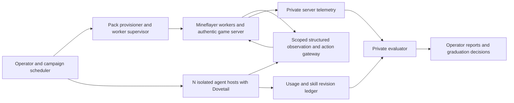

# Strata: build plan

Project name: **Strata**. Public repository: **[OpenCnid/strata-bench](https://github.com/OpenCnid/strata-bench)** (user decision D03).

Research baseline: 2026-09-17; architecture updated 2026-09-18 by D01. The plan below is supporting design, not current execution instructions. **September 24 closure: M0 verified; G0 pass for the D14 development feasibility slice; G1–G5 not_run.** Preserve M1–M7 without advancing them. Start with [the current handoff](docs/STATUS_AND_HANDOFF.md), [ledger](MILESTONES.md) and [final assembly](docs/verification/2026-09-24-g0-assembly.md).

The implemented harness gives GPT-6 Luna filtered observations and typed commands to a persistent Mineflayer worker. The model chooses actions; local scripts supply fixed motors, fixture setup and checks. Live15 verifies actual turn/walk/helper play. Live18's independent19/19 audit joins a zero-input refusal and corrected turn with source/pack/worker identity, saved player, costs and clocks; its two-action goal still fails because no walk occurred. Exact E9E has a separate development Forge fallback, not a Mineflayer pass.

The six-outcome assembly and 318 child dispositions are complete. The changed minor12 worker passes its authentic cancellation/reconnect audit48/48. Normal-stop case 04, successful helper play, sealed installations and the accepted/refused join retain their named scopes; do not repeat them unchanged. D14 defers full isolation to M1/G1; full T05 also remains G1, canonical recovery and soaks G2. These wider requirements are retained, not waived or completed.

D18/D19 authority preserves the original $10 while all unresolved amounts stay reserved. Exposure is $4.887796, including the old $0.7554 hold and four full $1 failed envelopes. Recheck durable authority before future authorized spend; no per-run permission is pending. D13's 1,000ms Java policy and all historical 500ms failures remain. The M0 closure used no new inference; no further experiment is selected.

## 1. Recommendation

Build a **meta-harness around authentic Minecraft Java servers, with Mineflayer as the first character-control backend**, one Dovetail-equipped runtime per embodied agent and a private evaluator. Use structured observations and bounded actions through a small local CLI called by Codex, with fixed local motor/pathfinding execution. Start with vanilla 1.19.2, then immediately test the selected Forge expert pack before expanding duration or teams. Screenshots are optional, not the primary control loop. The authoritative implementation contract is the current [SPEC.md](SPEC.md); [MILESTONES.md](MILESTONES.md) records unpassed work.

The scientific target is **improvement attributable to experience**, measured separately from how far agents get in a world. Long playthroughs provide authentic experience; controlled, held-out probes determine whether an experienced agent performs better when equipment, starting conditions, and inference budgets are matched.

Confirmed user choices: **Mineflayer as the first backend**, **CurseForge + Forge**, and **[OpenCnid/dovetail-codex](https://github.com/OpenCnid/dovetail-codex)**. Use Codex as the first agent host and the current Windows environment for the integration spike. CurseForge is an installer/distribution application, while Forge is the mod loader. Keep provider boundaries extensible without substituting another launcher or Dovetail port in the MVP.

## 2. What the research establishes

| Prior work | Relevant evidence | Consequence for this project |
|---|---|---|
| [MineRL](https://github.com/minerllabs/minerl), [MineDojo](https://docs.minedojo.org/), [MineStudio](https://github.com/CraftJarvis/MineStudio) | Established Minecraft simulation, task, trajectory, and policy infrastructure | Borrow task/evidence conventions; their existence does not establish compatibility with arbitrary retail expert packs |
| [Voyager](https://github.com/MineDojo/Voyager) | Persistent executable skills and a curriculum; uses a Mineflayer-based interface | Useful lifelong-learning reference using the same family of structured interfaces; freeze the actual affordances for comparisons |
| [Mindcraft](https://github.com/mindcraft-bots/mindcraft) / [MineCollab](https://github.com/mindcraft-bots/mindcraft/blob/develop/minecollab.md) | Mineflayer agents, cooperative tasks, evaluation runners and logging | Main harness reference; its [FAQ](https://github.com/mindcraft-bots/mindcraft/blob/develop/FAQ.md) does not support mechanics-changing mods |
| [Minecraft MCP Server](https://github.com/yuniko-software/minecraft-mcp-server) | Existing Mineflayer MCP facade | Reuse interface ideas after source/version review; no expert-pack compatibility claim |
| [MineLand](https://github.com/cocacola-lab/MineLand), [TeamCraft](https://teamcraft-bench.github.io/) | Multi-agent interaction and collaborative evaluation | Reuse coordination ideas; do not translate simulator agent counts into a full-client capacity promise |
| [MirrorCraft](https://arxiv.org/abs/2607.29218) | Paired Minecraft worlds with hidden changed rules | Direct prior art; changed-rule performance alone does not isolate learning from experience |
| [Polycraft World AI Lab](https://arxiv.org/abs/2301.11891), [PAL code](https://github.com/StephenGss/PAL) | An actual Minecraft mod and agent evaluation platform with task modification and novelty trials | Modded and novelty evaluation already exist; avoid claiming to invent either |
| [MineMind](https://github.com/Boyan253/minemind) | Early modpack-playing project, using a server companion and structured quest/recipe access; reports testing on Reclamation | Inspect for adapter ideas, but it does not establish end-to-end Enigmatica expert play or full-client GUI support |
| [Enigmatica installation guidance](https://wiki.enigmatica.net/main/help-desk/guides/installation) | Official launcher guidance and version-specific pack setup | Use real released client/server artifacts and verify the active expert configuration |

Within the reviewed primary sources, no turnkey system was verified to combine expert-pack installation and operation, Dovetail, resource-accounted multi-agent campaigns, and longitudinal adaptation evaluation. This is a bounded research finding, not an exhaustive novelty claim.

Detailed investigations: [benchmark design](research/benchmark-design.md), [modpack runtime](research/modpack-runtime.md), [control and keybindings](research/control-keybindings.md), and [Dovetail integration](research/dovetail-integration.md).

## 3. Product scope and experimental units

The operator defines a campaign: pack lock, world fixtures, agent roster, communication policy, resource envelope, duration, and evaluator suite. The harness provisions workers, launches play, records evidence, recovers infrastructure failures, and produces an auditable report.

Define three different counts:

- **Embodied agents N:** each has its own Minecraft player identity, isolated backend worker (initially Mineflayer) and Dovetail-equipped runtime.
- **Reasoning helpers:** temporary delegates or self-play roles belonging to an embodied agent; they do not automatically receive another avatar.
- **Concurrent campaigns:** independent worlds/teams used for replication or model comparison.

Support `N >= 1` in the configuration without a hard-coded small roster. Admission control must reject or queue campaigns that exceed measured CPU, GPU, RAM, account, server, or provider capacity. A shared-world N-agent run requires simultaneous capacity for that N; quietly time-sharing fewer avatars would change the experiment.

Offer independent-world and cooperative-team modes. Fix player count, team membership, quest-sharing behavior, messaging bandwidth, memory sharing, and joining/leaving policy per run. Competitive play can be an extension. A team, not each teammate, is the independent statistical unit for shared-world outcomes.

## 4. Architecture and trust boundaries

The agent-facing surface provides filtered structured game state, bounded actions, declared player-accessible information, and its own workspace. The evaluator receives authoritative server evidence and private scoring definitions. It never returns hidden scores, test identifiers, graduation criteria, or held-out answers to agents.

Agents get an ordinary gameplay brief: survive, develop the base, and advance the pack's objectives and quest book. The adaptation measurement goal is absent from prompts, tool descriptions, memory seeds, and readable files. Agents may still infer they are being evaluated; the guarantee is non-disclosure and enforced access separation, not control over their beliefs.

Keep evaluator code, server saves/admin access, held-out fixtures, other arms, and campaign orchestration outside the agent sandbox. Client and evaluator capabilities use different credentials and endpoints. The agent runtime must not share the operator's unrestricted home or credentials. A private evaluator directory in an otherwise readable workspace is insufficient. The plan, reports, and future `SPEC.md` themselves are operator-only and must never be mounted into gameplay agents.

Use a declared information policy. Default to capability-tested player-accessible recipe/quest projections plus a pinned allowed documentation corpus. An open-web track can follow, with requests and retrieved content logged and benchmark/evaluator resources excluded. Keep these tracks separate because retrieval changes the measured system and cannot eliminate pretraining contamination.

## 5. Game provisioning and initial compatibility

First backend target: **Mineflayer on vanilla 1.19.2**. Recommended first modded target: **Enigmatica 9 Expert, Minecraft 1.19.2, Forge**, after a release-specific compatibility spike. Mineflayer does not load Forge client mods: verify exact handshake/channels, registry data, altered recipes, physics, containers and a real modded machine. A successful join is insufficient. Keep CurseForge acquisition and the full installed pack as the distribution/reference; backend support is a separate lock and gate. E6E/1.16.5 and E2E/1.12.2 are subsequent compatibility work, not automatic steps in a difficulty ordering. Enigmatica edition numbers are not a calibrated difficulty scale.

For each supported pack, record an immutable `PackLock`: distribution/project/file IDs, client and server artifact hashes, Minecraft/loader/JVM builds, mod hashes, configs, scripts, recipes, quests, resource packs, expert-mode assertions, and approved bridge/evaluator additions. Distinguish the original distribution from the final installed profile. Resolve transitive downloads and installer tools before sealing the runnable instance. Clone sealed templates into writable run directories; never reuse a player's personal installation.

The provisioning interface should implement `resolve`, `acquire`, `verify`, `materialize`, `launch_server`, `launch_backend`, optional `launch_client`, `health`, and `stop`. These are proposed contracts, not existing CurseForge CLI commands. Start with an operator-authenticated official installation/import workflow. Add unattended providers only where documented and tested. Handle unavailable/restricted artifacts as explicit provisioning states, not by bypassing distribution controls. Keep account/token material out of locks and logs.

For authentic multiplayer, provision suitable player identities/accounts through supported authentication. Do not assume one authenticated identity can supply N concurrent players. Pin the server authentication policy; authentication failures are infrastructure outcomes. Record required game/server license acceptance as provisioning prerequisites without redistributing proprietary game binaries or pack files by default.

Verify expert mode through actual runtime configuration and representative changed recipes/quest state. A pack title or Git branch is insufficient. Server pack startup must follow that release's script/installer instructions; a single universal `java -jar` recipe will not cover every generation.

## 6. Mineflayer control and hotkey skill

Primary track: **`structured-actions/v1`**. Run a Node.js/TypeScript Mineflayer worker per avatar behind a scoped local game CLI. Implement a replaceable `GameBackend` interface for connection, capability discovery, observations/events, bounded execution, action status/cancellation, stop-all, state export/resume and health. This is our API contract, not an upstream Dovetail or Minecraft SDK.

Observations contain own position/health/inventory, current open-container slots, scoped chat and bounded observed blocks/entities. Filter client-received chunks: nearby searches and pathfinding must not reveal hidden ore, unopened inventories or evaluator data. Keep player-visible state separate from authoritative private telemetry. Publish compact state and event summaries on meaningful changes and action completion; no LLM call on every tick and no required screenshot round trip. Declare optional images and expanded knowledge separately.

Actions include navigate, look, dig/place, equip/use, interact, slot transactions, single-recipe craft and chat. A pinned local controller handles movement/aiming and sustained actions with deadlines, preconditions and interruption. Navigation uses the allowed observed map, with auto-dig/build/resource collection disabled initially. Recipe queries require tested pack-correct data; no recursive crafting planner or quest solver is built into the body. The agent learns goals and production strategies through Dovetail. No raw bot object, arbitrary JS eval, packets, teleportation, item grants or server commands are exposed.

Pin Mineflayer, protocol/data packages, pathfinder, enabled plugins and observation/action policies. Maintain one executor and one active mutation lane per avatar. Record accepted/executing/completed/failed/cancelled/unknown states; cancellation stops navigation/dig/use and clears controls locally. Unknown effects require fresh state before another action, not blind replay. Charge local execution events/ticks as well as high-level calls. Keep backend/policy identical across compared models and probes.

Use Mindcraft/MineCollab as the main orchestration reference, Voyager for learning experiments, and existing Mineflayer MCP servers as adapter references. Their presence does not establish Enigmatica compatibility. The first expert-pack acceptance test must demonstrate modded registry decoding, a changed recipe and an actual machine/container operation. If unsupported, record the exact gap and qualify either an extension or a separate structured Forge client backend. Backend changes create a new system identity; vanilla success or fallback success cannot be reported as Mineflayer/E9E success.

The required `minecraft-keybindings` skill remains in scope for a capability-tested Forge client/settings extension: discover bindings/owners/contexts, diagnose collisions, allocate from a tested pool, apply a revision-checked transaction, verify intended and competing effects, persist/restart-check and roll back on failure. Preserve essential controls; Unicode text is not an unlimited physical-key namespace. Stock Mineflayer has no mod keybinding registry and must return `CAPABILITY_MISSING`; that rejection is not proof that the skill works. Do not fabricate hotkeys or invoke arbitrary mod actions by name. Full real repair evidence is required at T05/G1 before full MVP; the initial Mineflayer spike can proceed independently.

In-play repairs preserve world/agent continuity and charge time/compute. Probes match backend, capabilities and applicable keymaps, and clear backend map caches; retained cognitive artifacts are the intended difference. Optional physical-input/pixel profiles keep normal input and OS parity requirements, separately identified and scored. See [Mineflayer decision/research](research/mineflayer-backend.md) and [SPEC section 8](SPEC.md#8-observation-actions-and-the-keybinding-skill).

## 7. Dovetail and agent state

The user-selected [Dovetail for Codex](https://github.com/OpenCnid/dovetail-codex) is a native skill plugin. The inspected remote commit is `15c306ccfef28eb5f616fadcd5fd8eac0663e361`, whose manifest declares version `0.4.1`. Pin it per isolated Codex instance. The local sibling checkout is older and must not be mistaken for the current project.

Use pinned Codex CLI `exec --json` for initial supervised sessions and a direct local `mcgame` command bridge for game actions. A persistent Mineflayer worker owns the bot connection between commands. MCP is an optional facade; app-server is an optional lifecycle adapter if later needed. Official documentation describes session/turn lifecycle and schema generation; the installed CLI `0.154.0-alpha.6.2` exposes those tooling commands. Its help marks app-server experimental, so pin the CLI and prove native command execution, JSONL/resume lifecycle, skill loading, game tools, usage accounting, and resume behavior in Phase 0. Use `codex exec --json` for bounded batch probes where appropriate. Keep the harness adapter interface host-neutral; it is not an invented Dovetail SDK. [Official app-server documentation](https://learn.chatgpt.com/docs/app-server), [non-interactive mode](https://learn.chatgpt.com/docs/non-interactive-mode).

Separate immutable initial skills from learned skill revisions and ordinary episodic notes. Version all edits and reads. Preserve the selected state across restarts and campaign boundaries only when the retention policy permits it. Changing the model, host, initial scaffolding, tools, or Dovetail revision creates a distinct experimental system.

Self-play here means reasoning and testing through isolated roles; it does not require PvP or weight training. Helpers may see only agent-visible evidence. If practice-world branches are allowed, they must use permitted state, have a declared quota, and count all game and model compute. Hidden evaluation probes cannot feed discoveries back into training memory. A single designated executor owns each avatar's action stream.

Default adaptation is at inference time: notes, plans, skill construction, retrieval, and strategy revision. Weight updates would constitute a separate training track.

## 8. Measuring adaptation without confusing it with progress

Run two connected layers:

**Campaign layer:** long, natural playthroughs under unchanged pack rules. Record validated milestones, survival, functional automation, cost, and recovery from ordinary setbacks. Let agents use normal quest rewards and game knowledge. Hours played, inventory breadth, and quest counts are useful descriptive outcomes, not sufficient evidence of learning.

**Probe layer:** at preregistered exposure checkpoints, clone the permitted memory/skill state into fresh evaluation processes. Give experienced and fresh-state agents the same held-out starting world, inventory, task brief, tools, and evaluation budget. Their only intended difference is retained experience. Use previously unseen world/task instances and counterbalanced presentation. Probe processes are discarded afterward and their discoveries never return to the campaign.

Minimum arms:

- Full persistent notes + learned skills + self-play.
- Same initial skills/tools with persistence disabled between declared segments; retain equal short-term context policy within segments.
- Persistent notes, frozen executable/procedural skills.
- Full adaptation with self-play disabled and a matched opportunity/compute envelope.
- A scripted or human-verified positive control for fixture reachability and evaluator sensitivity; it is not a model competitor.

Use an initial pilot to reduce this matrix if unaffordable, but preserve a matched fresh-state comparison. Memory ablations change more than one cognitive mechanism unless tightly controlled; report exactly what is removed. A successful skill load or an eloquent reflection is not a learning outcome.

For milestone weights `w_j` fixed before testing and server-verified completion indicators `I_j`, define progress `P = sum(w_j * I_j) / sum(w_j)`. Add sustained-operation predicates for machines/automation so a gifted item or quest reward alone cannot prove operational understanding. Score raw pack progression separately from these evaluator-defined milestones.

For held-out task instance `i` at exposure checkpoint `t`, define `AG_t = mean_i(P_i(experienced_t) - P_i(fresh))` under matched probe conditions. Also report exposure-versus-performance curves and an area under that curve over the preregistered exposure range. Explicitly state whether the horizontal axis is game ticks, wall time, or total inference compute. A single average cannot substitute for the curve.

Secondary metrics: success within budget, censored time-to-milestone, repeat-failure rate after an observed contradiction, recovery delay, retained performance after intervening packs, and transfer to unseen task families. Count a rule encounter from predeclared observable evidence, not a model's retrospective assertion. Natural-setback measures are descriptive when events were not randomized. Deliberate hidden-rule or controlled-setback probes are an optional separately labeled track, with reachability checks.

Use matched seeds/fixtures and replicated campaigns, cluster uncertainty by independent world/team, and publish failures and censoring. Start with 3–5 development seeds as a feasibility pilot; determine confirmatory sample size from pilot variance and a minimum detectable effect. Do not present a small pilot as a powered benchmark. Keep development fixtures distinct from sealed evaluation fixtures. Avoid repeatedly tuning against held-out results.

Evaluate future model releases on the same locked fixtures and baseline track; changing provider aliases mid-campaign must be detected where possible and flagged otherwise. Compare a new model both with clean initial state and, in a separately labeled transfer experiment, inherited learning. This separates model-release improvement from within-system adaptation.

On a detected provider generation change, end the fixed-model segment, quarantine observations after the last verified identity boundary, and start a new cohort with fresh anchor controls. An inherited-state continuation is a separate transfer arm. If an immutable model identity is unavailable, record that limitation and scheduled anchor checks; do not claim that within-run gains are cleanly separated from provider drift. Unexpected changes to host/tool/skill baselines follow the same cohort-splitting policy.

## 9. Difficulty ladder and graduation

Maintain a **calibrated catalog**, not a list sorted by Minecraft or Enigmatica release number. Characterize tiers by prerequisite depth, alternative routes, machine interfaces, cross-mod dependencies, automation requirements, hazard exposure, and observed completion/cost distributions. Human analysis helps choose candidates; fixed-system pilots provide the actual calibration.

Begin with vanilla controls, a compact modded mechanics suite, and early/mid/late milestones within E9E. Only then add other complete packs and expert packs. Preserve anchor tasks across benchmark versions to distinguish a harder suite from a weaker model.

Preregister graduation rules after pilot calibration. An illustrative candidate is a success-rate confidence bound above a declared threshold across several task families, within a fixed total compute/time envelope, plus retention and integrity checks. The exact threshold is a design parameter, not an empirical research result. Use independent confirmation after a promotion decision and a multiple-look policy; adaptive scheduling on development runs must not redefine the frozen comparison suite.

Advance agents between fresh worlds/pack instances with an explicit memory-transfer policy. Do not attempt to open an existing world in an incompatible pack as a graduation mechanism. Report the highest confirmed tier together with within-tier learning curves, costs, and uncertainty.

## 10. Reliability, time, and cost

Default to continuous real-time simulation, including model thinking time. Record wall time, server ticks, backend event-loop lag, server TPS/MSPT (client FPS only for rendered extensions), observation/action latency, and model latency separately. A pause-between-actions track would be a different environment and must be labeled. Infrastructure interventions and pauses cannot be hidden from the audit trail.

Persist campaign state with leases and heartbeat deadlines. Give every observation/action/event a run ID, agent ID, sequence ID, epoch, and timestamp/tick reference. Reject stale inputs and enforce a local cancel/stop-all watchdog. Do not blindly retry an input whose acknowledgment was lost: its effect may already have happened. Resynchronize from observed state.

Checkpoint world, player/quest/team data, backend state and applicable keymaps, agent memory/skill revisions, runtime session state, and the last durable event boundary as one consistent recovery unit. Use clean stops for the first correct implementation; add coordinated save/quiesce snapshots only after testing pack-specific persistence. A live copy of a world folder is not a proven consistent snapshot.

Resume infrastructure failures from the last consistent checkpoint with the rollback/lost interval recorded. In-game death, lost gear, bad plans, and normal setbacks remain outcomes. Charge already-consumed inference to the cost ledger even if a world rollback occurs; record duplicated work and potential retained knowledge. If synchronization cannot be restored, mark the run interrupted rather than inventing continuity.

The ledger includes every model call, retries, helpers, self-play, observation tokens/images, cached tokens where reported, tool time, runtime/host identity, and pricing snapshot. Enforce total-team and per-agent budgets; publish both fixed-team-budget and fixed-per-agent-budget scaling experiments. An N-agent speedup bought with N times the inference budget is not evidence of coordination efficiency on its own.

Estimate resources from measured peak client/server/runtime footprints plus margin. Do not promise a particular N from minimum pack RAM. Retain delivered structured observations, signals and action receipts. Optional frames/video have explicit retention tiers and measured overhead.

## 11. Proposed stack

These are architectural choices to validate, not claims that dependencies have already been integrated.

| Component | Initial choice | Reason / expansion boundary |
|---|---|---|
| Control plane and workers | Python 3.12, asyncio, Pydantic 2, Typer; FastAPI for remote workers/operator API | Good process supervision and experiment/analysis interoperability; pin exact dependency versions during implementation |
| Agent host integration | Pinned Codex CLI exec JSONL, native dovetail-codex, direct mcgame CLI to persistent worker; MCP/app-server optional | Verify experimental/version-specific behavior; retain Codex's agent loop and a replaceable adapter |
| Character-control backend | Node.js active LTS + TypeScript, Mineflayer, pinned pathfinder/protocol/data packages, scoped local CLI/IPC facade; MCP optional | First implementation; structured state/actions, no mandatory renderer; plugin versions and motor policies are experimental identity |
| Minecraft bridge/evaluator | Java + Gradle, separate loader/version modules; Java 17 target for the initial 1.19.2 profile subject to pack verification | Private Forge telemetry and optional structured client/keybinding extensions; older packs need separate toolchains/conformance |
| Wire format | Versioned JSON requests/responses via mcgame CLI and scoped local IPC; HTTP/WebSocket and MCP optional | Bounded actions, explicit capability negotiation, one source of protocol truth |
| Durable metadata | SQLite WAL on a single controller, migration-managed schema | Simple correct MVP; PostgreSQL for multiple controllers after scheduling semantics stabilize |
| Evidence | Append-only JSONL, content-addressed local artifacts; Parquet + DuckDB for analysis | Auditable raw records and efficient offline comparison; S3-compatible storage later |
| Observations and recordings | Structured snapshots/events and action receipts; optional client capture + FFmpeg | Structured evidence is primary; images/video require declared capability and measured cost |
| Deployment | Current-host worker first; isolated VMs or proven container/display workers next | Mineflayer is headless; account/process/network isolation and measured server/worker capacity drive packaging; rendered extensions have extra requirements |
| Testing/reporting | pytest for controller/protocol, Java integration checks, real-game conformance fixtures; static HTML reports first | Test meaningful boundaries and game effects; a React dashboard is optional after the end-to-end loop works |

## 12. Build sequence and acceptance gates

| Phase | Deliverable | Required evidence to proceed |
|---|---|---|
| 0: Decisions and feasibility | Prove native Dovetail + Mineflayer worker/CLI on vanilla, then immediate locked E9E API suite | Structured movement/mining/crafting/container flow, cancel/reconnect, exact Forge/registry support, expert recipe and real modded machine; private telemetry/accounting, no join-only pass |
| 1: One-agent vertical slice | Qualified vanilla + E9E backend profiles, full keybinding skill/settings extension, budget ledger, initial Dovetail skills, event store | Agent performs a preregistered short survival/progression task in both profiles; authoritative evidence reaches operator without score leakage; real hotkey repair/restart evidence remains required for the settings extension |
| 2: Durable play | Checkpoint/resume, watchdogs, bounded actions, fault classification | Staged 1-hour then 8-hour then 24-hour soak; injected client/runtime/controller failures; no stuck keys, duplicate scoring, silent resets, or uncharged calls |
| 3: Multi-agent campaigns | Independent and cooperative modes; N configuration and admission control | N=2 then N=4 tests within measured capacity; isolated input/memory/credentials; correct team milestones and helper accounting; larger N only after capacity evidence |
| 4: Adaptation protocol | Campaign/probe separation, controls, holdouts, analysis | Positive control passes, negative control is distinguishable, state-matched probe comparisons, leak tests, pilot uncertainty and resource report |
| 5: Expand difficulty and compatibility | Calibrated pack catalog, retention/transfer, promotion policy; E6E/E2E modules | Each pack passes install/input/scoring/recovery conformance; tier calibration and frozen anchor suite; no assumed edition ordering |
| 6: Release benchmark | Versioned schema/catalog, reproducible fixture recipes, baseline reports, operator docs | Independent rerun from permitted artifacts, full configuration provenance, published limitations and failure accounting |

Phase 0 is the critical path. Mineflayer is first; if it cannot implement a required Forge mechanic, record the gap and test an extension or a separate structured Forge client backend. Match the public action/information policy where possible, and report backend-specific system identities and results. No silent backend swap, pack simplification, privileged item/machine mutation or false Mineflayer support claim.

## 13. What the specification must settle

Validate the Codex integration and supported model/provider configurations; define available hardware, accounts, and campaign budget; lock the structured observation/action policy and exact Mineflayer dependencies; choose release pins and expert-mode checks; define precisely how persistent notes, skills, self-play, and communication are exposed. Mineflayer first, CurseForge + Forge and dovetail-codex are confirmed. The remaining implementation choices need Phase 0 owners and exit criteria, not another installer/repository decision.

[SPEC_PROMPT.md](SPEC_PROMPT.md) remains the historical design prompt. For a fresh **implementation** session, use [STATUS_AND_HANDOFF.md](docs/STATUS_AND_HANDOFF.md), the existing SPEC and MILESTONES ledger. Continue the working M0 implementation; do not regenerate the specification or restart the research/design phase.
