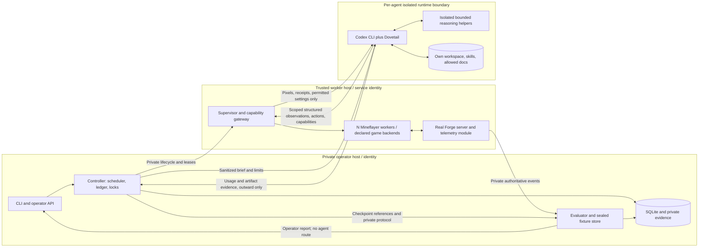
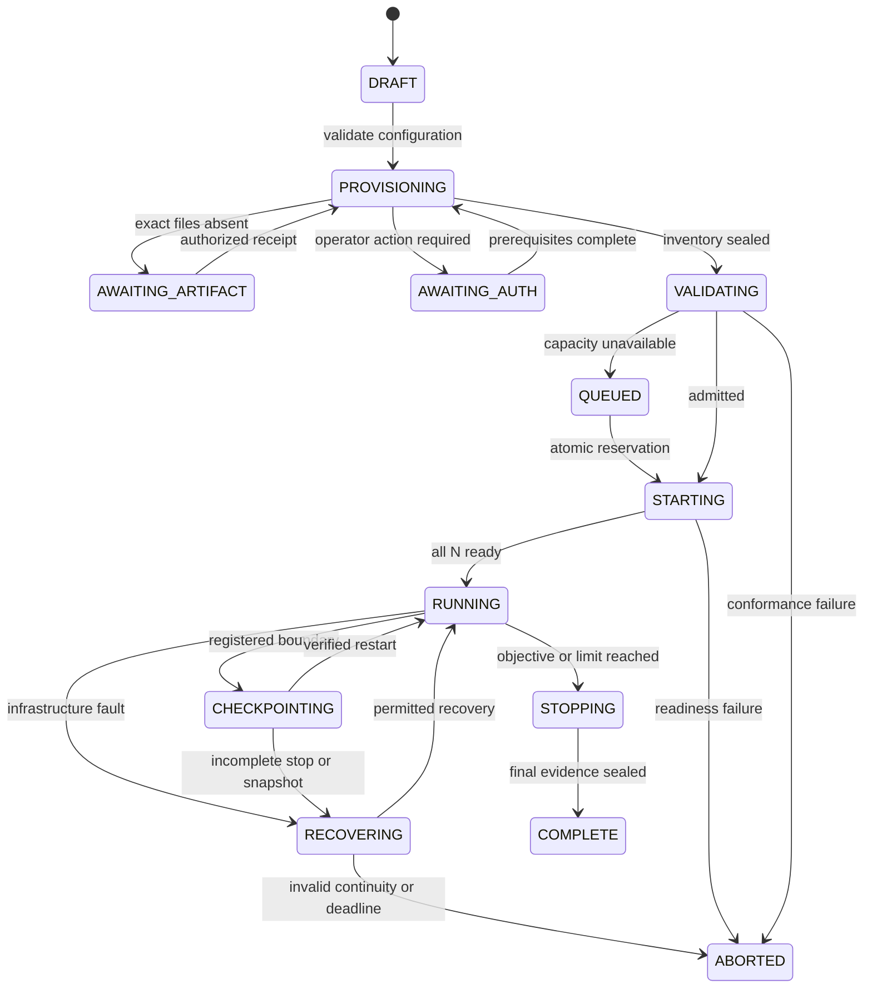
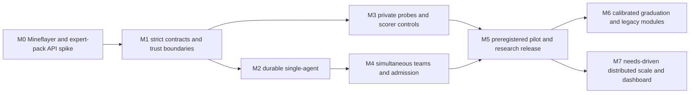

# Strata: Minecraft adaptation benchmark meta-harness

**Project:** Strata. **Repository:** [OpenCnid/strata-bench](https://github.com/OpenCnid/strata-bench).

**Specification version:** 0.2.86, target contract with partial implementation. **Written:** 2026-09-18. **Updated:** 2026-09-21 (client preparation admission). **Research baseline:** 2026-09-17; primary-source spot checks repeated 2026-09-18.

**Classification: operator/research only. Never mount this document, BUILD_PLAN.md, research/, or evaluator material into a gameplay agent.**

This document specifies the complete target system. Implementation began on 2026-09-18 and now includes partial Mineflayer and Forge development workers plus controller, contract, accounting, checkpoint and evaluator components; current implementation and verification are recorded in [MILESTONES.md](MILESTONES.md). No Minecraft installation, paid inference, game interaction, compatibility experiment, or benchmark run occurred during the initial design drafting. Subsequent authorized integration evidence includes a failed exact E9E Mineflayer handshake and partial vanilla/Forge checks; every aggregate acceptance gate remains **incomplete**, with exact results in the ledger. Local synthetic tests do not pass real integration gates. Example records are synthetic and cannot authorize execution.

## 1. Purpose, evidence conventions, and scope

Build a reproducible meta-harness for long, real-time Minecraft Java Edition playthroughs, including community expert modpacks, with configurable embodied teams using the user-selected **OpenCnid/dovetail-codex** native Codex plugin. Measure whether experience retained by a fixed experimental system improves later behavior, separately from progress caused by better equipment, changed terrain, more inference, or a newer model.

The deliverable is an integrated implementation and longitudinal protocol, not a claim to invent Minecraft adaptation, persistent skills, modded evaluation, or multi-agent play. Prior work already covers these ideas in different combinations. A bounded source review did not verify a turnkey implementation of all the requested properties.

**2026-09-18 decision D01 [U]:** the user selected Mineflayer for character control and as the first backend. This supersedes the v0.1 screenshot-first default. The primary track is now `structured-actions/v1`; full-client input remains an explicit extension/reference. CurseForge + Forge, expert-pack support, the keybinding skill, Dovetail, and private adaptation evaluation remain in scope. No implementation or compatibility pass is implied.

**2026-09-18 decision D02 [D, user steering]:** direct Codex CLI integration is the default. Codex uses its native command tool to invoke a small `mcgame` client, which sends typed requests to a persistent Mineflayer worker over scoped local IPC and prints JSON. MCP is optional. Start host automation with pinned `codex exec --json` and tested session resume/fresh handoff; app-server is an optional lifecycle adapter, independent of game transport.

### 1.1 Reading conventions

**2026-09-18 decision D03 [U]:** the user named the project Strata, selected `strata-bench` as the repository name, and authorized a public GitHub repository. This design document is public operator material; runtime exclusion from gameplay-agent input remains required. Credentials, private evaluator instances, sealed fixtures and run data are not authorized for public storage. Public design availability is not a claim that models cannot infer the research objective or encounter it in pretraining.

- **[U] User requirement:** binding scope: real Minecraft Java servers, Mineflayer as the first character-control backend, arbitrary positive configured N, selected Codex port including self-play, hidden research objective, CurseForge + Forge, expert packs, persistent keybinding repair, historical comparison and graduation.
- **[F] Sourced fact:** supported by the linked primary material, at the stated revision/date. A project's feature claim is attributed, not independently validated.
- **[D] Design decision:** this specification's default, including all numeric limits and statistical thresholds unless otherwise stated. These are proposed engineering/research choices, not empirical findings.
- **[G] Verification gate:** a condition requiring actual installation, protocol inspection, testing, account access, or measured capacity. Unpassed gates cannot be relabeled as support.

MUST requirements have IDs, owners, and observable tests in Section 3. Normative details in later sections inherit their listed requirement IDs and owners; the final traceability table closes the mapping. P0 means required before the relevant MVP release gate, not that all work happens in the first spike. P1 means the next research release; P2 is later extension work. A change to a default is a versioned protocol/configuration change, never an undocumented operator choice mid-run.

### 1.2 Users and hypotheses

Researchers preregister cohorts and analyze retained-experience effects. Operators acquire packs, reserve resources/accounts, and diagnose failures. Agent engineers implement the Codex/plugin seam and control clients. Pack integrators establish version-specific recipes, GUI coverage, saves, and authoritative predicates. Auditors reconstruct claims from locks, raw events, accounting, and sealed protocol commitments.

Preregister these falsifiable hypotheses before confirmatory evaluation:

1. **H1, primary:** at the final fixed exposure, retained campaign artifacts improve held-out success over initial artifacts, under matched model, fresh conversations, starting world, equipment, keymap, tools, and probe budgets.
2. **H2, mechanism controls:** persistence of notes, procedural skills, and permitted self-play each changes held-out performance under matched opportunity budgets. These interventions identify effects of configurations, not a unique internal cognitive mechanism.
3. **H3, retention/transfer:** retained experience remains useful on earlier families and transfers to fresh target-pack worlds without unacceptable retention loss.
4. **H4, coordination:** N-player teams improve outcomes or efficiency at fixed aggregate resources. A separate fixed-per-agent condition measures scaling with additional resources.
5. **H5, model generations:** new systems outperform earlier systems on frozen anchors and reach harder calibrated tiers. This is distinct from H1 learning within a fixed system.

Null/negative findings, inability to reach prerequisites, and initial ceiling performance are legitimate results. No completion or improvement is assumed.

### 1.3 Scope and non-goals

MVP: current Windows development environment; Mineflayer protocol clients against vanilla 1.19.2 first and one locked E9E/Forge server after conformance; structured observations and bounded actions; native Codex plus the selected plugin; isolated agent state; private telemetry; a capability-gated keybinding skill/extension; one durable controller; long-horizon recovery; simultaneous teams when admitted; matched held-out evaluation and an auditable pilot/report. Vanilla backend success alone does not satisfy the modded MVP.

Later: E6E and E2E compatibility modules, additional packs, distributed scheduling/storage, optional dashboard, separately labeled pixel and expanded-assistance conditions, optional mechanic interventions and budgeted practice worlds. A structured Forge client bridge is the fallback candidate if Mineflayer cannot pass a mandatory expert-pack mechanic; introducing it requires a recorded backend/system identity and its own conformance, never an invisible in-run switch.

Not in scope: building this system during specification, installing games now, weight training, promising pack completion, unrestricted compatibility, a universal launcher CLI, bypassing distribution/authentication, perfect secrecy of the model's beliefs, deterministic modded replay, or comparing unlike action tracks as if equivalent.

### 1.4 Definitions

| Term | Operational definition |
|---|---|
| Experimental system | Immutable hash of model/provider identity policy, inference settings, runtime binary/schema, Dovetail commit, initial skills/prompts, tool/capability profile, learning/context policy, and information policy. Learned revisions are descendants, not changes to this initial identity. |
| Cohort | Independent lineages assigned the same system, pack/protocol version, and treatment. Immutable model identity is required for unqualified fixed-model claims. |
| Lineage | One independent learning history, including its ordered campaigns, permitted artifacts, costs, and ancestry. A shared team has one statistical lineage even with N memories. |
| Campaign | One roster of N concurrent avatars in one persistent world under one lock and protocol, from admission through completion/abort. A cross-pack lineage starts a new campaign in a fresh world. |
| Replica | An independent campaign/lineage sample. Replicas have separate worlds, memories, credentials/capabilities, and randomization. R replicas do not mean R avatars in one team. |
| Episode | A declared contiguous gameplay segment within a campaign, default one active hour. It marks context/persistence boundaries, not an automatic world reset. |
| Exposure | Acquired campaign experience measured on several clocks: active campaign wall time, actual server/avatar ticks, actions, and inference consumption. Probe work is excluded from training exposure but included in total cost. |
| Probe | A held-out, resource-matched evaluation execution cloned from a checkpoint into disposable processes/worlds. Each arm gets its own copy of the same fixture. |
| N | Positive integer of embodied players in a campaign. Each has a distinct Minecraft player identity, isolated backend worker (initially a Mineflayer client), Codex runtime, and selected plugin. Rendering is not required for Mineflayer. No small hard-coded roster limit; physical admission limits apply. |
| Helper | A bounded reasoning delegate or self-play evaluator owned by an embodied agent. It has no avatar/action lease by default. It is neither a teammate nor an independent sample. |
| Self-play | Isolated reasoning/evaluation of the agent's own plans, procedures, and development cases. It is not inherently PvP, extra avatars, or model weight training. |
| Adaptation | Improved behavior attributable to retained experience for a fixed system, estimated with controlled probes. Campaign progress alone is not adaptation. |
| Graduation | A versioned, independently confirmed promotion to a harder calibrated task tier. Pack edition numbers are compatibility families, not ranks. |
| Epoch | Monotonic control-generation number fencing stale leases/input after a reset, restore, or ownership change. It never decreases, even when game state rolls back. |

## 2. Prior art and compatibility evidence

Links in this table are primary sources. Entries were opened during the 2026-09-18 spot check unless identified as carried-forward research. Source availability and metadata establish neither successful installation nor comparable affordances.

| Source | [F] Established or author-reported evidence | Consequence / [G] limit |
|---|---|---|
| [MineRL](https://github.com/minerllabs/minerl), [MineDojo](https://docs.minedojo.org/), [MineStudio](https://github.com/CraftJarvis/MineStudio) | Minecraft agent/task infrastructure; MineStudio builds on MineRL. | Borrow dataset/task conventions. Instrumented environments and support mods are not proof of arbitrary expert-pack support. |
| [Voyager paper](https://arxiv.org/abs/2305.16291), [repository](https://github.com/MineDojo/Voyager) | Automatic curriculum, executable skills, transfer; documented Mineflayer integration. | Prior ideas are not novel here. Its structured-action approach informs our primary track; action and information policies must still be matched. |
| [Mindcraft](https://github.com/mindcraft-bots/mindcraft), [MineCollab](https://github.com/mindcraft-bots/mindcraft/blob/develop/minecollab.md) | Mineflayer-based LLM agents, task execution, cooperative benchmarks and evaluation logging. | Main harness reference; the [FAQ](https://github.com/mindcraft-bots/mindcraft/blob/develop/FAQ.md) excludes mechanics-changing mods. Reuse needs pinned source/license review and our private evaluator separation. |
| [Mineflayer](https://github.com/PrismarineJS/mineflayer), [pathfinder](https://github.com/PrismarineJS/mineflayer-pathfinder), [Minecraft MCP Server](https://github.com/yuniko-software/minecraft-mcp-server) | Structured bot APIs, local pathfinding, and an existing MCP facade. | First backend and adapter references; neither the MCP facade nor Forge handshake support proves expert-pack operation. |
| [Forge protocol plugin](https://github.com/PrismarineJS/node-minecraft-protocol-forge) | Forge/FML negotiation support is documented. | Validate exact loader handshake, registry decoding, custom channels, altered recipes and machines independently. No turnkey E9E support is assumed. |
| [MineLand](https://github.com/cocacola-lab/MineLand), [TeamCraft](https://teamcraft-bench.github.io/) | Multi-agent precedents; MineLand's repository says it was archived June 4, 2026. | Published agent counts do not establish capacity for N Mineflayer workers or optional rendered E9E clients. |
| [MirrorCraft](https://arxiv.org/html/2607.29218v1) | Matched standard/hidden-rule worlds measure intervention effects. | Changed-rule outcomes alone do not isolate learning after experience. |
| [PAL paper](https://arxiv.org/abs/2301.11891), [Polycraft/PAL source](https://github.com/StephenGss/PAL) | Modded agent evaluation, task mutation and novelty trials. | No claim of first modded or adaptation benchmark. |
| [MineMind](https://github.com/Boyan253/minemind) | Authors describe Reclamation/Forge 1.20.1 testing, quest/recipe access and a server companion, with incomplete general-pack/machine/reward support. | Implementation lead; E9E compatibility is not established. |
| [Enigmatica installation](https://wiki.enigmatica.net/main/help-desk/guides/installation), [server guide](https://wiki.enigmatica.net/main/help-desk/guides/server-installation) | Launcher acquisition and release-specific loader/server startup are separate concerns. | Official CurseForge acquisition and pack-supplied Forge distribution remain the MVP path. |
| [E9E client 8161120](https://www.curseforge.com/minecraft/modpacks/enigmatica9expert/files/8161120), [server 8161123](https://www.curseforge.com/minecraft/modpacks/enigmatica9expert/files/8161123) | Published 1.27.0 candidate, Minecraft 1.19.2/Forge. | Archive contents, resolved dependencies, JVM and installed compatibility remain untested. This is a candidate, not a sealed lock or a commitment to “latest.” |
| [E9 tagged instance metadata](https://github.com/EnigmaticaModpacks/Enigmatica9/blob/d6bed3a552de25b3bc211856fcd276fbb35d1c43/minecraftinstance.json), [tagged server setup](https://github.com/EnigmaticaModpacks/Enigmatica9/blob/d6bed3a552de25b3bc211856fcd276fbb35d1c43/server_files_expert/server-setup-config.yaml) | Inspected source metadata names Forge 43.4.23; server setup references E9E 1.26.0. | Inspect the **distributed** 1.27.0 server archive and resulting inventory. Do not synthesize a release from a source tag or silently accept the older reference. |
| [E9 packmode source](https://github.com/EnigmaticaModpacks/Enigmatica9/blob/d6bed3a552de25b3bc211856fcd276fbb35d1c43/kubejs/startup_scripts/packmode.js) | Startup mode logic includes a normal-mode default. | Assert effective expert configuration plus recipes/quests after cold start; a filename/title is insufficient. |
| [CurseForge REST API](https://docs.curseforge.com/rest-api/), [download-auth announcement](https://blog.curseforge.com/introducing-api-key-authentication-for-curseforge-file-downloads/) | Documented API/file metadata and evolving download access requirements. | No universal unattended CLI/download path is assumed. Recheck policy and actual bootstrap behavior; missing artifacts become typed provisioning states. |
| [GLFW input guide](https://www.glfw.org/docs/latest/input_guide.html), [Forge 1.19 key mappings](https://docs.minecraftforge.net/en/1.19.x/misc/keymappings/), [LWJGL2 Windows mapping source](https://github.com/LWJGL/lwjgl/blob/master/src/java/org/lwjgl/opengl/WindowsKeycodes.java) | Text characters and physical key events differ; contexts/modifiers and backend mappings matter. | Unicode is not an unlimited gameplay-key namespace. Discover and verify a usable key pool for each exact backend. |
| [Pinned Dovetail manifest](https://github.com/OpenCnid/dovetail-codex/blob/15c306ccfef28eb5f616fadcd5fd8eac0663e361/.codex-plugin/plugin.json), [self-play](https://github.com/OpenCnid/dovetail-codex/blob/15c306ccfef28eb5f616fadcd5fd8eac0663e361/skills/self-play/SKILL.md), [surface map](https://github.com/OpenCnid/dovetail-codex/blob/15c306ccfef28eb5f616fadcd5fd8eac0663e361/docs/codex-surface-map.md) | Commit 15c306ccfef28eb5f616fadcd5fd8eac0663e361 declares plugin 0.4.1 and native skills. Self-play distinguishes conversational and filesystem isolation. | Use this Codex port, not an older sibling checkout, generic port, or invented Dovetail runtime SDK. Worker/tool integration remains a gate. |
| [Codex app-server](https://learn.chatgpt.com/docs/app-server), [exec JSONL](https://learn.chatgpt.com/docs/non-interactive-mode) | Documented stdio initialization, thread/turn operations and generated version-specific schemas; exec emits JSONL. Local read-only help: CLI 0.154.0-alpha.6.2, app-server/schema tooling labeled experimental. | Pin and validate the binary/protocol; Desktop tool availability and full usage/resume coverage are not established by documentation. |

Carried-forward family facts: E6E targets 1.16.5 and E2E 1.12.2, per [E6E](https://www.curseforge.com/minecraft/modpacks/enigmatica6expert) and [E2E](https://www.curseforge.com/minecraft/modpacks/enigmatica2expert). Revalidate their exact releases/toolchains when implementing them. The [Enigmatica Java guide](https://wiki.enigmatica.net/main/help-desk/guides/java) failed the current web fetch; Java 17 for 1.19.2 and Java 8 candidates for the older families remain research-backed starting points requiring release-specific verification. No installed compatibility row is green.

## 3. Requirements and accountable owners

Owner roles: **PL** platform lead/controller; **GI** game/pack integration; **AR** agent-runtime lead; **RS** research/statistics; **SI** security/integrity; **QA** reliability/validation. A role can be held by one engineer, but each requirement has one accountable owner. Test IDs are defined in Section 16.

| ID | Priority | Requirement | Owner | Acceptance evidence |
|---|---|---|---|---|
| F01 | P0 | MUST run authentic Minecraft Java servers with Mineflayer as the first character-control backend; vanilla plus one E9E expert release remain initial targets. | GI | T02/T03: locks, expert assertions, structured vanilla/modded interaction and server events; joining alone cannot pass. |
| F02 | P0 | MUST accept any representable positive integer N, reserve all N simultaneous bodies, and queue/reject the entire campaign when unavailable. | PL | T01/T09: positive-N validation, N=1/2/4 evidence or explicit capacity failures; no roster reduction. |
| F03 | P0 | MUST give every body the pinned native dovetail-codex plugin and account for bounded helpers/self-play separately. | AR | T04/T12: skill load/use, helper isolation and reconciled nested usage. |
| F04 | P0 | MUST hide research objectives, evaluation criteria and holdouts through actual capability isolation. | SI | T06: filesystem/process/network/tool/log leakage attempts fail. |
| F05 | P0 | MUST use official CurseForge acquisition and the pack's Forge/server distribution, with exact provenance and explicit missing-artifact states. | GI | T02: clean install inventory; restricted/missing artifacts block sealing. |
| F06 | P0 | MUST expose bounded structured observations/actions through a versioned backend contract and retain a capability-gated, tested keybinding skill for supported mod-control extensions. | GI | T03/T05: action/state correctness, deadlines/cancellation, unsupported-capability rejection; real conflict repair and persistence on a keybinding-capable backend before the full MVP. |
| F07 | P0 | MUST define and enforce information, communication, learned-artifact and context policies per system/arm. | AR | T04/T06/T11: allowed corpus only, scoped messages, correct retained state. |
| F08 | P0 | MUST keep persistent campaigns separate from disposable, matched, one-way held-out probes. | RS | T11: clone manifest diff contains only allowed artifacts; probe canary cannot return. |
| F09 | P0 | MUST implement leases, lifecycle state, fenced input, consistent checkpoint sets and classified recovery. | PL | T07/T08: transition journals, fault injection, restore equivalence. |
| F10 | P0 | MUST score from authoritative evidence and preserve positive/negative control results. | RS | T10/T13: false-positive controls fail, valid alternatives pass, deterministic report reconstruction. |
| F11 | P0 | MUST charge all model/helper/retry/practice activity and enforce team, agent and evaluation budgets. | PL | T12: duplicate ingestion deduplicates; repeated actual calls still charge. |
| F12 | P0 | MUST distinguish fixed-model experience from new-generation improvements and quarantine identity drift. | RS | T14: alias/reroute simulation splits or invalidates the affected segment. |
| F13 | P0 | MUST export reproducible evidence, censoring, uncertainty, interventions and supported comparison limits. | RS | T13/T15: frozen report code consumes raw evidence and includes all assigned samples. |
| F14 | P1 | MUST implement calibrated graduation/retention and frozen historical anchors before promotion claims. | RS | T16: decision reproduces from preregistration and independent confirmation. |
| F15 | P1 | MUST require separate conformance for each later pack/version module, transferring artifacts to fresh worlds. | GI | T17: module-specific install/input/save/scoring tests; incompatible saves rejected. |
| F16 | P0 | MUST expose typed lifecycle, acquisition, capability, game, settings, telemetry, communication, artifact and private evaluation contracts. | PL | T01: schema/API conformance, auth, deadline and error tests. |
| N01 | P0 | MUST fail closed on unknown required capabilities, schemas, unresolved locks, or isolation/accounting gaps. | PL | T01/T04/T06: deliberate omissions stop preflight. |
| N02 | P0 | MUST preserve exactly one avatar executor and at-most-once dispatch intent; ambiguous physical effects require resynchronization. | GI | T07: lost-ack/crash tests show no blind input replay. |
| N03 | P0 | MUST maintain real-time clocks and performance evidence, including thinking latency and summed avatar exposure. | QA | T08/T09/T12: wall/tick/TPS/event-loop/lag/usage series (FPS only when rendering) and excluded intervals reconcile. |
| N04 | P0 | MUST protect credentials, private records and immutable initial artifacts from agent code and extensions. | SI | T06: cross-identity access and indirect tool escape tests. |
| N05 | P0 | MUST stop safely on resource exhaustion and retain all faults/costs without turning gameplay failure into infrastructure recovery. | QA | T07/T08/T12: exhaustion, death and stalled-progress classifications. |
| N06 | P0 | MUST pin dependencies and experiment definitions and support audit replay without claiming deterministic gameplay replay. | PL | T01/T13: hash mismatch rejected; report rebuilt from recorded events. |
| N07 | P0 | MUST meet declared operating-envelope targets before admitting confirmatory runs. | QA | T08/T09: staged soaks and measured capacity certificate. |
| N08 | P0 | MUST keep storage durable, bounded and privacy-aware, with no silent deletion of required evidence. | PL | T07/T13: disk fault, retention/tombstone and restore checks. |

## 4. Architectural decisions and deployment

All rows are [D]. The selected launcher/port remain [U].

| ADR | Decision and rationale | Rejected/default alternative and tradeoff |
|---|---|---|
| A01 | Mineflayer first [U], primary `structured-actions/v1`; one Node.js/TypeScript worker per avatar behind the scoped local game CLI. Structured state and local motor/pathfinding execution avoid mandatory screenshot inference. | Replaces the v0.1 pixel-first default (D01). Forge client bridges and `pixels-input-settings/v1` / `pixels-os/v1` remain explicit extensions/reference conditions. No automatic backend switch or score pooling. |
| A02 | One controller with SQLite WAL, one worker supervisor per execution host, separate agent and evaluator security principals. | No broker/microservice mesh initially. Isolation boundaries are required; separate independently deployed business services are not. |
| A03 | Python 3.12, asyncio, Pydantic 2, Typer; FastAPI for operator/worker transport. Node.js active LTS + TypeScript for Mineflayer and selected plugins. Java/Gradle for private Forge telemetry and optional client extensions. | Exact compatible Node/package/JVM patches are implementation locks. Keep research orchestration independent of game/loader versions. |
| A04 | Native Codex CLI loop with pinned `codex exec --json` for supervised execution; local `mcgame` commands expose game actions and JSON state. Dovetail remains the native plugin. | MCP is an optional facade and app-server an optional lifecycle adapter; neither is required to move a character. No custom model reasoning loop or invented Dovetail SDK. CLI helper/accounting/resume behavior still needs conformance. |
| A05 | Per-agent isolated runtime and backend worker; evaluator owned separately. Windows first; Mineflayer is headless and needs no per-avatar display. | Account/process/network isolation still applies. Optional rendered adapters require independent input/display routing and separately measured resources. |
| A06 | Immutable local content-addressed evidence plus append-only JSONL; derived Parquet/DuckDB analysis; bounded FFmpeg recordings. | PostgreSQL/object storage follow demonstrated multi-controller/storage needs. Raw events remain the audit source, not mutable dashboard rows. |
| A07 | Natural pack rules, bounded structured player/world/container state and pinned allowed documentation. Probes match backend, action/observation policy, learned-map reset and applicable keymaps. | Secret mechanic changes, open web, expanded world/recipe access and learned-keymap advantage are separate registered conditions. |
| A08 | Clean-stop snapshots first; never copy live saves and call them consistent. | Live snapshot orchestration is deferred until each pack's asynchronous data writers are understood. Clean stops cost downtime, reported explicitly. |
| A09 | Helpers and notes/procedural skills enabled; extra practice worlds disabled by default. | Practice branches materially expand game compute and leakage risks. Later enable them only with explicit quotas and provenance. |
| A10 | Fixed exposure confirmatory cohorts; adaptive curriculum only on development data; anchors retained across releases. | Comparing only graduates or moving to harder packs without anchors creates selection and measurement confounding. |

### 4.1 Process, host and trust boundaries



Roles may share physical hardware at N=1, but they do not share privileges. Use an isolated agent execution identity whose game access is only the gateway. Workers own game/backend installation, account credentials, process handles and protocol connections. Agent-authored code cannot access the raw Mineflayer bot, protocol socket, client/server filesystem, process memory or arbitrary ports. The gateway filters client-received state according to Section 8; possessing a full chunk packet does not make all its contents agent-visible. Network policy allows the gateway and controlled inference, and denies evaluator/admin services, sibling workers, arbitrary loopback and metadata endpoints. No arbitrary URL, path, JavaScript eval or protocol-packet proxy is exposed.

The operator controller alone has scheduler and account-secret references. Evaluator telemetry endpoints require a separate identity unavailable to clients/agents; server telemetry is not broadcast as custom payloads to players. The evaluator's fixture administration is permitted only before probe start or during registered infrastructure stops. Server console/admin credentials never enter runtime processes. Authentication remains enabled for real player identities; agent avatars receive no operator permissions.

Codex's own sandbox is defense in depth, not the whole boundary. Provider authentication needs a host-supported broker or a service identity protected from model-executed code and child processes. If the pinned host cannot separate provider credentials from arbitrary code tools, restrict those tools or use an external execution service; this changes the declared capability manifest and requires conformance. Never claim isolation merely because paths are absent from a prompt.

The purpose is benchmark validity and protection of private state, not a requirement to obtain a VM. Engineer the smallest enforceable boundary on available hardware and qualify it against these access rules, including native helpers. A separate desktop addresses input routing only. Failed boundary qualification prevents affected agent runs and integrity claims; it does not prohibit independent implementation or explicitly labeled operator-controlled development diagnostics. D11 clarifies the initial budget in Section 15; the [continuation contract](docs/operations/validation-admission.md) identifies the unimplemented policy migration without waiving these gates.

| Data | Agent visibility | Private ownership and rule |
|---|---|---|
| Sanitized gameplay brief, scoped structured observations, own action acknowledgments | Yes | AR/GI; optional images only by capability; no scoring/objective/holdout labels. |
| Controls-equivalent binding IDs/values and tested key pool | Only with declared keybinding capability | GI; stock Mineflayer returns unsupported; no arbitrary mod-object access. |
| Own notes, learned skills, own sent/received team messages | Yes | AR; no implicit sibling filesystem sharing. |
| Pinned permitted pack documentation | Yes, read-only corpus | AR; no benchmark research, sealed fixture text or evaluator sources. |
| Runtime usage/status and remaining own allowance | Sanitized balance only | PL; full treatment/cohort ledger remains private. |
| PackLock, full CampaignConfig/AgentConfig, process paths and account mapping | No direct mount | PL/GI; explicit allowlisted projections only. |
| Server saves, other players' private state, authoritative evaluator GameEvents | No access | GI/RS; own coordinates/inventory and scoped client-observed state are allowed through the independent gameplay projection. |
| EvaluationProtocol/Result, fixture seeds, weights, anchor selection, promotion data | Never during gameplay | RS/SI; separate store, endpoints and encryption/access keys. |
| Other lineages, probe memories/transcripts, operator reports/spec/research | Never | SI; export only after runs under a publication policy. |

**Shared-desktop availability and unattended qualification (operator implementation).** Routine action outcomes use scoped observations and independent server evidence. The operator's working desktop must remain usable; lengthy graphical/physical-input qualification requires separate execution, not repeated shared-desktop takeover. Candidate launch policy `windows-noninput-desktop-suspended-job/1` creates a fresh non-input Win32 desktop, starts an operator-authorized child suspended with an exact environment and no inherited handles, assigns a no-breakaway kill-on-close Job Object before resuming, and enforces a bounded wall lifetime. Never switch the input desktop or inject input through this launcher. Stop the owned tree if its desktop becomes input, observation fails or the deadline expires; cleanup/owner-crash termination is not a clean game checkpoint. Desktop and Job Object separation alone do not establish filesystem/process/network/credential isolation against same-user code, nor native keybinding parity. The disposable hidden-window/OpenGL probe is prerequisite evidence only. Actual dedicated Minecraft launch/authentication, game-only visual evidence, guarded API operation, input/focus/rendering semantics and all existing isolation/resource/native gates remain required before unattended campaign admission. This work changes the operator execution path; gameplay affordances, physical-key acceptance cases, scientific controls and release thresholds remain unchanged.

The operator development wrapper `noninput-java-independent-challenge-lifetime/1` connects that launch primitive to the independent Java guardian. The caller must service fresh challenges; a blocked caller cannot renew a lease. Private bounded durable launch records exclude arguments, environment and challenge nonces. Typed guardian failures retain their bounded reason without exporting exception text or implying confirmed termination. Startup uses the exact installed official game/Forge artifacts and reviewed version-metadata arguments in a dedicated client copy; label this direct JVM bootstrap separately from launching through the official launcher UI, while preserving official acquisition/provenance. Cached authenticated session arguments remain in protected operator storage and are retired after use. A title-screen read-only API check and confirmed forced process termination establish only startup/lifetime evidence, not native frame correctness, world interaction, physical input, clean checkpoints, the Forge-aware worker's complete health contract, or production isolation. Keep all those gates open.

The native 1.19.2 `--server`/`--port` connection path skips title-screen installation. The private bridge may initialize after loading at a disconnected title screen or after same-connection tag and recipe synchronization followed by an unobstructed world RenderTick.END; it does not initiate connection itself. Readiness policy `same-connection-tags-recipes-later-world-render/1` accepts only client-thread client-packet tag events with the current listener's exact registry object and recipe events with its exact recipe-manager object. The completed render and next tick must have the same complete player/level/listener tuple and no screen, overlay or disabled rendering. Earlier frames, partial bodies and old connections cannot establish readiness. Disconnection clears synchronization; replacing a player or level requires a new frame. After admission ordinary menus do not revoke the body merely by obscuring the world. Further tag/recipe events invalidate admission until another unobstructed frame; this is an initial synchronization barrier, not an atomic datapack-reload protocol or proof that all later mod work has finished. Identity and observations reject `GAME_INITIAL_SYNC_PENDING` while the connected body is unqualified, including joins after a title-screen bridge was installed. No action/watchdog deadline is extended. This barrier is not a graphics-state, latency or physical-input certificate. Private endpoint policy `server-metadata-or-resolved-tcp/1` preserves existing menu-joined body identities and uses the numeric resolved TCP peer/port when native startup supplies no saved-server entry. Never invent metadata or resolve a guessed hostname for this fallback. Missing/unresolved/non-TCP peers, invalid ports and corrupt metadata reject. The endpoint and player UUID remain private identity inputs. Pin dedicated-copy settings, including any pause-on-focus-loss adjustment, and retain full native input/focus, worker/guardian, server-reference and isolation gates before campaigns.

Operator native-client startup must reserve sufficient authenticated session lifetime for setup and the bounded client run, then recheck that lifetime immediately before launch. An optional minimum-lifetime policy in the trusted authentication seam suppresses only a near-expiry Minecraft access token from the pinned provider's cache view, allowing its ordinary refresh path without deleting Microsoft/Xbox caches. Recheck the returned token after provider work; unknown/malformed expiry or insufficient lifetime rejects without launching. Decoded JWT expiry restricts reuse; it does not verify a signature, authenticate an account or replace the profile/certificate/account-binding checks. Keep tokens and substituted arguments private; record only bounded expiry/timing evidence. The ordinary vanilla authentication path and all credential-isolation/expiry-recovery gates remain separate.

The Java guardian confirms stop only after the held root signals, the held Windows Job reports zero active processes, and every process in its cumulative accounting has a signaled observation handle. Zero active accounting alone is insufficient. Retain only membership-verified read-only handles from that job, beginning at attachment and updating during the guard loop and before termination; do not terminate rediscovered PIDs. The bounded inventory holds at most 256 lifetime handles. Missing members, truncated inventories, quota exhaustion or query failure leave termination unconfirmed, including a short-lived process that escaped observation; this is a fail-closed development limit, not a full lifetime qualification. The root wait and subsequent accounting/handle checks share one unchanged 500 ms bound starting at the root wait; no retry or new descendant allowance is introduced. Remaining or unsignaled processes, or proof obtained after the deadline, cannot pass. This does not enroll descendants created before attachment or qualify the launch gap. The Forge-aware guardian retains private diagnostics under `job-call-wait-tree-qpc/2`, extending historical `job-call-wait-qpc/1`: a QPC start timestamp, clock resolution, relative job-call/wait/tree-check boundaries, active/total/held/signaled process counts, the unchanged wait bound and distinct job/wait/tree outcomes. Queue evidence only after guardian handle cleanup; evidence backpressure must not delay termination. These process-local timestamps include scheduling/Python call overhead and are not kernel-internal events. The broker rejects malformed, contradictory or duplicate timing records and requires timely complete handle/accounting evidence plus a separate confirmed-stop receipt. Timing cannot establish input release, clean checkpoints or successful termination by itself; a timed-out wait remains a failure despite later process absence. Private diagnostics and source fingerprints change without adding gameplay capabilities or extending lease, action or stop deadlines. The base guardian wire format remains unchanged.

Private resource observation uses an independently owned, identity-verified read-only process handle and a separate sampler thread, never the guardian stop path. `PrivateProcessResources/2` records CPU/I/O, handle/memory counters and aggregate region metadata without memory contents, mapped names, environment or process mutation. Sample at most once per second with a 25-ms query budget checked between native calls; a single kernel call cannot be preempted and measured overruns remain explicit. Continue an incomplete region census from its cursor with at most 8,192 total regions, eight segments and eight seconds. Record its entire non-atomic interval; never treat a census spanning teardown as instantaneous pre-stop memory. API failure, exit, quota or expiry preserve partial evidence. Keep terminal counters distinct from live allocations. Bound observer lifetime to 480 seconds, samples to 512 and private journals to fixed byte quotas. Resource sampling cannot block independent exit waiting; two-second observer finalization happens after stop and a timeout stays failed after late completion. Lifecycle completion does not certify counter/census completeness. No observation can extend the unchanged 500-ms guardian bound, add gameplay capabilities or waive failed evidence. [Implementation and native synthetic verification](docs/verification/2026-09-21-process-resources.md).

The development worker uses private startup policy `child-bootstrap-initialization-heartbeat2250/1`. Fork an executor without configuration, token or avatar authority, and require its actual post-import bootstrap message within 2,250 ms. Only then attach the Forge guardian, retaining the independently bounded launch owner's responsibility before attachment. The child emits 100 ms event-loop pulses while awaiting configuration and initializing; these are not body-readiness or gameplay-health claims. Guardian renewal still requires a child message no older than 200 ms and the guardian's independent native identity/health checks. After validated guardian binding, configuration starts a separate fixed 2,250 ms initialization deadline; pulses cannot extend either startup deadline. The existing guardian setup/lease/stop bounds remain. Count bootstrap, guardian preparation and initialization inside the worker's overall wall budget. Publish a public game grant only after successful lane/server initialization, live guardian validation and the correctly ordered gateway-ready message. Reject unknown/extra-field/duplicate/out-of-order/late IPC; active health retains its own typed message and heartbeat-loss behavior. Record private phase/exit evidence without secrets, including failures before a gateway exists. Load only the explicitly selected backend's runtime dependencies; this is not automatic backend fallback. Hung/crashed/late startup, cleanup, authentic timing and full production isolation remain conformance gates.

## 5. Code organization and version policy

**Operator frame evidence.** Policy `private-main-target-pre-display-png4/1` is an optional private diagnostic, not a gameplay image affordance. An explicit startup property selects a new protected directory disjoint from the client profile. The exact Forge 1.19.2 runTick callsite before Window.updateDisplay captures the client's own main render target after its blit, using the native screenshot readback/PNG path. It does not capture OS windows, the compositor, hardware cursor or any drawing outside that render target; full visual/physical parity remains a separate gate. Restore the prior texture binding and pack alignment; reject unsupported PBO/row-layout state, mismatched texture size or disabled rendering. No screenshot keypress, chat notification, arbitrary path or gameplay command is added, and public screenshots:false remains.

The private session/request/intent/frame/failure records have explicit versioned identities and remain operator-only. Each process session lasts at most ten minutes and permits at most four PNGs, at least one second apart, each at most 1920×1080 and 12 MiB. Requests are bounded to 4 KiB and specify exact session, next sequence, expected screen class and an expiry at most ten seconds away; enforce both UTC and converted monotonic deadlines. Write durable intent before readback; publish a receipt only after bounded PNG output and deadline checks. Preserve partial files, reject a reused directory, stop capture on any failure and never replay it within the failed session. Record native clock/frame counter, dimensions, screen/world context, source JAR hash, PNG hash and capture elapsed time; include its overhead/intervention in any run accounting. Independent decoding and visual/reference inspection must qualify actual frame content; a success receipt is not sufficient. Current startup/isolated-image evidence does not admit a campaign or establish private-evaluator/credential/process/network isolation.

Responsibility: PL (F16/N06), GI (F01/F05/F06), AR (F03/F07), SI (F04/N04).

Target layout; consult MILESTONES.md for the implemented subset and actual evidence:

```text
pyproject.toml, uv.lock                 # exact Python/dependency lock, hashes
src/mcbench/
  cli.py                               # proposed `mcbench` operator CLI
  contracts/                           # Pydantic models, exported JSON Schema 2020-12
  controller/{scheduler,state,leases,budgets,checkpoints}.py
  workers/{supervisor,processes,health,windows}.py
  packs/{base,curseforge,locks,vanilla,e9e}.py
  runtime/{base,codex_cli,exec_jobs,skills,context}.py  # app-server adapter optional
  gateway/{auth,capabilities,observations,actions,keybindings,messages}.py
  evidence/{journal,cas,retention,redaction}.py
  analysis/{estimands,censoring,reports}.py
  operator_api.py                      # private FastAPI service
schemas/v1/{public,operator,evaluator}/ # deployed separately by capability
backends/mineflayer/
  package.json, package-lock.json, tsconfig.json
  src/{worker,adapter,cli,observations,actions,navigation,events,capabilities}.ts
  tests/                               # game/API conformance and worker isolation
java/
  wire/                                # protocol types without game dependencies
  forge1192-client/                     # conditional structured/UI/keybinding extension; separately qualified
  forge1192-telemetry/                  # private server-side observation
  conformance/                         # instrumentation only in development fixtures
skills/minecraft-keybindings/          # SKILL.md, typed plans, safe adapter references
profiles/{system,pack_candidates,information}/
tests/{unit,contract,host,actions,pack,security,recovery,statistics}/
tools/{export_schemas,verify_lock,build_report}/
docs/{operations,capabilities,compatibility}/
```

Private evaluator implementation is built as a separate package/image from an operator-only source root: `mcbench_evaluator/{protocols,predicates,fixtures,runner,results}`. Sealed fixtures, keys and results never ship in agent distributions. Public test fixtures and protocol schemas can be released after their secrecy window; future sealed data remain separate. The repository root is an operator workspace, not an agent workspace.

Runtime data reside outside the checkout: controller database/journals; sealed installation templates; writable per-campaign game directories; per-agent runtime profiles; per-probe isolated roots; and distinct evaluator stores. A shared physical CAS is allowed only behind an authorization service; possession of a hash never grants read access. Agents cannot enumerate CAS contents. All agent path operations reject absolute paths, `..`, symlink/reparse escapes, alternate streams and cross-volume tricks.

Pin the Python and Node.js patch releases, TypeScript, Mineflayer, minecraft-protocol/data, pathfinder and every enabled plugin/transitive package, Java vendor/build/architecture, Gradle wrapper/distribution hash, Forge mappings/loader/installer, Codex binary/hash and generated schema, Dovetail commit/tree, local CLI/IPC implementation (MCP only when enabled), OS build and backend capability/policy manifests; FFmpeg, GPU driver and input/capture backend only when used in a system/environment lock. Use Java 17 as the initial 1.19.2 candidate; compile against the exact release toolchain after G0 validation. Older modules can require separate JDKs. No floating `latest`, automatic pack updates or package upgrades during a cohort. Schema major changes reject negotiation; backward-compatible additions require an advertised minor capability and conformance.

Initial deployment is one Windows controller with worker services and isolated runtime environments, local authenticated IPC and loopback-only HTTP where required. Remote services later use mTLS. Before automated campaigns, prove separate bot sockets/processes, action/state routing and account authentication; display/input routing is additional for rendered backends. Installer GUI steps may be operator-assisted and journaled; campaign play itself is autonomous. A CLI/static report suffices for MVP; a dashboard is not on the critical path.

## 6. Codex and Dovetail integration seam

Responsibility: AR (F03/F07), PL (F11/N01), SI (F04/N04). **Everything named `AgentRuntimeAdapter` below is a harness interface to implement, not an upstream Dovetail API.**

### 6.1 Host contract and negotiation

```text
AgentRuntimeAdapter
  inspect(RuntimeLock) -> RuntimeCapabilities
  start(AgentLaunchProjection, WorkspaceGrant, BudgetGrant) -> RuntimeHandle
  deliver(handle, GameplayMessage | ObservationRef) -> DeliveryReceipt
  events(handle, after_cursor) -> ordered stream<RuntimeEvent>
  interrupt(handle, reason, deadline) -> QuiescenceReceipt
  export_state(handle, boundary) -> RuntimeStateManifest
  resume(RuntimeStateManifest, new_epoch, grants) -> RuntimeHandle
  spawn_helper(handle, HelperContract, subreservation) -> HelperHandle
  stop(handle, deadline) -> StopReceipt
```

`RuntimeCapabilities` records schema digest, binary digest/version, plugin discovery/invocation proof, image delivery, scoped command execution, helper boundary type, all-call accounting coverage, interruption, resume mode and provider identity evidence. Required for the full default system: native plugin loaded, structured tool responses/events, tool allowlisting, clean helper contexts with enforced permitted files, nested usage attribution, cancellation, artifact checkpoint/restore, fresh-session startup, and restricted execution/egress. Optional: image delivery (required only for an image-enabled profile), exact conversation resume, streaming token estimates, provider immutable identity, live compaction notification. Optional identity affects scientific claim strength; it is not silently promoted to verified. Missing accounting or helper enforcement blocks this full-self-play system; a no-self-play control is an explicitly different configuration, not a fallback pass.

[F] The official [Codex CLI documentation](https://learn.chatgpt.com/docs/codex/cli) describes native command execution; [noninteractive mode](https://learn.chatgpt.com/docs/non-interactive-mode) documents `codex exec --json` and session resume. Local read-only `codex --help` / `codex exec --help` also expose exec, resume, JSONL and working-directory controls. This verifies command availability, not full Dovetail/helper/budget isolation. No paid agent job was run.

| Harness operation | First CLI mapping / optional alternative | Phase 0 evidence required |
|---|---|---|
| inspect/start | Launch the pinned `codex exec --json` process in an isolated agent profile/workspace; preserve Codex's native loop | Exact binary/config/event format, no inherited user integrations/private docs, plugin load and skill inventory. |
| deliver | Initial/follow-up ordinary gameplay prompt; game state returned by native command calls to `mcgame`; resume session or fresh handoff at declared boundaries | Structured output consumed correctly, state freshness and action effects; optional images tested only when enabled. No fabricated live-stdin prompt injection. |
| events | Parse exec JSONL plus separate durable gateway/action ledger | Observe commands, completion, root/descendant usage, ordering and failures. Pin the actual event schema; cumulative usage becomes deltas once. |
| interrupt | Revoke game lease and cancel worker actions immediately; interrupt/terminate CLI process under validated host procedure | Late command results cannot act; preserve unresolved billable calls and prove safe quiescence. |
| export/resume | Tested `codex exec resume` session persistence or controlled fresh CLI session with handoff | Restore exactly admitted session/files; no hidden in-flight work; correct resume_mode and fresh probe isolation. |
| helpers | Native collaboration where available/enforceable or separately isolated CLI jobs through a validated Dovetail-compatible helper seam | Actual helper capability, child file/tool boundaries and complete accounting. If unavailable, the full self-play configuration remains blocked. |

The game worker is a long-lived process: invoking `mcgame` does not launch another bot, reconnect or recreate game state. A CLI invocation sends one structured request and returns JSON; long actions return a request ID with explicit status/wait/cancel commands. Bound wait calls to 3 s by default; use recorded backoff/coalescing instead of busy polling. Within an episode, Codex can make many game commands in its native loop. Session supervision is separate from game transport.

The optional [app-server adapter](https://learn.chatgpt.com/docs/app-server) can later implement finer thread/turn streaming and interruption if CLI lifecycle limitations justify it. Its protocol must be generated from a pinned binary and separately tested. Optional MCP exposes the same authorized contracts; it adds tool discovery/portability, not necessary game control or an automatic security boundary. Neither extension changes the model's permitted game state/actions without a new profile.

The native shell-boundary failures motivate a candidate MCP broker profile, `native-stdio-projected-artifacts-executor-game/1`, under C36. Its owned stdio transport derives caller identity from pinned native metadata outside tool arguments. Operator-only enrollment binds explicit root/helper permissions and prior admission evidence; model-supplied identity, guessed namespaces and unregistered descendants are denied. The broker copies only admitted artifacts, preserves immutable initial skills, restricts helpers to their own result writes, and forwards the unchanged typed game request only for the designated executor. Source and actual-CLI/synthetic-worker evidence are [partial](docs/verification/2026-09-20-restricted-native-tools.md): configuration integrity, trusted live ingress, full tool/file/process/network conformance and actual skill/artifact/game integration remain required. This candidate does not waive the selected runtime, helper, executable-artifact or isolation requirements; app-server remains conditional.

The candidate's [participant admission](docs/verification/2026-09-20-native-admission.md) binds the root to independent native stdout, each exact request/reservation to the running frozen job, and each helper to a registered parent, bounded depth/capacity, clean initial context and finite nested budget envelope. Reject inherited history before forwarding. Native metadata alone is not authentication on an exposed endpoint; the protected ingress and native instruction projection remain qualification dependencies. Broker grants require durable per-call dispatch intent, expire with the job, and are revoked by ancestor/job termination, closed or uncertain budgets and exposure quarantine. Helper and root envelopes close only after exact participant/request inventory and settled usage are sealed behind dead processes and fenced ingress. Do not refund ambiguous requests, count envelopes as additional usage, or infer helper termination from a model message. Partial synthetic evidence does not qualify live credentials, lifecycle or the full boundary.

The candidate now also declares `native-job-http-header/1`: a native transport capability binds one job, pinned profile, loopback authority and exact request digest. Reject missing/duplicate/wrong credentials, stopped/revoked/expired jobs, changed profiles and unapproved routes before body capture; recheck durable authentication before child-envelope admission and per-call dispatch. Never journal credential values or replay an old intent. The operator-private capability depends on the qualified tool/bootstrap boundary and is not protection from arbitrary same-user code. Preserve independent native participant/context checks. [Source and actual CLI/synthetic-provider evidence](docs/verification/2026-09-20-native-ingress.md) are partial: upstream OAuth credential separation/transport, complete skill/artifact/helper integration and live qualification remain required.

The native OAuth transport candidate `native-chatgpt-fixed-https-responses/1` keeps login/refresh in the trusted native runtime and binds captured bearer/account headers to the authenticated job/profile/request. Preserve the bounded observed native protocol headers; reject unknown/duplicate/control/oversized metadata. Forward only to fixed verified HTTPS Responses/compact destinations, without redirects or internal retries. Reuse the existing per-request reserve/receipt/estimate path; failures retain unknown holds. Require expiring private profile/account-bound transport evidence with individual check references before live forwarding. A separately guarded fabricated-token/loopback adapter supplies [partial native evidence](docs/verification/2026-09-20-native-oauth-transport.md), never a live fallback. Gateway/lifetime wiring now has partial implementation evidence; actual TLS/account/usage/exposure and complete credential/tool/helper qualification remain required.

The gateway policy `native-budgeted-loopback-gateway/1` binds finite request/handler/time limits, price basis and exposure to the native profile. Authenticate before body capture, assign every distinct HTTP request its own operation, reserve before forwarding and enroll scoped tools only after durable intent. Revoke admission and cancel transports before releasing the listener; require native termination, fenced handlers and an exact durable request inventory for closure. Unknown usage retains holds. Never rebind a crashed job or invent its process fence. The optional `dovetail-eight-immutable-bodies/1` projection binds eight unchanged installed skill bodies to the sealed file hashes, preserving native invocation rules and exposing immutable broker paths to each admitted participant. Declare unavailable supporting-file/script/learned-activation capabilities; body access does not complete those required contracts. [Gateway and native skill-read evidence](docs/verification/2026-09-20-native-gateway.md) remains synthetic-provider evidence, with actual OAuth/game/private integration still required.

A sealed broker launch additionally binds `NativeBootstrap/1` to the frozen profile. Its private software bundle contains the inspected interpreter, broker sources and dependency modules; exact file inventories include native/plugin/static settings and worker descriptors. Hold deny-write/delete/replacement and ancestor-directory leases through process cleanup, detect additions, reject links and preserve long-path coverage. Isolated Python startup must ignore site/environment imports and execute only pinned module origins and source, including rejection of unlisted bytecode caches. Bind exact launch arguments, job/configuration scope and import roots outside gameplay workspaces before dispatch. Native CLI uses the declared read-only sandbox for this profile; broker artifact drafts remain separately scoped. [Source and native synthetic evidence](docs/verification/2026-09-20-native-bootstrap.md) is partial: file integrity is not arbitrary-process read isolation, HTTP caller authentication, OAuth credential separation or complete OS/resource qualification. Those remaining boundaries and the full skill/helper/artifact contracts remain mandatory.

[Dovetail's source](https://github.com/OpenCnid/dovetail-codex/blob/15c306ccfef28eb5f616fadcd5fd8eac0663e361/docs/codex-surface-map.md) references native collaboration and version-sensitive flags. It does not prove every Desktop tool exists in a headless CLI. Preserve the selected plugin; a helper shim must demonstrate equivalent declared capabilities and include its revision in system identity. Missing accounting/helper enforcement cannot be hidden by substituting a no-self-play run.

**First-receipt conformance (D11 implementation).** A private `NativeOAuthConformancePermit/1` may admit one fixed receipt-only root request with no helpers/game grant under exact-profile native boundary, all-request reservations, credential containment, finite exposure and verified TLS prechecks. Bind the original authority, account, estimate basis, short expiry and at-most-$1 initial exposure. The first receipt is an outcome to verify, never an invented prerequisite or campaign qualification. Persist one durable first-receipt job, forbid replay, and keep full holds plus ancestor admission blocking if usage is missing. Safe private response diagnostics cannot settle a call or change thresholds. [Actual failed receipt trial](docs/verification/2026-09-20-native-oauth-conformance.md) remains unresolved.

**Native catalog pinning.** `native-selected-model-startup-catalog/1` installs a digest-checked operator snapshot for the selected model through the supported startup catalog override. Retain the complete selected row unchanged, bind it to the frozen launch and hold its file in the private bootstrap inventory. Reject unpinned/workspace-overlapping files. Metadata loading is not inference, hard-limit enforcement, immutable server identity or campaign qualification; changed catalog bytes require a new profile and conformance. Do not infer a refund or shrink an ambiguous reservation from catalog defaults.

Declare native session storage in the frozen launch profile: `ephemeral` is the development default; `private_profile` retains native session artifacts in the private profile. Changing this mode changes the qualification digest. The pinned CLI's tested collaboration profile enables `features.multi_agent_v2`; its older feature flag alone does not establish tool availability. Full-history native forks require qualified persistent session storage in this candidate; clean-context forks omit parent conversation but still inherit runtime/tool/file affordances. Probe contexts must receive only admitted artifacts, never sibling/operator sessions. Preserve native spawn/wait/result/lineage evidence and meter all child calls separately from root turn totals. Aggregate gateway inclusion does not by itself prove enforceable child budgets, trustworthy helper identity, or file/process/network isolation. Retained session files alone are neither a complete game-plus-agent checkpoint nor a verified resume route. No lifecycle/isolation gate may be waived to use native collaboration.

Pin discovery policy `dovetail-top-level-eight/1` with the unchanged selected
plugin source. Preserve all eight top-level skills: six allow implicit discovery;
`spark-steering` and `upsum` retain their upstream explicit-invocation-only policy.
Disable nested package-test skills in the native skill catalog and hash those
settings into the system profile. Verify both implicit discovery/tool-body loading
and explicit native injection, plus a disabled-plugin negative control. This
catalog filtering is not filesystem protection: test fixtures, operator material,
credentials, and evaluator state still require the enforced private boundary.
Initial plugin bytes remain immutable and separate from learned overlays.

### 6.2 Initial skills, learning and invocation

Install the exact remote plugin commit `15c306ccfef28eb5f616fadcd5fd8eac0663e361` (manifest 0.4.1) into each isolated worker profile through the pinned host's supported plugin mechanism; retain original source and attribution. This is the initial candidate pin, not a claim that it is the newest commit. No global user skill directory or older sibling checkout is inherited.

The immutable initial bundle contains the selected plugin, a small ordinary-gameplay instruction file, `minecraft-keybindings`, a tools/control card, and the allowed documentation index. It contains no solved held-out procedures or research vocabulary describing the hidden objective. Operator-generated projections are allowlisted field-by-field, not redacted copies of this spec. The gameplay brief is ordinary, for example: “Survive, build a sustainable base, and advance the pack's quests. Use the supplied controls and documentation. Keep useful notes and improve your procedures.” General self-play skill vocabulary is allowed; benchmark scoring names and adaptation-study objectives are not.

Full arm permits notes and executable/procedural learned skills in an overlay. Skills cannot overwrite the plugin, initial instructions, tool definitions, permission grants, budget enforcement or scorer. Every published revision records parent, content digest, generating calls, inputs, development evidence and activation time. Activation occurs atomically at a turn boundary; partial files are not indexed. Executable snippets run only in the restricted agent environment; macros expand through the same allowlisted bounded actions and charge local execution. Fixed navigation and single-recipe crafting are allowed as declared in Section 8; teleportation, item grants, recursive resource/crafting planners and hidden quest solvers are not.

Explicit-only workflows remain explicit: schedule an ordinary handoff request at episode boundaries when using upstream `upsum`; any `spark-steering` invocation is a logged, policy-defined gameplay problem-solving request. Enable self-play on agent request and offer one neutral procedure-review opportunity at each episode boundary; acceptance is optional and charged. No mandatory per-episode model call if the agent declines or lacks budget. All arms receive the same goal/context schedule; no-self-play arms receive an ordinary direct-planning opportunity under the same budget. Skill availability is verified separately from observed use.

### 6.3 Context and helper policy

Default episodes last 3,600 active campaign seconds. Within an episode, the native loop manages turns and model thinking while the game runs. At the boundary, stop issuing new turns, settle/intercept tool work, request a bounded ordinary handoff if permitted, and begin a fresh conversation. Full-arm state is only its admitted notes/skills/handoff; initial-state controls receive initial artifacts only. No hidden conversation carryover. Both retain equal within-episode context policy. Default handoff limit is 8,000 UTF-8 bytes; learned-artifact quota is 20 MiB per agent and maximum single skill 256 KiB. Limits are [D], frozen before a cohort.

Record native compactions and summaries when exposed; otherwise record that their internals are unavailable and keep host/version/context limits identical. A harness handoff is not a claim to restore a hidden model state. Recovery can either resume an exact exported episode session or start a fresh one with the checkpoint handoff; select one tested mode per cohort. Probe arms always start fresh sessions.

Default helper concurrency is two per embodied agent, configurable before admission. A helper gets a read-only copy of the explicitly supplied plan/artifact/evidence plus the same initial skill bundle. No parent conversation, private expected results, sibling directories, original author's hidden notes, or avatar input token. It writes only its result namespace. A clean conversation alone is insufficient when independent filesystem review is claimed. Helper outputs are untrusted advice; the designated executor decides actions and commits revisions. A helper cannot spawn unregistered billable descendants. Recursive work requires a parent-linked reservation within the same aggregate limits and maximum depth two in MVP.

Campaign self-play uses agent-observed evidence and public development cases. Official private evaluation is a different trust domain. Helpers never receive its fixtures, rubrics, scores, schedules or process handles. Practice worlds default to zero. Enabling them later requires a separate campaign condition, fresh authorized development worlds, counted avatars/ticks and a way to prevent copying private probe fixtures.

## 7. Pack acquisition, provenance and support

Responsibility: GI (F01/F05/F15), PL (F02/N01). The launcher provider seam remains extensible, but MVP uses **official CurseForge + the pack's Forge distribution**.

Proposed `PackProvider` operations are `resolve_candidate`, `request_acquisition`, `import_acquisition_receipt`, `verify_inventory`, `seal_template`, `materialize`, `launch_client`, `launch_server`, `health`, `stop`. These are not CurseForge commands or claims of an available unattended API.

1. Operator selects explicit client/server release files and records official page/manifest provenance. For E9E, begin with the 1.27.0 candidates in Section 2. Acquire through the official app/site and permitted pack bootstrap; record any required operator step. An authorized API may assist metadata/acquisition only where its current access and download policy permit it. No alternative launcher substitution in MVP.
2. Require suitable Java Edition accounts/entitlements and supported authentication, one distinct usable identity per simultaneous player. Verify permitted account/provider concurrency. Secrets stay in protected stores; record opaque references privately. Complete any required terms/EULA acceptance as an operator prerequisite, never assume it from a process launch.
3. Install into an empty, dedicated, non-synchronized directory. Inspect the **actual server archive**, referenced client manifest, loader/installer, bootstrap version and transitive downloads. Run its documented platform-specific startup path; do not invent a universal `java -jar` command. If the distribution resolves a different release, block with `RELEASE_MISMATCH`; investigate upstream or choose another explicit candidate, creating a new lock.
4. Inventory every file that affects mechanics or execution: mods, client/server exclusions, libraries/natives, scripts, configs/defaultconfigs, datapacks, quests, resources, installer/bootstrap and approved harness additions. Record distribution hashes separately from the final installed root. Client and server need compatible role inventories, not identical directories. Preserve license/provenance metadata and do not redistribute restricted game/mod binaries in benchmark exports.
5. Configure expert mode **before the baseline world** through release-supported setup, then cold restart. The release module defines exact source-backed file paths/commands; no guessed universal mode API. Assert effective mode config, a representative expert recipe difference, and quest/team markers. Assertions require private runtime evidence plus independent player-accessible API or rendered-reference verification. A title, tag or successful join is insufficient. Configuration/mode changes are forbidden during scored play.
6. Validate Mineflayer/protocol/data/plugin versions, player identities, view/simulation distance, observation filters, navigation limits, registry mappings, JVM flags, server difficulty/gamerules and spawn/team behavior. Mineflayer does not require a renderer or keymap. If a rendered extension/reference is used, additionally pin GUI scale, language, resources, keymap, window size and display settings; 1280x720/GUI scale 2/English/60 FPS are candidate reference values only. Freeze successful values, not silent optimizations mid-run.
7. Run the compact modded API suite early: exact Forge handshake and required channels, namespaced modded blocks/items and metadata, safe physics/pathfinding, an expert-altered recipe, container transactions, a representative machine/energy/fluid operation and player-accessible quest/recipe information. Validate against server evidence and a real pack client/reference where needed. A successful join or vanilla craft does not prove modpack support. Unknown registry entries, serializers or mandatory custom messages produce typed unsupported errors. Add only locked adapter/telemetry modifications and verify mechanics preservation.
8. Seal a complete PackLock and acquisition report; disable automatic updates. Create fresh writable instances from the template. Reinstall/repair replaces damaged instances from the same sealed bytes; unavailable exact artifacts put provisioning into `AWAITING_ARTIFACT`, not “best effort latest.” Re-run changed-component gates if any hash changes.

**Server-confirmed craft baseline.** Forge minor 41 / `known-recipe-server-baseline-fill-output/4` adds a charged fixed full-menu refresh before each recipe fill. Local reads still reject dirty grids/cursors or lack of output space, but cannot establish the conservation baseline. No fill begins until actual server feedback exactly matches current owned state; the existing single bounded metadata reacquisition may restore that match, retaining its original server reply. Recheck empty grid/cursor and capacity on the confirmed baseline. Compare completed fill resources against that server snapshot, retaining exact metadata, output, remainder, deadline, budget, cancellation and no-replay requirements. A failed final fill logs which cursor/conservation/output checks differed privately without exposing them to gameplay. This additional admission read does not prove the cause of any historical ambiguous craft failure or retroactively qualify it.

**Delayed server craft previews.** Forge minor 42 / `known-recipe-server-preview-bound20/5` retains the server-confirmed baseline above and handles the pinned FastWorkbench delayed result computation. Its loaded configuration queues grid updates every two server END ticks, so a complete ingredient reply may still have an empty derived result. After verifying exact conservation, one ingredient per occupied cell and the selected native recipe/remainders, allow at most 20 additional charged fixed full-menu reads. Freeze every non-result slot and cursor from the first completed grid; any resource, metadata, layout or wrong nonempty result change rejects. A local preview never authorizes taking output: a fresh server reply must agree with current state and the exact expected result. Never repeat fill/click inputs, synthesize output, extend the action deadline or increase its budget. Missing output at the finite bound remains a failure requiring resynchronization. Existing full-feedback metadata reacquisition and all subsequent output/remainder checks remain in force. This is a motor synchronization change, not a relaxed crafting or reliability acceptance threshold.

**Overtaken full-menu reply.** Forge minor 43 / `known-recipe-server-preview-transition-bound20/6` additionally handles an ordinary result-slot update arriving after a full reply. Only an empty-to-exact-expected-output transition with identical full non-result slots and cursor permits another charged full read, within the same shared 20-read bound. The later local result never authorizes taking output by itself. A frozen metadata reacquisition may progress only in that derived result field; every resource identity remains frozen. Wrong results, cursor changes and resource or metadata drift reject, and all final recipe/conservation checks still precede the first result click.

**Private server craft witness foundation.** Telemetry 0.3.0 adds an exact 1.19.2 dedicated-server `AbstractContainerMenu.clicked` HEAD/RETURN bracket (`server-result-pickup-bracket/1`) without cancelling calls or writing game state. Record only ordinary left PICKUP of result slot 0 in exact InventoryMenu/CraftingMenu and ResultSlot classes, with the native ResultContainer holding an exact ShapedRecipe, empty carried stack and a noncreative, nonspectator server player. Private `CraftBegin/1` and `CraftEnd/1` records bind a transaction, actor, container, tick, native recipe ID/output, all 46 slot identities and carried stack. Hash complete saved components (including capabilities), bounded to 16 KiB per stack, with counts 0–64; export no raw component values. Bound nested call tracking to 16 and reject incomplete brackets at clean stop. The ordinary Forge callback remains independently recorded and score-ineligible. Private qualification requires exactly one matching callback between the boundaries, identical scope/tick/actor, the registered runtime shaped recipe including mirrored/offset layouts, one untagged item per occupied ingredient cell, exact removal of those ingredients, exact output on the previously empty cursor and unchanged full identity of every other owned slot. Unsupported remainders, custom recipes, quick craft, metadata, nested calls, foreign actors, partial records and missing/changed resources cannot qualify this narrow witness. Preserve failed witnesses and reject duplicate transaction IDs. A resource witness is not score authority: authenticated producer/ingestion, setup/team/role locks, positive/negative controls, overhead/mechanics parity and enforced private isolation remain required. Never convert earlier raw callbacks into this new evidence or silently expand its scope.

**Pinned FastWorkbench craft evidence.** Telemetry 0.3.1 / `server-result-pickup-fastbench-bound/2` extends the same private resource witness to exact FastWorkbench 7.1.4 `shadows.fastbench.util.CraftResultSlotExt`. Bind the loaded fastbench mod file to SHA256 `a2ac76078734a2506dec112cf9b6ba214528ce91e99ae5553070a88690f61c12`; reject other artifacts and unknown result-slot subclasses. The pinned mixin replaces the vanilla slot, and its native onTake reads the ResultContainer recipe, fires the callback before removal and applies the remaining-item loop. The complete click bracket and every output/resource/callback/scope/recipe predicate above remain unchanged. `ServerStarted/4` records the exact support hash (null when FastWorkbench is absent) and verifies the required click-mixin marker before admission. Callback-time private type diagnostics identify unsupported menu/slot/recipe variants without raw inventory values. The importer retains older schemas, binds each witness policy to its boot and keeps every raw/qualified resource record score-ineligible. This is an explicit compatibility extension, not acceptance of arbitrary subclasses or a retroactive pass for the original vanilla-slot-only producer.

**Selected loaded-config evidence foundation.** Private Forge telemetry 0.2.0 accepts operator-only `ForgeTelemetryConfig/2` selectors for at most 16 distinct registered config file names and 32 exact key paths each. Names are bounded lowercase TOML basenames, not filesystem paths; paths contain 1–16 printable ASCII keys of 1–128 characters. Version 1 retains its original fields and selects no configs. `ServerStarted/2` records the complete requested selector plan. At the first server tick END after startup listeners, `ConfigSnapshot/1` reports each file as unregistered, unloaded, unsupported spec/value, unstable, read failure, quota exceeded, or a complete selected snapshot. Read only ConfigTracker/ModConfig and ForgeConfigSpec's public registration/spec/raw backing-data accessors; never invoke configuration-value getters, correction, setters, saves, reloads or reflective consumers. Distinguish declared spec leaves from present raw values; quoted dots remain literal keys. Permit only booleans, safe-range integers, finite doubles, bounded valid UTF-8 strings and bounded lists, with at most eight list levels, 4096 value nodes and 64 KiB per selected snapshot. Require matching consecutive copies and unchanged registration/spec/data identity and loaded status. This is point evidence, not an atomic watcher-thread transaction, consumer-cache equivalence or a mechanics certificate. The importer requires the declared files/paths exactly once, correct first-tick ordering and a clean complete spool; absence/unsupported outcomes never become positive loaded-config evidence. Keep bytes, selectors and observations private. Role-specific file disposition still requires exact artifact/source/loaded-role/consumer evidence; never normalize legacy overlay settings or remove a failed check to obtain a pass. Cold-restart, player/reference, quest, expert-mechanic, overhead, isolation and complete T02/G0 gates remain required.

Vanilla 1.19.2 uses an official CurseForge-managed profile if that path is supported, with Mojang-sourced vanilla assets and server distribution; it has no Forge loader by definition. **G0 verifies whether the official workflow supports the vanilla control.** If it does not, report a provisioning blocker and obtain an explicit protocol amendment for the vanilla-only acquisition path; do not quietly change the selected E9E launcher or call a Forge-instrumented profile pure vanilla. An optional Forge-with-no-content-mods diagnostic is separately labeled. The vanilla control uses Mineflayer directly against the authentic vanilla server; private server outcomes may use documented logs/admin inspection or a separately declared read-only instrumentation variant, whose parity also needs evidence.

| Support stage | Target | Promotion evidence |
|---|---|---|
| Candidate | Metadata/source exists | No installed support claim. All current profiles are here. |
| Provisioned | Exact official artifacts installed and locked | T02 including cold restart/expert assertions. |
| Conformant | Declared structured mechanics/container suite works; settings extension qualified separately | T03/T10 and T05 for claimed settings capabilities; unsupported surfaces listed. |
| Campaign-ready | Recovery, security and operating envelope proven | T06–T09, 24-hour soak; admitted N stated. |
| Research-qualified | Probe isolation, scoring, accounting and protocol frozen | T11–T15; fixed-model claim separately conditioned on identity evidence. |

E9E is the first expert target. E6E/1.16.5 and E2E/1.12.2 receive independent Java/Forge/input/quest/save modules later. They are not interchangeable versions or an ordered difficulty ladder. Never upgrade an E9E campaign save to another pack to graduate an agent.

**Private client configuration probe.** Telemetry 0.3.2 retains the server 0.3.1 payload contracts and adds an opt-in connected-client export. An operator JVM property supplies an external `ForgeTelemetryConfig/2` plan with exactly one event, 64 KiB–1 MiB output cap, no recipe queries and 1–16 exact config selectors. The client reads the same bounded registration/spec/raw-data snapshots after joining, without config getters, changes, corrections, reloads, reflection or consumer-cache claims. Pin unchanged plan bytes and record process/session/actor/dimension/runtime with selected queries/results in `ClientConfigSnapshot/1`. No gameplay endpoint exists. Strict private ingestion verifies scope, complete ordered selectors and source bytes, and retains unregistered/failed states. A same-user file does not authenticate the process, qualify a pack lock or prove consumer/mechanics parity; actual role comparison, cold restart, instrumentation and isolation gates remain required. Installing this optional probe changes the client artifact identity and must be pinned as a distinct diagnostic profile. Dedicated telemetry still requires its separate explicit server plan; integrated-server telemetry remains disabled.

## 8. Observation, actions and the keybinding skill

Responsibility: GI (F06/N02), AR (F07), QA (N03). Mineflayer is the first backend [U]; E9E compatibility is a verification gate, not an established feature.

### 8.1 Primary body contract

Primary track: `structured-actions/v1`, initially implemented by one isolated Node.js/TypeScript Mineflayer worker per avatar. The agent calls a typed local `mcgame` CLI through Codex's native command tool; a backend adapter owns connection, structured state, bounded execution, cancellation and health. Screenshots are not required for this track. The full Forge distribution remains the authentic modded server and installed pack reference; a Mineflayer process does not load its Java client mods.

Proposed `GameBackend` operations: `connect`, `capabilities`, `observe`, `execute`, `action_status`, `cancel`, `stop_all`, `checkpoint_state`, `restore_state`, `health`, `disconnect`. These are harness contracts to implement. Pin backend implementation, plugins, capability manifest and observation/action policy in the system identity. Mindcraft/MineCollab inform orchestration, Voyager informs learned procedures, and existing Mineflayer MCP projects inform the facade; reuse does not replace Dovetail's native loop or expose their evaluators to agents.

**Observations.** Publish compact snapshots on demand and bounded event summaries on action completion/failure, damage, inventory/container changes and disconnect. Events signal that a decision may be needed; they do not force an LLM turn every game tick. Provide own position/orientation, health/hunger, inventory, current open container, recent allowed chat and observed nearby blocks/entities. Default nearby queries cover at most 16 blocks radius and 128 entries of each kind; paginate without expanding the authorized region. Expose only line-of-sight surfaces/entities and previously observed entries, with timestamps and dimension IDs. Mask hidden blocks in received chunks, including ore behind walls; prior observations are stale knowledge, not live updates through walls. Pathfinding consumes the same filtered known-world view, treats unknown cells conservatively and cannot obtain a private all-world route. No server save, seed, hidden entity, unopened inventory or evaluator data is available. Agent-written maps are versioned artifacts governed by persistence/ablation/probe policy; backend caches are cleared for fresh probes and cannot become undeclared memory.

**Bounded observed-map retention.** Vanilla minor 10 pins `delivered-nearest-captured-eye/1`: keep at most 1024 already-delivered cells, preferring distance to the latest captured own-avatar eye and breaking ties by cell key. Delivering farther pages must not discard the nearby known floor/head cells merely because those pages arrived later. Capturing a region never promotes its undelivered cells; older pages cannot overwrite newer delivered contents. Reset clears cells, anchor and dimension binding. Retain the same ray policy, authorized region, page/rate limits, conservative unknown geometry and no raw-world access for pathfinding. This changes cache retention, not visibility or motor assistance.


Snapshots carry an observation ID, age, state/control revision and capability digest. An action's initial observation must be at most 2,000 ms old at gateway acceptance; the worker then checks local preconditions during execution. A 3 s event wait may time out normally and return the unchanged observation with its original age. Disconnected data is never labeled fresh. Bound snapshots to 64 KiB UTF-8; summaries to 32 events; record truncation and cursor gaps. Snapshot coalescing defaults to at most 2 deliveries/s/agent, while terminal/cancel/error receipts are delivered promptly. The model may request a refresh within its budget. Full snapshots and ordered events are retained; no screenshot token cost is mandatory. Optional images are a declared extension with separate capability, cost and comparative identity.

**Actions.** Allow movement/looking, bounded attack/use, dig/place at an observed target, equip, open/interact with a reachable block/entity, inspect the open container, slot clicks/transfers, single-recipe craft, and permitted chat. Logical operation names such as `game.move_to`, `game.dig` and `game.click_slot` map to proposed `mcgame` subcommands, not claims about upstream method names. All mutations execute normal player mechanics and resource/reach/permission constraints. No teleport, item grants, direct machine-state mutation, arbitrary packets, operator commands or unfiltered JavaScript eval. Container mutation checks window ID plus revision and awaits server feedback; stale slots fail closed. Recipe/quest queries require a tested player-accessible source and declared discovery policy; do not use vanilla recipe tables for expert-changed recipes or dump a hidden dependency solution. Unsupported serializers/mechanics return `MECHANIC_UNSUPPORTED` or `REGISTRY_UNSUPPORTED`, never a guessed vanilla substitute.

**Recipe-source declaration (D08).** The E9E Forge development candidate adds focused JEI discovery separately from the unlocked recipe book. Pin JEI 11.8.1.1034 and policy `jei-visible-crafting-item-focus-pages32/1`: one visible item and input/output role, visible crafting category, non-hidden matching recipes, at most 512 candidates and 32 entries/32 KiB per page. Reject hidden ingredient alternatives, unsupported source/category versions, excess bounds and source/body changes. Preserve source generation, query echo, catalog revision and explicit unsupported definitions. Book membership is a separate `craft_authority` label; discovery does not grant recipe-book execution, bypass ordinary resource/menu checks or solve dependency chains. The projection checks a 100 ms cooperative time bound; blocking upstream calls and real timing still require qualification. Custom categories, authentic visible-but-book-locked execution, modded machines/quests and JEI/UI parity remain required gaps, not waived features. A new capability identity and matched comparison policy are required; this candidate cannot admit campaigns before conformance.

**Visible-recipe execution (D09).** A Forge `craft` request may explicitly include `recipe_selection` identifying the JEI query, source generation and initially observed recipe-page revision. Omitted/null selection retains the unlocked recipe-book route. The selected ID must still be visible and supported in that focused page before the native definition is read; repeat visibility, generation, object and definition checks throughout execution. Subsequent book-unlock changes alone need not interrupt an already selected recipe. Execute the exact shaped/shapeless recipe with a fixed bounded allocation over the player's 36 main/hotbar slots (4,096 search visits), ordinary pickup/place-one/return clicks and server feedback after every click. Preserve shaped blanks, exact private component/resource counts, output/remainder validation, the ten-second deadline and existing cancellation/charge semantics. No automatic gathering, recipe chaining, JEI transfer hook or implicit book fallback. Pin policy `visible-recipe-manual-grid-feedback-search4096/1` and a new capability identity. Stock Mineflayer rejects this source selection. Loaded-pack and reference qualification remains required before any support claim.

**Focused machine discovery (D08 extension).** Policy `jei-visible-crafting-thermal-item-fluid-focus-pages32/2` supersedes the initial crafting-only query policy for the new candidate. Preserve the existing crafting query shape and allow `thermal:furnace` / `thermal:crucible` queries with exactly one `item_id` or `fluid_id`, input/output role and cursor. Require all four exact loaded JEI/Expansion/Thermal Core/CoFH Core artifact hashes and exact category/recipe classes. Use JEI's default non-hidden focused lookup and public recipe layout slots, never an unfiltered recipe-manager scan or transfer hook. Expose only the two declared input/output slot displays, bounded visible untagged item/fluid alternatives and amounts, positive displayed energy in RF, and the furnace output tooltip's integer chance/additional-chance percent. Null energy/tooltip means no corresponding display; it does not assert zero energy or guaranteed output. Preserve tooltip rounding and omit undisplayed XP, raw chance sign/precision, custom ingredient predicates and other private state. Non-vanilla or nonsimple input ingredients, tagged stacks, unknown types/layouts and hidden alternatives are unsupported. Machine rows always have `craft_authority:discovery_only` and cannot be selected by `craft`. The original 512-match, 32-row/32-KiB, cooperative 100-ms, source/body and revision limits still apply; category and ingredient kind participate in query identity. Other custom categories/ingredients and quests remain required, as do authentic JEI/UI parity, timing, machine effects and server/reference evidence. This is a new unqualified capability identity, with no campaign or comparison cohort changed in flight.

**Initial quest catalog (D06 implementation).** The Forge development candidate declares `ftb-visible-chapters-quests-own-team-pages32/1`. Pin exact FTB Quests 1902.5.10-build.497, Library 1902.4.1-build.236 and Teams 1902.2.14-build.123 artifact bytes. Query visible chapters, or visible quests within one visible chapter, through public client APIs with editing disabled and verified membership in the current player's own team. Check visibility before reading IDs, titles or progress; reject hidden/unknown chapter selectors. Return only entry kind/ID/title, own-team integer progress/completion, and quest startability/detail-access flags. No team selector, private evaluator data, raw NBT or hidden graph is exposed. Use at most 4,096 inspected entries, 32 rows/32 KiB per page, 1,024 Unicode code points/4 KiB per title, a 4 MiB aggregate projection bound and a cooperative 100-ms deadline. Bind results to the query, source generation, content revision and body/connection, and strip private identity at the broker. Source replacement, editing, invalid data and unsupported artifacts fail closed. Catalog visibility does not grant readable descriptions/tasks/rewards, quest mutation or campaign admission; these remain separate required adapters with their native hiding and resource rules. Native reflection, UI/team parity, timing and actual source/isolation conformance require exact-pack evidence before support claims.

**Readable quest text (D06 implementation).** The separate `ftb-visible-own-quest-plain-text-pages32/1` query names one chapter and quest plus a line cursor. Use the same exact FTB artifacts, current-player team and non-editing source. Require both chapter/quest visibility and detail access before reading title/subtitle; apply `hideTextUntilComplete` with own-team completion before reading any description. An accessible subtitle is independent of description visibility. Return bounded localized plain text, preserve explicit page-break entries, and mark unsupported rich/interactive/image lines without exporting their raw components, URI or interaction metadata. Unsupported rich subtitles fail explicitly. Bound to 512 lines, 32 rows/32 KiB per response, 1,024 code points per title/subtitle, 4,096 per description line, 2 MiB aggregate line projection and the cooperative 100-ms limit. Recheck visibility/source before returning; preserve body/source/query/content revisions and private identity stripping. This read-only adapter does not supply task/reward definitions, dependency graphs, guide/rich content, submissions or claims. Those remain required work; actual localization/parser/UI/team behavior and isolation remain qualification gates for this new candidate identity.

**Task/reward displays (D06 implementation).** The read-only `ftb-visible-own-quest-task-reward-tooltips-pages32/1` source selects tasks or rewards within one visible, detail-accessible quest. Retain the three exact FTB artifacts, non-editing own-team membership and source/body guards. Filter blocked and invisible-auto-claim rewards before reading identifiers or display content. Use public task/reward tooltip APIs with normal item tooltips and released Shift/Control/Alt; omit debug/time metadata and raw server definitions/commands. Return bounded plain/explicitly unsupported tooltip lines plus task completion/optional status and the ordinary formatted progress label, or current-player claim state and team-reward flag. Preserve hidden progress-number rules, normal formatting and displayed clamping; expose no raw progress counts or selectable player/team identity. Source-owned classes outside the qualified FTB task/reward namespaces remain explicitly unsupported. Limits: 512 inspected components, 32 rows/32 KiB per page, 64 tooltip lines and 16 KiB per entry, 4 MiB aggregate projection and cooperative 100-ms timing. Recheck visibility/source and privately fence body/lease drift; bind part/query/content into revision. This gives no submission/claim or choice-menu execution authority. Remaining choice/item-alternative/extension surfaces, rich representation and ordinary interactions stay required, together with actual FTB UI/mod-hook/team/timing/isolation conformance. The build may consume the exact hash-checked official Library artifact from an operator-specified external installation as a compile-only dependency when its upstream Maven endpoint is unavailable; never bundle or substitute that runtime.

**Current item-alternatives menu (D06 implementation).** Policy `ftb-current-item-alternatives-clipped-pages32/1` reads only the active exact FTB `ValidItemsScreen`, through `quest-menu` / `quests.menu`, with source `ftb_quests` and a page cursor. Retain the three exact FTB artifact pins, non-editing current-team context, chapter/quest visibility and detail access, task membership and private body/lease fencing. Require the supported wrapper/widget layout, no context menu, normal item-tooltip settings and released Shift/Control/Alt. Compute the scrolled viewport using the installed UI's integer truncation and clipping rules, without changing render offsets or hover state. Check visibility before reading item stacks, names or tooltips; do not scan off-screen item contents or automatically open/scroll a menu. Return visible item IDs, displayed counts/names, ordinary bounded tooltips, current chapter/quest/task IDs and menu title, plus visible Back/Submit control titles, tooltip and displayed enabled state. Enabled state is not server authorization or proof of a successful submission. Bind source, observed screen replacement, layout, context and projected contents into generation/revision; revalidate before delivery and export no raw screen identity, geometry, NBT or predicates. Limit to 512 inspected item widgets, 32 rows/32 KiB per page, 64 tooltip lines/16 KiB per item, two controls/8 KiB total, 4 MiB aggregate item projection and cooperative 100-ms timing. Page indices enumerate only projected visible items in native order. Unknown/changed layouts and sources reject. Choice/extension menus, opening/navigation/submission/claim actions and full rich content retain separate required work. Native class loading, tooltip/mod-hook behavior, clipping/scroll/GUI parity, timing, source isolation and ordinary effects still require authentic conformance; this candidate grants no campaign admission.

**Initial machine observation adapter.** The separately identified Forge development candidate may project the currently displayed Thermal furnace/crucible GUI under `thermal-current-gui-energy-fluid-base-slots/1`. Require exact Expansion 10.3.1.25 / Thermal Core 10.3.0.9 / CoFH Core 10.3.1.48 artifact bytes, shortened runtime versions, exact menu/screen/tile classes, registered menu ID, current body/context and known slot layout. Expose active base/player slots, stored/capacity energy in RF, and the crucible's displayed output tank in mB. Omit augment-panel slot entries while preserving native indices; absence does not mean empty. Read only the current menu's tile through fixed public getters, never search other block entities, export raw components or infer hidden tanks. Tagged fluids and invalid bounds fail closed. These are client GUI values, not authoritative processing evidence. The additive nullable `window.machine` field and new capability identity do not grant campaign admission or close the modded-operation gate.

**Exact pre-state feedback reacquisition.** Forge minor 38 uses `fixed-full-refresh-owned-slots-one-prestate-reacquire/3` for ordinary non-result slot feedback. A non-quick-move transfer now also requires every unaffected owned slot in the server reply to remain exact. If that verified reply equals the full predicted owned post-state but the current menu has returned to the exact owned pre-click state, permit one additional charged fixed full-menu refresh for that click. Emit no repeated click, extend no deadline or budget, and advance only when the new actual server reply and current owned view both match the exact expected transfer. A repeated mismatch, unrelated rearrangement, gift/loss/component change, context loss, missing response or exhausted bound still fails/fences with partial effects retained. Quick-move does not use this recovery case. Derived preview differences remain separate, and the final selected-output barrier remains mandatory. Bounded operator diagnostics identify owned-slot disagreement without adding a gameplay observation. This narrowly defined case requires authentic qualification; the observed failure location alone does not prove its cause.

**Untouched client-metadata recovery.** Forge minor 39, `fixed-full-refresh-owned-slots-one-reacquire/4`, extends the preceding single-read rule to client component drift in untouched owned slots. Require an exact predicted full server reply, unchanged current cursor and clicked stack, and identical current IDs/counts/positions in every other owned slot. A component difference permits only one charged fixed refresh, sharing the existing per-click allowance with pre-state reacquisition. The renewed reply must satisfy the original exact pre-click conservation and predicted post-state, including all component hashes; the current owned view must then equal that renewed reply exactly. Do not strip fields, accept client-generated metadata as server identity, change items, repeat clicks, increase bounds or adopt a changed server baseline. Persistent client disagreement, a changed server component or any resource/context change still fails. The observed E9E client-only `contentsUuid` addition motivates this recovery; its originating upstream caller is not yet established. Synthetic coverage does not qualify authentic crafting.

**Craft feedback barriers.** Forge minor 40 uses `known-recipe-fill-output-exact-metadata-reacquire/3`. The final filled-grid barrier and output-pickup barrier may each issue one additional charged fixed refresh if current IDs/counts/positions remain exact in the player inventory and only their components differ. Cursor, grid, result and every slot outside that inventory range must already match exactly. Retain the first actual full server reply as an immutable comparison baseline; the renewed reply must equal it in full and the current view must equal the renewed reply. Apply all original conservation, selected recipe/output, remainder, capacity, context and deadline checks before continuing. No changed server baseline, repeated fill/take, metadata stripping or extra time/budget is permitted. Repeated mismatch remains terminal and all partial effects/costs persist.


**Derived crafting preview continuity.** Forge minor 37 distinguishes a derived result-slot preview from owned inventory during ordinary non-result slot transfers. Each click still requires actual server feedback with exact expected cursor/target and conserved full owned resources; every non-result slot and cursor must match the current view. A later preview-only update may not cancel grid assembly. It never authorizes clicking that result. After manual grid completion, charge one new fixed full-menu refresh and require actual full server/current agreement, the exact selected recipe output, filled-grid conservation, native recipe match and remainders before the first output click. Keep existing failure paths, budgets, deadlines, no-replay and private causal diagnostics. Policy `known-recipe-fill-final-server-output-remainders/2` records the stronger final feedback barrier. Authentic interrupted preview evidence remains failed until the complete craft is established independently.

**Vanilla fresh-tool crafting (D01 implementation).** Mineflayer minor 9 extends the previous plain-output restriction under `plain_ingredients_plain_or_fresh_damage0_output/2`. Ingredients remain untagged with no remainders. An output may carry exactly the native compound containing integer `Damage=0`, only for a registry-known damageable item with output count one; names, enchantments, other fields and nonzero damage remain unsupported. Expose only `component_summary:{damage:0}` for that declared output. Require exact authoritative output metadata before pickup, on the cursor and at the reserved destination, while preserving every existing tagged inventory stack and full item counts. Preserve selected-recipe authorization, ordinary slot inputs, feedback, deadlines and charges. This narrow support does not qualify other metadata/remainders or full T03. Terminal Mineflayer authentication/connection failures also fence an epoch before its first spawn, with sanitized supervisor reasons; cache locks still require explicit operator review of an exited owner and are never silently removed.

**Explicit EMI crafting source (D06 implementation).** E9E includes EMI 1.1.24, which skips JEI vanilla recipe registration. Forge minor 36 adds explicitly requested `source=emi` for item-focused `minecraft:crafting` queries; JEI remains separately selected for its existing crafting/Thermal sources. Never silently substitute a source. Pin the loaded EMI JAR SHA256 and policy `jei-thermal-emi-crafting-visible-focus-pages32/3`. Use the public EMI focus/recipe/index APIs and exact pinned public reload/hidden/disabled predicates; no hidden manager enumeration. Require loaded, unchanged source/connection identity, indexed visible target/ingredients, the exact standard EMI crafting/shaped/shapeless display classes, untagged deterministic item alternatives and equality of displayed layout/result with the supported native plain recipe definition. Unsupported/custom layouts remain unsupported. Preserve the 512-match, 32-row, 32 KiB and 100 ms bounds (index inspection additionally bounded at 65,536 stacks), explicit source selection through execution, ordinary manual slot inputs, independent server feedback, costs and no replay. Actual pack discovery/crafting and isolation still require authentic qualification; local checks do not close T03/G0.

**Vanilla selected-recipe continuity.** Mineflayer capability minor 8 binds each craft to the exact declared recipe object and its current per-recipe unlock authorization. Ordinary unrelated/duplicate recipe unlocks, including those caused by crafting output, do not invalidate that selection. Selected-recipe removal/regrant, a full book reset or a declaration replacement invalidate the binding before another primitive; selected permission and exact definition remain mandatory. Existing server feedback, resource checks, action bounds, charges and no-replay rules are unchanged. Pin `selected_recipe_definition_and_authorization/1`; authentic vanilla crafting qualification remains required.

**Private native startup binding.** An explicitly enabled `strata.awaitGameAuthority` development launch publishes one bounded immutable `strata/PrivateGameBootstrap/1` record to the existing protected bridge directory. It contains the loaded-runtime identity as exact JSON bytes and its fingerprint, never credentials. No transport or action lane is created until the operator atomically supplies the existing strict static authority file. The operator verifies installed/loaded artifact pins and capability policy before deriving the matching broker digest and authority. Missing, invalid or mismatched authority never admits an action. The original startup/client watchdog limits remain; this is not a new exposure allowance, dynamic gameplay grant, isolation proof or sealed PackLock. Default prebound launches retain their existing behavior. Bootstrap material stays outside gameplay access.

**Machine transfer and input-fence decision D10.** Declare `thermal-visible-slot-owned-transfer-feedback/2` (Forge capability minor 35) for ordinary left/right pickup/place and machine-to-player quick-move on the exact current menu. Execute one normal native player click, check that its immediate client prediction conserves visible resources and changes only the requested slot/cursor or declared quick-move destinations, then await actual applied full server contents. Prediction alone cannot confirm anything. Full-menu packets have no request identifier: if a reply echoes the exact pre-click owned state and current owned state is either that same state or the prediction, permit at most one additional charged fixed full-menu refresh within the original action deadline/budget. Never repeat the click. A second mismatch, any other owned difference, invalid prediction, lost context or exhausted bound remains unknown/fenced. This handles a possible older in-flight response without treating prediction or a read retry as proof. Require the exact predicted cursor and all 36 owned player slots in the server reply and current state; reject unexpected gifts/loss/components or later owned changes. Independent machine processing/charging may alter machine storage during this wait; that is not credited as a consequence of the click or as successful production. An invalid prediction still needs resynchronization after already-emitted input; never replay it. Mask augment slots before the motor/feedback readers inspect stacks. Native player-to-machine quick-move can target hidden augment slots and remains explicitly unsupported until the panel/routing is qualified; full transfer/control and energy/fluid operation scope remains required.

Pin `thermal-display-independent-slot-cursor-fence/1`: passive `window.machine` energy/tank data remains in observations and capture revisions, but is excluded from the window input revision and live input comparison. Otherwise a continuously running machine could prevent even ordinary close. All slot/cursor/window identity/revision, body/control/lease/generation, latest captured observation and two-second age checks remain. Unknown machine policies cannot receive this exception. This explicitly supersedes v0.2.4's overly broad telemetry-dependent input fence; it is a new candidate capability identity, not a claim of real conformance or a changed experimental arm in flight. Controls/progress/augment panels, other required mechanics, authentic GUI/action/feedback ordering and authoritative production/reference evidence remain open.

**Local execution.** Use a pinned, fixed pathfinder for a specified coordinate and fixed motor routines between LLM decisions. Initial movement disables automatic digging, block placement, resource gathering and recipe planning; tasks needing those actions remain agent decisions. Path execution may only use the allowed map and verified collision rules. No auto-eat/combat/equipment plugins are enabled implicitly. Record any later motor assistance as a new capability/system version. The LLM discovers goals, recipes, production dependencies, failure diagnoses and strategies; local routines execute its bounded choice.

ActionBatch remains the envelope name for traceability, but structured v1 contains exactly one typed action per request. `move_to` defaults to a 30 s cap, other bounded actions to 10 s, and an individual attack/use hold to 2 s; these are proposed limits to calibrate. All actions have deadlines, preconditions, one executor and one active mutation lane. Return an accepted receipt quickly, then completion/failure/cancellation with a fresh observation reference. Damage, obstruction, state change or lost connection can interrupt; no hidden scorer predicate may do so. Worker watchdogs cancel navigation/dig/use and clear controls without an LLM round trip on deadline, budget stop, epoch/lease loss or explicit stop. A responsive worker must stop within 250 ms; a hung process is fenced/terminated within a further 2 s. If a packet may already have taken effect, report uncertainty and resynchronize without retrying it blindly. Count both requested actions and their versioned local execution events/ticks; a long navigation is not a zero-cost single primitive.

**Extension policy.** The capability manifest includes exact pack/backend versions, supported observations/actions, recipe/container adapters, limits, and settings support. Stock Mineflayer declares `keybindings=false` and `screenshots=false`; it cannot press a client mod hotkey by inventing a Unicode code or binding ID. Retain the required keybinding workflow below for an explicit Forge-client/settings extension. If the expert pack needs unsupported behavior, record the failing mechanic and implement/test a Mineflayer extension or a structured Forge client backend. Backend changes create a new system/cohort; never silently route scored actions through a second avatar/client or pool unlike results. Optional `pixels-input-settings/v1` and `pixels-os/v1` retain bounded ordinary input, per-client routing, 2 s/64-event batches and OS parity checks when claimed; they are not the first implementation or default.

**Implementation selection D06 (2026-09-18):** following the failed exact E9E Mineflayer handshake, implement the already-permitted structured Forge client fallback as candidate `forge1192-structured-development/1`, backend kind `forge_client`. The real client loads the exact pack's Java mod/channel/registry implementations; a scoped API invokes ordinary player mechanics on its client thread. This is an implementation choice under the fallback above, not a waiver of Mineflayer-first order, the modded API cases or any gate. Mineflayer remains the vanilla backend and its E9E failure remains recorded. The Forge candidate cannot advertise campaign support until it passes its own observation/action, resource/mechanics, cancellation, isolation and expert-pack tests. Initial development operations and unsupported actions must be enumerated explicitly; desktop-driven gameplay is not the primary API contract.

**Contract clarification D07 (2026-09-19):** ordinary container use requires an
explicit `close_window` action so opening a menu does not strand a structured
executor. It names the current window and revision, executes the ordinary player
close once, and awaits a fresh server-confirmed player inventory. Preserve carried
and crafting-grid resources; reject before dispatch if safe return capacity cannot
be established, and retain uncertain/partial effects without replay if confirmation
fails. No implicit close is attached to movement or another action. Advertise this
additive action in each backend's new capability minor and retain the 10-second
bound, single mutation lane, charged local execution and authentic conformance
requirements. This implementation clarification fills an omitted lifecycle operation
under F06/F16; it waives no requirement or gate.

**Ordinary quest opening (D06 implementation).** Forge action `quest_ui` initially accepts only `operation:open` and `source:ftb_quests`, with the source generation and expected revision from a current root chapter-catalog query (`chapter_id:null`). Policy `ftb-own-team-open-screen-cas/1` retains the three exact FTB artifacts and uses the ordinary public `ClientQuestFile.openGui()` callback once. Require a live survival player, verified own team, editing disabled, quests enabled, an unlocked team, no existing screen or server container, an empty carried stack, idle hands and released mapped inputs/modifiers. Recheck the source/catalog before dispatch. Journal and charge the callback through the single mutation lane; verify the actual new exact quest-screen identity and source immediately and on the next client tick. Receipt `emitted` confirms this local UI transition only; it does not confirm quest completion, reward receipt or server resource effects. A refused callback, changed source or replaced screen after possible emission produces an uncertain fenced outcome; never retry automatically or undo an already opened screen on cancellation. The ten-second action limit, ordinary observation/control/body guards, cancellation, retained charges and explicit subsequent resynchronization remain binding. Forge minor 21/native fourteen-action policy is a new unqualified candidate; stock Mineflayer does not advertise this action and rejects it. Chapter/task navigation, back/scroll, submissions, claims, choice displays, GUI parity and authentic server/reference conformance retain separate required children; opening alone closes no aggregate gate.

**Current book navigation (D06 implementation).** Policy `ftb-own-team-book-state-navigation/1` adds read-only `quest-screen` / `quests.screen`, with no selectors, and `quest_navigate` actions `chapter`, `quest`, `back` and `close`. The observation contains only closed/book kind, visible selected chapter/quest IDs, source generation, screen generation and revision. Keep actual object identities and layout fingerprints private; recheck the source and exact UI twice before publishing, with a cooperative 100-ms bound. Unknown screens, prior-screen chains, context menus, editing/dragging or hidden detail panels are unsupported by this initial candidate and retain required follow-up work. This initial book context is opened from gameplay with no previous screen. Validate visible own-team membership before reading selected IDs and detail access before reading the viewed quest ID. Preserve the three exact FTB artifacts and current body/lease binding. Navigation names the observed source/screen generation and revision. `chapter`/`quest` additionally require a selected entry in the exact visible catalog page, with its query and revision; require quest detail access and revalidate the resolved native object before emission. Use the ordinary public book-link callback, with no graph solving, gathering or automatic submission. Back leaves the detail view first, otherwise closes the book; explicit close uses the ordinary book-hotkey close callback. Preserve native same-chapter behavior, including its possible no-op. Because book close invokes ordinary player-container close, require empty carried, crafting-grid and result slots for opening and these navigation actions; integrating occupied crafting state remains a named lifecycle gap, not a resource-conservation pass. Retain the single charged mutation lane, ten-second deadline, rechecks around selection, immediate/next-tick local confirmation, uncertain-result fencing and no replay or cancellation rollback. Local UI state confirmation is not rendered parity, authoritative resource feedback or quest success. Forge minor 22/native fifteen-action policy is an unqualified candidate. Task/menu/choice opening, back/scroll in those surfaces, rich displays, submission/claims, other ordinary UI contexts and authentic reference/isolation/timing remain required before release.

**Visible item-task opening (D06 implementation).** Policy `ftb-visible-item-task-menu-open/1` adds `quest_task/open` to the scoped ActionBatch. Require an entry in a current bounded `quest-components` task page, its query/revision, and the current book's source/screen generation/revision. The selected chapter and quest must already be displayed. Retain exact artifact, own-team, non-editing, survival, idle-input and empty carried/crafting/result guards; reject advanced tooltips. Bind the actual enabled TaskButton and its exact public widget ancestry, respecting ancestor clipping, native truncated scroll offsets and later sibling layers before reading a task ID. Initially accept only exact ItemTask callbacks that open a nonempty item-alternatives menu of at most 512 entries; non-consuming single-item JEI routes, empty-item toast routes and extension tasks retain required follow-up. Bound widget/task/alternative lists to 512 and selection to a cooperative 100 ms. Revalidate the selected native object and layout inside the charged dispatch, invoke ordinary LEFT once, and confirm the actual new exact menu, task, source and previous-book identity immediately and next tick. This is local opening evidence only, with no progress writes, submissions, reward claims or server-resource success. Retain cancellation effects/costs, uncertain-result fencing and no replay. Forge minor 23/native sixteen-action policy is unqualified; stock Mineflayer rejects it. Menu back/scroll, other UI routes, occupied crafting state and full authentic/reference/isolation qualification remain required.

**Current item-menu controls (D06 implementation).** Policy `ftb-current-item-menu-back-wheel/1` adds `quest_menu/back|scroll` to the scoped ActionBatch. Bind the current `quest-menu` source/menu generation and revision, exact menu/task/previous-book objects and visible layout. Back requires null direction and an enabled visible ordinary Back button; scroll requires `up` or `down`, never an arbitrary magnitude. Dispatch one native wheel step using the exact panel's step and clamping, including boundary no-ops. Target the clipped visible panel through temporary logical hover, invoke the ordinary wheel callback once, and restore logical hover in `finally`; do not move the OS pointer or write scroll state directly. Require released modifiers, ungrabbed mouse, own-team non-editing source, survival, idle inputs and empty carried/crafting/result state. Reject attached scrollbars, horizontal-default panels or a scrollable outer menu. Revalidate immediately inside charged dispatch; confirm exact scroll state or return to the retained parent quest immediately and next tick. Cancellation retains effects/costs; uncertain outcomes fence without replay. Menu observation policy `ftb-current-item-alternatives-clipped-pages32/2` supersedes `/1`, preserving response fields while including wheel-sensitive layout in revisions. Forge minor 24/native seventeen-action policy remains unqualified. Choice/extension menus, other UI contexts, occupied crafting state, submissions/claims and authentic callback/viewport/resource/reference/isolation qualification remain required. Stock Mineflayer rejects this action.

**Choice-menu opening and projection (D06 implementation).** Policy `ftb-visible-choice-reward-menu-open/1` adds `quest_reward/open`, binding a current rewards components page to the displayed chapter/quest and an enabled clipped exact RewardButton. Require current-player `can_claim`, native claim permission, own-team visibility, non-editing source and the existing idle survival/empty carried/crafting/result guards. Accept only the exact ChoiceReward route; bound its table count to 512 without reading or returning entries before the ordinary callback. Revalidate the actual button/reward/layout inside one charged LEFT invocation. Confirm the exact new choice screen and previous book immediately and next tick; retain the source, parent and reward binding privately from that opening. Never recover it through private-field reflection or a raw-table lookup. Invalidate it when the screen or source changes and recheck parent membership/visibility/eligibility before reading display content. Menu policy `ftb-current-item-choice-clipped-pages32/3` supersedes `/2`: existing item rows remain unchanged; `reward_choices` has a reward context, visible ordinal/title/enabled/normal-tooltip rows, and no controls. Project only clipped visible exact native widgets through public APIs; expose no table index, weight, command or raw definition. Retain 512-candidate, 32-entry, 32-KiB page, 16-KiB row, 64-tooltip-line and cooperative 100-ms limits. An ordinal grants no claim authority. Native eighteen-action policy / Forge minor 25 remains unqualified. Choice Back/scroll, other extensions, occupied crafting state, claims/resource feedback and all authentic/reference/isolation qualification remain required; stock Mineflayer rejects the action.

**Opening-bound choice-menu controls (D06 implementation).** Policy `ftb-current-item-choice-menu-back-wheel/2` supersedes the item-only `/1` action policy, retaining its item controls and adding Back/scroll for the exact opening-bound choice menu. Back invokes the ordinary ScreenWrapper Backspace/onBack callback once and confirms the same parent book/quest; the choice observation still reports no visible controls. Native Back can restore the OS pointer through the ordinary FTB close callback. The no-OS-pointer-movement guarantee above applies to the temporary wheel targeting only. Wheel dispatch uses the exact attached vertical PanelScrollBar and its native step/minimum/maximum/value, with no direct scroll writes. Preserve pinned Mth clamp behavior even when content-minus-viewport maximum is negative: scrollbar value may change while panel Y remains zero. Confirm both scrollbar and panel state immediately and next tick; include wheel state/range/step in observation revisions. Reject malformed/desynchronized state, held physical mouse buttons, source/parent/reward/layout changes, unknown widgets and scrollable outer menus. Retain normal modifiers, ungrabbed mouse, empty carried/crafting/result state, one charged callback, safety release, cancellation effects and uncertain-result fencing without replay. Menu observation policy `ftb-current-item-choice-clipped-pages32/4` supersedes `/3` without adding private scrollbar fields to responses. Forge minor 26 keeps eighteen action kinds and remains unqualified. Other extensions, occupied crafting state, submissions/claims, native dragging/polling/pointer/viewport behavior and authentic server/reference/isolation qualification remain required; no aggregate gate closes.

**Task-to-JEI screen lifecycle (D06 implementation).** Task policy `ftb-visible-item-task-menu-or-jei-open/2` supersedes `/1`, preserving item-alternatives opening and adding the exact non-consuming, single-display-item ItemTask route through the ordinary TaskButton callback. Require the original three FTB pins plus exact FTB XMod Compat 1.2.4 and JEI 11.8.1.1034 artifacts, the exact helper class, and identical current XMod/Strata JEI runtime and RecipesGui objects. Recheck current task-page/widget/source/book state and the private copied ingredient before dispatch; require JEI's known visible item ingredient and released physical mouse buttons. A normally returning void callback is insufficient: confirm the actual distinct recipe screen immediately and next tick, retaining its originating book/task/source/runtime identity from opening. Screen/source/runtime replacement expires that binding. Screen policy `ftb-own-team-book-and-task-recipes-state/2` supersedes `/1` and adds `task_recipes`; chapter/quest fields identify the retained originating quest, not a displayed JEI recipe. Revalidate visible parent membership and task membership before publishing that state. `quest_navigate/close` with null selection invokes the ordinary Screen.onClose once and confirms return to the exact parent quest immediately and next tick. Recipe-history Back, chapter/quest navigation from this screen, unbound/manual recipe screens and `quest-menu` projection of this screen reject. Preserve all original idle survival, empty carried/crafting/result, deadline/cancellation, charge, deduplication and unknown-outcome/no-replay guards. Forge minor 27 keeps eighteen action kinds and remains unqualified. No private parent/focus/page fields are reflected or exported. Current rendered recipe-page contents, history/category/page controls, other task/extension routes, occupied crafting state and all authentic resource/reference/input/isolation qualification remain separate required work; focused recipe lookup is not a replacement for current-page evidence.

**Current-render provenance foundation (D06 implementation).** The exact task-bound JEI route may retain up to 32 private opaque layout identities from actual, normally returning `IRecipeLayoutDrawable.drawRecipe` calls inside the installed `RecipeGuiLayouts.draw` loop. A pinned optional Mixin wraps that one ordinary call with unchanged receiver/arguments and propagates its original exception. Forge screen-render Pre/Post bound the whole frame; no result exists before a matching Post and completed layout loop. Reject missing hooks, empty/duplicate/overflow layouts, nested/repeated loops, partial/aborted draws, changed screen/runtime/origin/dimensions, frames over 100 ms and reads older than 250 ms. Invalid reads erase completed evidence; a new frame invalidates the previous one. Arm only after the five-artifact, helper/runtime and originating-task checks in the lifecycle contract; expire on runtime/screen/source change. Use no private JEI field reflection or graph enumeration. This is internal render provenance, not a public observation or pixel/visibility proof: retained layout objects remain mutable and must never be serialized directly. A subsequent adapter must copy and filter displayed content during rendering, establish clipping/overlay/ingredient semantics and source/body freshness, and provide typed public transport before current-page support is advertised. Page labels, history/category/page controls and authentic hook-loading, input, overhead/mechanics and isolation tests remain required. This foundation retained public Forge minor 27 and eighteen actions; the subsequent current slot-page transport versions the partial observation. The candidate JAR hash identifies the instrumentation.

**Immutable slot-copy foundation (D06 implementation).** Extend the private render capture with a paired exact `RecipeSlot.draw` lifecycle, the actual return of its ordinary `getDisplayedIngredient` call, and the ingredient operand passed to `drawIngredient`. Do not invoke a second selection lookup or enumerate alternatives. Require the selected operand identity to match the draw operand; an observed empty selection is distinct from missing hooks. Only slots in the current layout's bounded public slot list, in native order, may contribute; reject missing, repeated, nested, wrong or incomplete callbacks. Ignore selection getters outside that slot's own draw. Whole off-screen layouts reject before category/content reads. Read a slot's role and ingredient only after its rectangle is wholly within both layout and viewport; omit clipped slots explicitly while retaining native indices. The internal immutable copy contains category ID and bounded slot role plus empty/unsupported marker or plain item/fluid registry ID and positive displayed amount. Require the exact installed JEI typed wrapper and public ingredient visibility; tagged ingredients, unknown wrappers and custom types remain explicitly unsupported with no raw payload. At most 128 expected slots per layout, 32 layouts and 32 KiB of aggregate copied-layout JSON including array punctuation; malformed/oversized/mixed copied-and-uncopied frames invalidate rather than truncate. The internal native reader now returns immutable copies only. These represent draw operands, not qualified final pixels: category labels, page labels, controls, rich/tagged/custom ingredient semantics, decorators/overlays and native clipping/rendering parity remain required. At the foundation stage no page capability was advertised. The following current slot-page transport adds the partial public route and source/body/schema contract. Eighteen actions remain unchanged; qualify actual hook application/overhead before release.

**Current slot-page transport (D06 implementation).** This supersedes the earlier foundations' lack of public page transport, without implying complete page content. Expose no-argument `mcgame recipe-page --json` / `recipes.page`, privately `recipe_page`, under `jei-task-drawn-slot-copies/1` and native response `strata/NativeRecipePage/1`. Require the exact five artifacts, current origin-bound task recipe screen, visible original own-team quest/task membership and all native render/source/geometry guards. Read copied layouts between matching current-screen checks and recheck copied content/freshness before returning. Expose only policy/source, `coverage:slot_draw_operands`, `complete:false`, origin chapter/quest IDs, quest-source and screen generations, screen revision, canonical content SHA-256 revision and copied layout/slot rows. These IDs describe the originating quest, not a current recipe focus. No recipe selector, other-team selector, raw source object, private parent, NBT, evaluator data or input route is accepted. Empty/unsupported markers carry no ID/amount fields; known item/fluid rows carry bounded registry IDs and positive signed-32-bit amounts. Native indices must increase, with gaps permitted only when `clipped:true`. Recompute the canonical digest in strict Python/TypeScript validators; reject extra fields, invalid shape/coverage/types, content mismatch and pages exceeding 32 KiB including the public envelope. At most 32 layouts and 128 slots each; whole output rejects rather than truncates. Recheck source/current screen, existing native frame age at most 250 ms and a cooperative 100-ms projection limit; 250 ms describes native read freshness, not a claim about final delivery latency. The scoped broker checks its deadline/lease/fence before and after transport, verifies the bound body/connection, records private evidence, and strips private schema/body metadata before public delivery. A stopped or changed body cannot receive a late page. Stock Mineflayer rejects unsupported page requests. Forge minor 28 advertises only this partial, unqualified copied-slot coverage; eighteen actions and existing mutation policies remain. Labels, custom/rich/components, decorators/overlays, page/category/history controls and full native/reference/input/clock/overhead/isolation conformance remain required. This observation does not authorize crafting or navigation by itself or substitute for focused recipe discovery.

**Current header-draw extension (D06 implementation).** Supersede the slot-only page policy with `jei-task-drawn-slot-and-header-copies/2`, native response `strata/NativeRecipePage/2`, Forge minor 29 and explicit `coverage:slot_and_header_draw_operands`, still `complete:false`. The same no-argument route and eighteen action kinds remain. Add exactly two ordered header rows, category then page, each with kind, state (`text`, `clipped`, `unsupported`) and nullable text. Only text rows carry content, bounded to 1,024 Unicode code points / 4,096 UTF-8 bytes; reject unpaired surrogates and unknown fields. Labels participate in the canonical revision and existing 32-KiB complete public-envelope bound. Preserve all source, origin, body, deadline/lease, frame age, clipping and incomplete-page qualifications above.

Capture the ordinary pinned RecipesGui render lifecycle, RecipeCategoryTitle draw lifecycle and both StringUtil header-helper argument/normal-return pairs. Require category then page before layouts and normal screen return before Post. Missing/nested/reordered/replaced/changed/unfinished callbacks invalidate the frame; other helper calls after headers do not grant observation authority. Read only the actual category helper operand (already truncated by JEI when necessary), never its stored full title, and the actual page string, never raw recipe counts/history/graph fields. Copy only bounded public component text, with unsupported markers for rejected rich representations. Require the known font and identity pose; filter the actual operand rectangle before reading text, then validate pinned rounded centering, nine-pixel line and ordinary shadow bounds. Partly clipped rows expose no text. Read fixed public rectangle getters, with no private-field reflection or invocation of extra input/render callbacks. These remain draw operands, not proof of final visibility through overlays or authentic font/renderer parity. Rich/custom/category annotations, final overlay semantics, history/category/page controls and actual hook/loading/input/overhead/mechanics/reference/isolation qualification remain required. Local compilation and synthetic lifecycle/schema checks cannot pass those gates.

**Current navigation-control observation (D06 implementation).** Policy `jei-task-drawn-slot-header-controls/3`, native `strata/NativeRecipePage/3`, Forge minor 30 and `coverage:slot_header_control_draw_operands` supersede the header-only page identity above. Keep `complete:false`, the same no-argument route, eighteen action kinds and every existing origin/source/frame/body/lease/deadline/bounds qualification. Add exactly four ordered control rows: `category_next`, `category_previous`, `page_next`, `page_previous`. Each exposes only `kind` and `state:enabled|disabled|clipped`; no widget identity, geometry, raw flags or invocation authority. Include them in the canonical page revision and 32-KiB envelope limit, and compare private copied operands again before delivery.

Capture the exact pinned GuiIconButton normal draw argument/return pairs between headers and layouts. Require four distinct native objects in the observed RecipesGui draw order, unchanged geometry and flags, identity pose and a complete frame. Check viewport containment before reading enabled/visible flags; clipped buttons expose only the marker. A contained control is enabled only when both native flags allow input. Reject missing, nested, duplicate, reordered, changed or unfinished operands. Draw-state observation does not certify final overlay visibility or implement navigation. The installed ordinary mouse-down route previews (`SIMULATE`); mouse-up executes (`EXECUTE`). The required follow-on motor must preserve that sequence, current-page authority, bounded charges/waits, cancellation cleanup and no blind replay. Recipe-history Back remains separate from Close-to-quest and requires its own native qualification. Synthetic tests do not satisfy actual hook, input, rendering, mechanics, timing or isolation gates.

**Current page/category navigation (D06 implementation).** Forge minor 31 adds the nineteenth action, `recipe_navigate`, under `jei-current-page-preview-execute-fresh-frame200/1`; native motor identity is `durable-intent-client-thread-nineteen-actions/1`. The action carries only `source:jei`, `control:category_next|category_previous|page_next|page_previous`, `source_generation`, `expected_screen_generation`, `expected_screen_revision` and the exact 64-character `expected_page_revision`. Use a full bounded ActionBatch and the existing one-avatar mutation lane, lease/body/observation/epoch/deadline/budget checks. A copied page supplies selectors, not authority outside that lane. Stock Mineflayer rejects this action. Preserve the observation policy and explicit incomplete page coverage above; no campaign or cohort silently acquires the new motor identity.

Require the exact five FTB/XMod/JEI artifacts, opening-bound task recipe screen and own quest origin. Check current page digest, screen/source revisions, exact copied button identity, enabled state, viewport containment, unchanged native geometry and idle physical keys/buttons/modifiers before preview and again before execution. Obtain the router/button association only from observed ordinary factories/constructor operands. Confirm one complete ordinary router call selects that intended button in each phase; missing, reordered, competing or ambiguous evidence fails closed. Emit Screen mouseClicked/SIMULATE once, then mouseReleased/EXECUTE once on a subsequent tick; never call private recipe logic, a button's onClick directly, raw packets or an arbitrary callback.

Invalidate pre-input render evidence after execution and await a fresh complete bounded frame from the same screen/source/origin. Charge preview, execution, every waiting tick and the existing combined safety release. Wait at most 200 ticks within the unchanged ten-second action limit and all tighter lease/deadline/resource bounds. A consumed input and fresh frame permit only an `emitted` receipt; unchanged content may be an ordinary no-op and does not prove recipe progress. Every cancellation, timeout or failure invokes the known router's public non-executing reset through safety release, never a synthetic release click. Invalidate the gesture before reset; retain ownership and fence the lane if cleanup fails. Attempted effects/costs remain recorded, and ambiguous acknowledgments are never replayed. History Back, rich/custom/overlay content, actual hook application, native cancellation/timing/reference parity and isolation retain their separate required gates. Synthetic callback/JVM/CLI evidence cannot close them.

**Current recipe-history Back (D06 implementation).** Forge minor 32 supersedes the minor-31 navigation policy with `jei-current-page-controls-history-fresh-frame200/2` and adds `history_back` to the existing `recipe_navigate.control` selector; there remain nineteen actions. All current source/page/screen, exact artifact, opening-bound origin, idle input, full ActionBatch and mutation-lane guards remain. Page/category controls preserve their ordinary preview/execute route and four-unit minimum admission. History dispatch requires no pending owned JEI gesture, invokes the exact pinned concrete `RecipesGui.back()` public callback once, invalidates prior render evidence and awaits a fresh complete same-context frame under the same charged 200-tick and deadline limits. This is the callback used by the pinned native Back handler; it is not a method of the public `IRecipesGui` interface and does not simulate a physical hotkey or certify keybinding/conflict parity. Neither inspect/export private history nor call private recipe logic. An exhausted history is an ordinary no-op that keeps the recipe screen open; never substitute Close-to-quest. A history action reserves at least three primitive units: callback, one fresh-frame check and safety release; extra active waits also charge. A normally returning callback plus fresh frame confirms only `emitted`, not recipe progress. Partial effects, callback failures, cancellation and failed cleanup retain charges and uncertain outcomes without replay. Synthetic history fixtures do not prove how actual user navigation populates JEI history. Authentic Back/no-op, hook/render/input/reference/isolation checks and complete rich/custom/empty-page coverage remain required under T03/T06/T07/T12 and G0/G1; T05 physical-key requirements remain separate and unchanged.

**Current empty-layout evidence (D06 implementation).** Forge minor 33 / `strata/NativeRecipePage/4` / `jei-task-drawn-slot-header-controls-empty-loop/4` supersede the nonempty-only page policy. Zero through 32 copied layouts are permitted only with complete current-frame header/control/source evidence. In the exact pinned native `RecipeGuiLayouts.draw` loop, wrap its existing single `Iterator.hasNext()` call site: invoke the original predicate exactly once, preserve its result/exception and observe only the returned boolean and private iterator identity. Each true requires exactly one normally completed copied layout draw before another predicate; a final false and the ordinary renderer return are required. Missing, repeated, replaced, reordered, unfinished or overflowing loop evidence invalidates the frame. No extra iteration, size/count/list reads, private-field access or iterator serialization. An empty list means the witnessed current draw loop contained no layouts, not that the instrumentation was absent, nor a claim about total available recipes. Existing two headers, four controls, source/screen/origin guards, age/time/size limits, canonical digest, explicit incomplete coverage and private-body stripping remain. A valid new empty frame may satisfy navigation's fresh-frame check; a missing frame cannot. Nineteen actions, motor charges, full physical-input qualification and all rich/custom/overlay/native/reference/isolation gates remain unchanged. Earlier nonempty-only evidence stays historical and cannot qualify this candidate.

**Observed-block outline targeting (D06 implementation).** Forge minor 34 advances the existing nineteen-action motor to `durable-intent-client-thread-nineteen-actions/2`, with `observed-outline-centers64-local16/1`. For `dig` and `interact_block`, retain the current delivered target/ID, body, menu, revision, lease, deadline and primitive checks. Read that target's ordinary player-context outline, accepting at most 64 finite positive-volume boxes with local coordinates within [-16,16]. Order distinct component centers by eye distance, then X/Y/Z. Raycast only candidates within the current native pick range; accept only the first ordinary OUTLINE hit on the requested block, and fail on empty/occluded/unreachable/unsupported geometry. Never assume the cell center lies inside a modded block. No path search, hidden target selection, reach extension or additional action replay is introduced; the existing look/dig/use/release primitives remain charged. This is a pinned motor revision requiring separate authentic conformance, not automatic support for all modded geometry.

Private broker policy `native-call-failure-after-fence/1` retains the request/epoch/action sequence, act-versus-status phase, time and an allowlisted native fault code after the existing fence/release attempt. Unknown errors are unclassified; messages, stack traces and arbitrary code strings are omitted. This diagnostic never weakens the public unknown/resynchronization result or authorizes replay; failure to record remains an evidence fault.

### 8.2 `minecraft-keybindings` skill

The skill is a required reasoning workflow over a narrow capability-gated settings API. Its full implementation/effect test remains an MVP requirement (T05/G1); it is not a prerequisite for the initial vanilla Mineflayer spike. Unsupported Mineflayer calls return `CAPABILITY_MISSING` without creating fake keymaps or claiming the skill passed. A keybinding-capable Forge client/settings extension must be separately qualified before advertising that feature. It triggers for controls setup or an agent-requested conflict repair on its own instance. Its output is a plan, transactional patch, evidence and a control card. It does not invoke mod actions by stable ID.

1. **Discover:** enumerate visible binding identifiers, owning-mod evidence, localized label, current/default representation, context/modifier, persisted value and protected status. IDs combine owner, translation identifier and registration occurrence; ambiguous owner/occurrence disables mutation. Record backend/layout/runtime fingerprint and current revision. Unknown custom consumers are conservative conflicts and may remain unsupported.
2. **Diagnose:** build a conflict graph from overlapping contexts, modifier behavior and tested effects. Same key in demonstrably disjoint contexts is not necessarily a conflict. Unknown context overlap is treated as conflict. Preserve Escape, movement, inventory, attack/use and host recovery shortcuts.
3. **Allocate:** minimize changed bindings, deterministic stable-ID order; prefer free proven keys, then tested single-modifier chords, then verified context sharing. F13–F24 are candidates only, never a universal pool. A defined key constant or a value accepted by Controls does not prove the OS/backend can send it. Legacy LWJGL2 requires separate discovery. Unicode is allowed for chat/search but never substituted for a physical hotkey. Exhaustion returns `KEY_POOL_EXHAUSTED`; do not silently unbind required controls or reuse a conflicting fallback.
4. **Apply transaction:** acquire per-profile exclusive lock, all-keys-up, compare expected revision/hashes, create backup/journal. Use a tested client-thread native settings writer, or patch transaction-owned fields with the client fully stopped. Never edit live options behind in-memory state. Save supported key fields only; protected gameplay/evaluator/graphics settings are not patchable through this API.
5. **Verify:** read runtime and persistent values; use ordinary input to show intended effect, absence of competing effects, release behavior and essential controls intact in every relevant GUI/game context. Preplay verification may use a disposable public conformance fixture. In-campaign checks use only naturally available state/equipment. Missing prerequisites yield `unverified_context`, not success. All affected bindings, including competing bindings, need checks.
6. **Persist/restart-check:** restart the affected client through the worker, rejoin and recheck values/effects. During a campaign the whole team remains the same and the world continues; client downtime and repair work are charged. If restart loses connectivity beyond the declared window, classify an infrastructure incident; do not hide it as training-free setup.
7. **Commit or rollback:** mark verified and publish a new keymap digest only when all required checks pass. Otherwise restore only transaction-owned values with compare-and-swap, release inputs and verify the restore. Unrelated concurrent changes produce `ROLLBACK_CONFLICT` and stop input pending operator infrastructure repair. A crash leaves a recoverable journal, never an assumed commit.

Initial bindings are verified before scored play. In-play repair enters `RECONFIGURING`: suspend only that avatar's input lane, cancel pending batches, preserve world and agent continuity, and log start/end/profile hashes. The server and other agents continue, with all real time, thinking, restart downtime and verification actions charged. No free evaluator-created items/fixtures. Automatic success from checking configuration bytes alone is forbidden. If no safe available effect test exists, roll back/defer the repair.

**Private settings crash fixture.** An explicitly armed operator-only title-screen probe may test process death after durable prepare, native mapping update, or confirmed options replacement, separately for apply and rollback. It must be inert by default; reject combination with settings/game bridges, discovery, frame or collision diagnostics before installing listeners. Require an existing private directory outside the profile, an exact bounded six-value plan, fresh output/journal files and the existing source-bound unbound Curios development target. Force the before/armed records and the actual boundary runtime/file report before abrupt exit; do not run rollback or shutdown hooks after the injected exit. A report alone is not process-death proof. The worker must independently confirm the planned exit and terminal process before any recovery client. Reopen the same fingerprint/journal, query status first and roll back conservatively without a forward apply. Preserve original prefixes, failed samples, private options and all costs. A changed artifact requires a new fingerprint and its own evidence. The generic seam's synthetic JVM checks do not establish native Minecraft effects, and these six between-write boundaries do not establish power-loss/directory durability, arbitrary interruption within a native setter, tested physical keys or full T05. This diagnostic introduces no gameplay operation or capability and remains prohibited in scored runs.

Cognitive probes use the same backend/capability profile and, where bindings exist, one common preverified keymap/control card and disable reconfiguration in both arms, removing learned keymap improvements as an intended treatment difference. Retained keymap files/control cards are excluded from the experienced artifact projection; procedural references to old chords can remain and are a documented transfer cost. A separate keymap-learning condition can preserve them and permit matched repair affordances; do not mix its scores into H1.

## 9. Typed records and illustrative wire examples

Responsibility: PL (F16/N01/N06), with GI owning game/pack payload semantics and RS owning evaluation payloads. This is a language-neutral type contract expressed in TypeScript-like notation; the Mineflayer worker uses TypeScript while the controller uses Python. Implement strict Pydantic types and export JSON Schema 2020-12, then generate TypeScript worker bindings and Java bindings where used. Every listed field is required unless marked `?`; null is accepted only where shown. Unknown fields, enum values and major schemas are rejected. Numbers are finite; counts/sequences are integers. IDs are nonempty opaque strings, never paths or credentials.

Common types:

```typescript
type Id = string;                         // 1..128 ASCII identifier characters
type Digest = string;                     // exactly 64 lowercase hexadecimal characters
type Ref = string;                        // cas:sha256:<Digest>, authorized separately
type Utc = string;                        // RFC3339 UTC, ends in Z
type UInt = number;                       // integer >= 0, interoperable range <= 2^53-1
type Positive = number;                   // integer >= 1, interoperable range <= 2^53-1
type Visibility = "agent" | "operator" | "evaluator";
type RecordHeader = { schema: string; is_example: boolean };
type Stream = { campaign_id: Id; epoch: UInt; seq: UInt; recorded_at: Utc };
type GrantRef = string;                   // opaque secret-store name, NOT a bearer value
type Pin = { version: string; digest: Digest };
type Evidence = { test_id: Id; status: "not_run"|"pass"|"fail"; refs: Ref[] };
type Limits = {
  active_wall_s: UInt; input_tokens: UInt; output_tokens: UInt;
  model_calls: UInt; primitive_events: UInt; avatar_ticks: UInt;
  practice_world_s: UInt; spend_microusd: UInt|null
};
type Key = {
  backend: "glfw"|"lwjgl2"|"os";
  representation: "keysym"|"scancode"|"mouse_button"|"unbound";
  code: UInt|null; name: string; modifiers: ("SHIFT"|"CONTROL"|"ALT")[];
  persisted: string
};
type FileEntry = {
  path: string; digest: Digest; bytes: UInt; role: "client"|"server"|"both";
  origin: string; project_id: Positive|null; file_id: Positive|null;
  license_ref: string|null; layer: "distribution"|"resolved"|"harness"
};
```

`Ref` metadata includes owner namespace, visibility, media type, digest and bytes; the reference never bypasses authorization. A `Key` tuple must occur in the negotiated tested pool, with an explicit adapter translation to the injector representation. Unbound means null code and no modifiers; a numeric Unicode character is never a keysym by inference. `Limits` are multidimensional ceilings, not fungible currency. Larger-than-wire-range N is rejected as `CONFIG_RANGE` before reservation; there is no arbitrary small agent-count limit.

### 9.1 Normative record shapes

Every type intersects `RecordHeader`; `schema` is exactly `mcbench/<TypeName>/1`. Stream records additionally intersect `Stream` as marked.

```typescript
type PackLock = {
  lock_id: Id; status: "candidate"|"sealed";
  provider: "curseforge"; pack_slug: string; release: string;
  project_id: Positive|null; client_file_id: Positive|null; server_file_id: Positive|null;
  minecraft: string; loader: {name: "forge"|"none"; version: string|null};
  source_revision: string|null; distribution_refs: Ref[];
  resolved_inventory: Ref|null; installed_root_digest: Digest|null;
  java: Pin|null; launcher: Pin|null; launch_profile: Ref|null;
  expert_assertions: Ref|null; harness_additions: Ref[];
  acquisition_report: Ref|null; sealed_at: Utc|null
};
type CampaignConfig = {
  campaign_id: Id; lineage_id: Id; cohort_id: Id; system_digest: Digest;
  pack_lock: Ref; protocol_ref: Ref; world_baseline: Ref;
  track: "structured-actions/v1"|"pixels-input-settings/v1"|"pixels-os/v1"|"semantic-assisted/v1";
  backend: {kind: "mineflayer"|"forge_client"|"os_input"; implementation: Pin; capability_manifest: Ref};
  n: Positive; agent_ids: Id[]; topology: "shared_cooperative";
  information_policy: Ref; communication_policy: Ref; runtime_profile: Ref;
  budget_policy: "fixed_team"|"fixed_per_agent";
  training_team_limits: Limits; per_agent_limits: Limits; evaluation_limits: Limits;
  checkpoints_active_s: UInt[]; episode_s: Positive; checkpoint_period_s: Positive;
  admission: "queue"|"reject"; drift_policy: "split_quarantine";
  recovery_policy: "terminate_confirmatory"|"resume_development"
};
type AgentConfig = {
  agent_id: Id; system_digest: Digest; runtime: Pin;
  provider: string; requested_model: string; immutable_model_id: string|null;
  identity_assurance: "immutable"|"provider_version_unverified";
  inference_config: Ref; dovetail_commit: string; dovetail_version: string;
  initial_skills: Ref; learned_overlay: Ref|null; memory_policy: Ref;
  capability_profile: Ref; account_ref: GrantRef; provider_auth_ref: GrantRef;
  helper_limit: UInt; helper_depth: UInt; self_play: boolean;
  resume_mode: "session"|"fresh_handoff"
};
type Vec3 = {x: number; y: number; z: number};
type ItemSlot = {slot: UInt; item_id: string|null; count: UInt; component_summary: object};
type MachineDisplay = {
  policy: "thermal-current-gui-energy-fluid-base-slots/1";
  kind: "thermal:machine_furnace"|"thermal:machine_crucible";
  energy: {stored: UInt; capacity: Positive}; // RF, stored <= capacity, signed-int maximum
  tanks: {capacity_mb: Positive; contents: {fluid_id: string; amount_mb: Positive}|null}[];
  // Furnace: zero tanks; crucible: one. Amount <= capacity; signed-int maximum.
};
type StructuredState = {
  dimension: string; position: Vec3; yaw: number; pitch: number; // yaw/pitch: Mineflayer radians
  health: number; food: number; inventory: ItemSlot[];
  window: {id: UInt; revision: UInt; type: string; slots: ItemSlot[];
    cursor_item?: {item_id: string; count: Positive; component_summary: Json}|null;
    machine?: MachineDisplay|null}|null; // Present machine kind must equal window type.
  nearby_blocks: {position: Vec3; block_id: string; observed_at: Utc}[];
  nearby_entities: {id: Id; type: string; position: Vec3; observed_at: Utc}[];
  active_request_id: Id|null; connected: boolean; truncated: boolean; next_cursor: Id|null
};
type PublicSignal = {cursor: UInt; kind: "action"|"health"|"inventory"|"window"|"chat"|"connection";
  recorded_at: Utc; summary: string};
type Observation = Stream & {
  agent_id: Id; observation_id: Id; mode: "structured"|"pixels";
  captured_mono_ms: UInt; gateway_sent_mono_ms: UInt; age_at_send_ms: UInt;
  state_revision: UInt; capability_digest: Digest; state: StructuredState|null;
  signals: PublicSignal[]; event_gap: boolean;
  frame: Ref|null; width: Positive|null; height: Positive|null;
  media_type: "image/png"|"image/jpeg"|null; control_revision: UInt;
  keymap_digest: Digest|null; pointer_locked: boolean|null; held_keys: Key[];
  last_action_seq: UInt|null
};
type InputEvent =
  {at_ms: UInt; kind: "key_down"|"key_up"; key: Key} |
  {at_ms: UInt; kind: "pointer_absolute"; x: UInt; y: UInt} |
  {at_ms: UInt; kind: "pointer_relative"; dx: number; dy: number} |
  {at_ms: UInt; kind: "scroll"; dx: number; dy: number} |
  {at_ms: UInt; kind: "text"; text: string} |
  {at_ms: UInt; kind: "wait"};
type RecipeQuery = {source: "jei"|"emi"; category: "minecraft:crafting"; item_id: string;
  role: "input"|"output"; after: UInt};
type RecipeSelection = {query: RecipeQuery; source_generation: UInt; revision: UInt};
type QuestSelection = {query: {source: "ftb_quests"; chapter_id: string|null; after: UInt}; revision: UInt; entry_id: string};
type QuestTaskSelection = {query: {source: "ftb_quests"; chapter_id: string; quest_id: string; part: "tasks"; after: UInt}; revision: UInt; entry_id: string};
type QuestRewardSelection = {query: {source: "ftb_quests"; chapter_id: string; quest_id: string; part: "rewards"; after: UInt}; revision: UInt; entry_id: string};
type GameAction =
  {kind: "move_to"; target: Vec3; tolerance: number} |
  {kind: "look_at"; target: Vec3} |
  {kind: "dig"; target: Vec3; expected_block_id: string} |
  {kind: "place"; support: Vec3; face: Vec3; expected_item_id: string} |
  {kind: "interact_block"; target: Vec3; expected_block_id: string} |
  {kind: "interact_entity"|"attack"; entity_id: Id} |
  {kind: "equip"; inventory_slot: UInt; expected_item_id: string; destination: "hand"|"off_hand"|"head"|"torso"|"legs"|"feet"} |
  {kind: "use_item"; hand: "main"|"off"; hold_ms: UInt} |
  {kind: "click_slot"; window_id: UInt; expected_window_revision: UInt; slot: UInt; button: "left"|"right"; mode: "pickup"|"quick_move"} |
  {kind: "close_window"; window_id: UInt; expected_window_revision: UInt} |
  {kind: "quest_ui"; operation: "open"; source: "ftb_quests"; source_generation: UInt; expected_catalog_revision: UInt} |
  {kind: "quest_navigate"; operation: "chapter"|"quest"|"back"|"close"; source: "ftb_quests"; source_generation: UInt;
    expected_screen_generation: UInt; expected_screen_revision: UInt; selection: QuestSelection|null} |
  {kind: "quest_task"; operation: "open"; source: "ftb_quests"; source_generation: UInt;
    expected_screen_generation: UInt; expected_screen_revision: UInt; selection: QuestTaskSelection} |
  {kind: "quest_reward"; operation: "open"; source: "ftb_quests"; source_generation: UInt;
    expected_screen_generation: UInt; expected_screen_revision: UInt; selection: QuestRewardSelection} |
  {kind: "quest_menu"; operation: "back"|"scroll"; direction: "up"|"down"|null; source: "ftb_quests";
    source_generation: UInt; expected_menu_generation: UInt; expected_menu_revision: UInt} |
  {kind: "craft"; recipe_id: string; count: Positive; window_id: UInt; expected_window_revision: UInt; recipe_selection?: RecipeSelection|null} |
  {kind: "chat"; text: string};
type ActionBatch = Stream & {
  agent_id: Id; lease_id: Id; request_id: Id; observation_id: Id;
  mode: "structured"|"input"; expected_state_revision: UInt; capability_digest: Digest;
  control_revision: UInt; keymap_digest: Digest|null; deadline_at: Utc;
  duration_ms: UInt; action: GameAction|null; events: InputEvent[]; release_at_end: true
};
type ActionAck = Stream & {
  agent_id: Id; request_id: Id; action_seq: UInt;
  status: "accepted"|"executing"|"completed"|"failed"|"cancelled"|"emitted"|"rejected"|"unknown";
  emitted_events: UInt|null; completed_mono_ms: UInt|null;
  release_confirmed: boolean; error_code: string|null; requires_resync: boolean;
  result_observation_id: Id|null
};

type GameEvent = Stream & {
  server_boot_id: Id; server_event_seq: UInt; server_tick: UInt;
  kind: string; payload_schema: string; payload: object;
  actor_ids: Id[]; evidence_refs: Ref[]; visibility: "evaluator"
};
type SkillRevision = {
  revision_id: Id; agent_id: Id; parent_revision_id: Id|null;
  kind: "initial"|"notes"|"procedure"|"executable"|"handoff";
  content: Ref; provenance_refs: Ref[]; generating_call_ids: Id[];
  origin: "initial"|"campaign"|"practice"|"probe";
  status: "candidate"|"active"|"rejected"; activated_at: Utc|null
};
type BindingChange = {
  binding_id: Id; owner_mod: string; owner_evidence: Ref;
  contexts: string[]; context_confidence: "known"|"unknown";
  before: Key; after: Key; protected: boolean;
  competing_binding_ids: Id[]; candidate_evidence: Ref; checks: Evidence[]
};
type KeybindingPatch = Stream & {
  agent_id: Id; transaction_id: Id; expected_revision: UInt;
  expected_keymap_digest: Digest; backend_fingerprint: Digest;
  changes: BindingChange[]; backup_ref: Ref|null;
  phase: "planned"|"applying"|"verifying"|"committed"|"rolled_back"|"failed";
  resulting_revision: UInt|null; resulting_keymap_digest: Digest|null;
  restart_check: Evidence; failure_code: string|null
};
type AgentSnapshot = {
  agent_id: Id; workspace: Ref; skills: Ref; keymap: Ref|null; backend_state: Ref;
  runtime_state: Ref; last_action_seq: UInt; model_identity: string|null
};
type CheckpointManifest = {
  checkpoint_id: Id; campaign_id: Id; parent_checkpoint_id: Id|null;
  status: "preparing"|"committed"; created_at: Utc; source_epoch: UInt;
  scheduled_active_s: UInt|null;
  pack_lock: Ref; system_digest: Digest; server_boot_id: Id; server_tick: UInt;
  world_and_external_state: Ref; agents: AgentSnapshot[];
  event_cursor: UInt; ledger_cursor: UInt; clean_stop_report: Ref;
  clocks: {active_wall_s: UInt; elapsed_wall_s: UInt; avatar_ticks: UInt};
  manifest_digest: Digest|null
};
type BudgetLedger = Stream & {
  ledger_id: Id; campaign_account: "training"|"evaluation"|"development";
  agent_id: Id|null; operation_id: Id; parent_operation_id: Id|null;
  source_event_id: Id; posting: "reserve"|"settle"|"adjust";
  kind: "model"|"helper"|"tool"|"practice"|"body"|"infrastructure";
  usage: {input_tokens: number; cached_input_tokens: number; output_tokens: number;
    reasoning_tokens: number|null; model_calls: number; primitive_events: number;
    avatar_ticks: number; wall_ms: number; spend_microusd: number|null};
  metering: "reported"|"estimated"|"unknown"; pricing_ref: Ref|null;
  model_identity: string|null; raw_usage_ref: Ref|null; reason: string
};
type EvaluationProtocol = {
  protocol_id: Id; visibility: "evaluator"; preregistered_at: Utc;
  system_digests: Digest[]; suite_digest: Digest; sealed_instances: Ref;
  scorer: Ref; family_weights: {[family: string]: number};
  exposure_s: UInt[]; primary_checkpoint_s: UInt; probe_limits: Limits;
  artifact_projection: Ref; control_keymap: Ref|null;
  primary_estimand: "paired_success_gain";
  sample_plan: Ref; randomization_plan: Ref; censoring_plan: Ref;
  alpha: number; min_effect: number; retention_margin: number;
  analysis_plan: Ref; access_log: Ref
};
type EvaluationResult = {
  result_id: Id; protocol_id: Id; visibility: "evaluator";
  lineage_id: Id; checkpoint_id: Id; pair_id: Id; instance_id: Id;
  arm: "experienced"|"initial"; outcome: "success"|"failure"|"censored"|"invalid";
  success: boolean|null; progress: number|null; active_time_s: UInt;
  event_observed: boolean; censor_reason: string|null;
  scores: Ref; evidence_refs: Ref[]; budget_ledger_ref: Ref;
  validity_flags: string[]; scored_at: Utc
};
```

Semantic validators supplement schemas:

- Canonical record hashes use SHA-256 over RFC 8785 JSON Canonicalization Scheme UTF-8 bytes. Exclude a record's own digest field where specified. This pins number formatting and UTF-16 property ordering across Python and JavaScript; invalid Unicode, non-finite numbers and non-interoperable integers are rejected. Artifact byte hashes still cover original bytes without JSON reserialization.

- A sealed PackLock has non-null JVM/launcher/launch profile, installed inventory/root hash, acquisition evidence and seal time. E9E requires client/server file IDs and expert assertions. Vanilla can have null CurseForge file IDs and `loader=none`, with official origin artifacts in its inventory. Inventories contain every `FileEntry`, exclusions, launch dependencies, scripts/recipe/quest/config digests, mode evidence, provenance and legal acquisition receipts. The launch profile stores command **argument arrays**, resolved executable hashes, working directories and environment allowlists, never shell strings with secrets.
- Campaign agents are unique and `len(agent_ids)=n`; their system identities/limits match the assigned system/arm. Checkpoints begin at zero, are strictly increasing, and do not exceed training duration. Protocol references resolve only in the evaluator domain. Only sanitized gameplay projections reach agents. N=1 is still `shared_cooperative`; independent campaigns have distinct IDs rather than a second ambiguous N meaning.
- Observation monotonic times share the gateway clock domain; backend timing is mapped with uncertainty privately. Structured mode requires state and permits no frame unless the profile advertises images; pixel mode requires frame/dimensions/media type. No private evaluator stream enters Observation. PublicSignal summaries use fixed allowlisted templates and player-accessible data; private event names/payloads cannot be passed through. Item components are bounded allowlisted projections, not arbitrary NBT. Enforce Section 8 limits and map visibility in both observation queries and navigation. Unknown state is represented as unavailable, never guessed from vanilla IDs. A Mineflayer profile without settings has null keymap/pointer state and an empty physical-key list.
- Structured ActionBatch requires one non-null typed action, no raw events, a compatible capability digest and a permitted duration (move <=30 s, others <=10 s, hold <=2 s); input mode requires null action and <=64 events/2 s under the pixel profile. Reject stale epoch/revision/lease/deadline before dispatch; check block/item/window and dimension preconditions before mutation and throughout local execution. Unrelated state updates may refresh a read, but a failed compare-and-swap never executes optimistically. Text <=256 Unicode code points; place face is an axis unit vector, positions finite/in bounds, tolerance positive/bounded by policy, slot/recipe/count and reach validated. Input keys balance down/up and pointer bounds match the referenced frame.
- Ack `accepted`/`executing` is not completion. `completed` requires the action-specific postcondition from current player-visible state, with result_observation_id; benchmark success still belongs only to the private scorer. Input-only `emitted` means events were sent, not that gameplay succeeded. `failed`/`cancelled` may have partial effects and must expose those through a fresh observation or require resync. Unknown emitted counts are null; `unknown` requires resynchronization. Exactly one terminal receipt per known request, with append-only corrections for uncertainty.
- GameEvent payload is validated against its registered versioned `payload_schema`, never arbitrary scorer code. Private event deduplication key is `(server_boot_id, server_event_seq)`; score deduplication also includes predicate/instance and monotonic completion state. Epoch changes do not permit double scoring restored progress.
- Active learned revisions from origin `probe` cannot be imported into campaign namespaces. A checkpoint is committed only after all N snapshots, complete server/external quest/team files and durable boundaries validate. `manifest_digest` hashes canonical content excluding itself. Auth caches are excluded from state exports and reattached through grants. Scheduled checkpoints record target and actual exposure separately; unscheduled recovery snapshots use a null target.
- Ledger `reserve` holds capacity and is not spent usage; `settle` releases that reservation and records actual usage; `adjust` adds signed corrections referencing the same operation/source lineage. Counters on reserve/settle are nonnegative; only reconciliation adjustments can be negative, never gameplay rollback refunds. Raw usage counters, whether cumulative or deltas, are retained. Do not sum reserved and settled rows as cost. Cached tokens are a subset of input; reasoning tokens are a reported subset of output unless provider semantics explicitly differ. Unknown cost/usage stays null/unknown, never zero.
- Family weights are positive and normalized by the scorer; probabilities/alpha/progress are within [0,1]. Censored/invalid results use null success when not observable. Failure within a complete allowed budget is false. Result visibility cannot be downgraded by an agent API.

### 9.2 Synthetic examples

All following JSON is illustrative, structurally valid under the shapes above, with `is_example=true`. Repeated `a` digests are synthetic references, not measured hashes. They do not resolve to real assets. IDs/accounts/model names are examples, not credentials. Admission rejects example records and unresolved content; the candidate PackLock is intentionally not executable. Examples of emitted/committed/passing records illustrate representation, **not actual results**.

**PackLock**

```json
{"schema":"mcbench/PackLock/1","is_example":true,"lock_id":"e9e-candidate","status":"candidate","provider":"curseforge","pack_slug":"enigmatica9expert","release":"1.27.0","project_id":null,"client_file_id":8161120,"server_file_id":8161123,"minecraft":"1.19.2","loader":{"name":"forge","version":"43.4.23"},"source_revision":"d6bed3a552de25b3bc211856fcd276fbb35d1c43","distribution_refs":[],"resolved_inventory":null,"installed_root_digest":null,"java":null,"launcher":null,"launch_profile":null,"expert_assertions":null,"harness_additions":[],"acquisition_report":null,"sealed_at":null}
```

**CampaignConfig** (references are synthetic placeholders; this is not a resolvable run configuration and does not refer to the candidate lock above).

```json
{
  "schema": "mcbench/CampaignConfig/1",
  "is_example": true,
  "campaign_id": "c1",
  "lineage_id": "l1",
  "cohort_id": "co1",
  "system_digest": "aaaaaaaaaaaaaaaaaaaaaaaaaaaaaaaaaaaaaaaaaaaaaaaaaaaaaaaaaaaaaaaa",
  "pack_lock": "cas:sha256:aaaaaaaaaaaaaaaaaaaaaaaaaaaaaaaaaaaaaaaaaaaaaaaaaaaaaaaaaaaaaaaa",
  "protocol_ref": "cas:sha256:aaaaaaaaaaaaaaaaaaaaaaaaaaaaaaaaaaaaaaaaaaaaaaaaaaaaaaaaaaaaaaaa",
  "world_baseline": "cas:sha256:aaaaaaaaaaaaaaaaaaaaaaaaaaaaaaaaaaaaaaaaaaaaaaaaaaaaaaaaaaaaaaaa",
  "track": "structured-actions/v1",
  "n": 1,
  "agent_ids": [
    "a1"
  ],
  "topology": "shared_cooperative",
  "information_policy": "cas:sha256:aaaaaaaaaaaaaaaaaaaaaaaaaaaaaaaaaaaaaaaaaaaaaaaaaaaaaaaaaaaaaaaa",
  "communication_policy": "cas:sha256:aaaaaaaaaaaaaaaaaaaaaaaaaaaaaaaaaaaaaaaaaaaaaaaaaaaaaaaaaaaaaaaa",
  "runtime_profile": "cas:sha256:aaaaaaaaaaaaaaaaaaaaaaaaaaaaaaaaaaaaaaaaaaaaaaaaaaaaaaaaaaaaaaaa",
  "budget_policy": "fixed_team",
  "training_team_limits": {
    "active_wall_s": 86400,
    "input_tokens": 2000000,
    "output_tokens": 200000,
    "model_calls": 5000,
    "primitive_events": 200000,
    "avatar_ticks": 1728000,
    "practice_world_s": 0,
    "spend_microusd": null
  },
  "per_agent_limits": {
    "active_wall_s": 86400,
    "input_tokens": 2000000,
    "output_tokens": 200000,
    "model_calls": 5000,
    "primitive_events": 200000,
    "avatar_ticks": 1728000,
    "practice_world_s": 0,
    "spend_microusd": null
  },
  "evaluation_limits": {
    "active_wall_s": 14400,
    "input_tokens": 600000,
    "output_tokens": 60000,
    "model_calls": 1000,
    "primitive_events": 40000,
    "avatar_ticks": 288000,
    "practice_world_s": 0,
    "spend_microusd": null
  },
  "checkpoints_active_s": [
    0,
    3600,
    10800,
    21600,
    43200,
    86400
  ],
  "episode_s": 3600,
  "checkpoint_period_s": 3600,
  "admission": "queue",
  "drift_policy": "split_quarantine",
  "recovery_policy": "terminate_confirmatory",
  "backend": {
    "kind": "mineflayer",
    "implementation": {
      "version": "example-unresolved-pin",
      "digest": "aaaaaaaaaaaaaaaaaaaaaaaaaaaaaaaaaaaaaaaaaaaaaaaaaaaaaaaaaaaaaaaa"
    },
    "capability_manifest": "cas:sha256:aaaaaaaaaaaaaaaaaaaaaaaaaaaaaaaaaaaaaaaaaaaaaaaaaaaaaaaaaaaaaaaa"
  }
}
```

**AgentConfig**

```json
{"schema":"mcbench/AgentConfig/1","is_example":true,"agent_id":"a1","system_digest":"aaaaaaaaaaaaaaaaaaaaaaaaaaaaaaaaaaaaaaaaaaaaaaaaaaaaaaaaaaaaaaaa","runtime":{"version":"0.154.0-alpha.6.2","digest":"aaaaaaaaaaaaaaaaaaaaaaaaaaaaaaaaaaaaaaaaaaaaaaaaaaaaaaaaaaaaaaaa"},"provider":"example-provider","requested_model":"example-fixed-model","immutable_model_id":null,"identity_assurance":"provider_version_unverified","inference_config":"cas:sha256:aaaaaaaaaaaaaaaaaaaaaaaaaaaaaaaaaaaaaaaaaaaaaaaaaaaaaaaaaaaaaaaa","dovetail_commit":"15c306ccfef28eb5f616fadcd5fd8eac0663e361","dovetail_version":"0.4.1","initial_skills":"cas:sha256:aaaaaaaaaaaaaaaaaaaaaaaaaaaaaaaaaaaaaaaaaaaaaaaaaaaaaaaaaaaaaaaa","learned_overlay":null,"memory_policy":"cas:sha256:aaaaaaaaaaaaaaaaaaaaaaaaaaaaaaaaaaaaaaaaaaaaaaaaaaaaaaaaaaaaaaaa","capability_profile":"cas:sha256:aaaaaaaaaaaaaaaaaaaaaaaaaaaaaaaaaaaaaaaaaaaaaaaaaaaaaaaaaaaaaaaa","account_ref":"example-account-slot","provider_auth_ref":"example-provider-slot","helper_limit":2,"helper_depth":2,"self_play":true,"resume_mode":"fresh_handoff"}
```

**Observation**

```json
{
  "schema": "mcbench/Observation/1",
  "is_example": true,
  "campaign_id": "c1",
  "epoch": 1,
  "seq": 1,
  "recorded_at": "2026-09-18T12:00:00Z",
  "agent_id": "a1",
  "captured_mono_ms": 10000,
  "gateway_sent_mono_ms": 10020,
  "age_at_send_ms": 20,
  "frame": null,
  "width": null,
  "height": null,
  "media_type": null,
  "control_revision": 1,
  "keymap_digest": null,
  "pointer_locked": null,
  "held_keys": [],
  "last_action_seq": null,
  "observation_id": "obs1",
  "mode": "structured",
  "state_revision": 1,
  "capability_digest": "aaaaaaaaaaaaaaaaaaaaaaaaaaaaaaaaaaaaaaaaaaaaaaaaaaaaaaaaaaaaaaaa",
  "state": {
    "dimension": "minecraft:overworld",
    "position": {
      "x": 0,
      "y": 64,
      "z": 0
    },
    "yaw": 0,
    "pitch": 0,
    "health": 20,
    "food": 20,
    "inventory": [],
    "window": null,
    "nearby_blocks": [],
    "nearby_entities": [],
    "active_request_id": null,
    "connected": true,
    "truncated": false,
    "next_cursor": null
  },
  "signals": [],
  "event_gap": false
}
```

**ActionBatch** and **ActionAck** (a bounded movement request and hypothetical terminal receipt; no real outcome is claimed).

```json
{
  "schema": "mcbench/ActionBatch/1",
  "is_example": true,
  "campaign_id": "c1",
  "epoch": 1,
  "seq": 1,
  "recorded_at": "2026-09-18T12:00:01Z",
  "agent_id": "a1",
  "lease_id": "lease1",
  "request_id": "request1",
  "observation_id": "obs1",
  "control_revision": 1,
  "keymap_digest": null,
  "deadline_at": "2026-09-18T12:00:11Z",
  "duration_ms": 10000,
  "events": [],
  "release_at_end": true,
  "mode": "structured",
  "expected_state_revision": 1,
  "capability_digest": "aaaaaaaaaaaaaaaaaaaaaaaaaaaaaaaaaaaaaaaaaaaaaaaaaaaaaaaaaaaaaaaa",
  "action": {
    "kind": "move_to",
    "target": {
      "x": 1,
      "y": 64,
      "z": 0
    },
    "tolerance": 0.5
  }
}
```

```json
{
  "schema": "mcbench/ActionAck/1",
  "is_example": true,
  "campaign_id": "c1",
  "epoch": 1,
  "seq": 2,
  "recorded_at": "2026-09-18T12:00:02Z",
  "agent_id": "a1",
  "request_id": "request1",
  "action_seq": 1,
  "status": "completed",
  "emitted_events": 20,
  "completed_mono_ms": 12000,
  "release_confirmed": true,
  "error_code": null,
  "requires_resync": false,
  "result_observation_id": "obs2"
}
```

**GameEvent** (`mcbench/player-item-transition/1` payload has `item_id:string`, `before:UInt`, `after:UInt`, and `source:string`; scorer rules separately verify provenance).

```json
{"schema":"mcbench/GameEvent/1","is_example":true,"campaign_id":"c1","epoch":1,"seq":8,"recorded_at":"2026-09-18T12:00:02Z","server_boot_id":"boot1","server_event_seq":42,"server_tick":1200,"kind":"player_item_transition","payload_schema":"mcbench/player-item-transition/1","payload":{"item_id":"minecraft:oak_planks","before":0,"after":4,"source":"craft"},"actor_ids":["a1"],"evidence_refs":[],"visibility":"evaluator"}
```

**SkillRevision**

```json
{"schema":"mcbench/SkillRevision/1","is_example":true,"revision_id":"skill1","agent_id":"a1","parent_revision_id":null,"kind":"procedure","content":"cas:sha256:aaaaaaaaaaaaaaaaaaaaaaaaaaaaaaaaaaaaaaaaaaaaaaaaaaaaaaaaaaaaaaaa","provenance_refs":[],"generating_call_ids":["call1"],"origin":"campaign","status":"candidate","activated_at":null}
```

**KeybindingPatch** (conditional keybinding-capable extension, not stock Mineflayer; hypothetical `examplemod`; F13 is only an illustrative proposed candidate whose evidence still needs verification).

```json
{
  "schema":"mcbench/KeybindingPatch/1","is_example":true,"campaign_id":"c1","epoch":1,"seq":3,"recorded_at":"2026-09-18T12:00:03Z",
  "agent_id":"a1","transaction_id":"kb1","expected_revision":1,
  "expected_keymap_digest":"aaaaaaaaaaaaaaaaaaaaaaaaaaaaaaaaaaaaaaaaaaaaaaaaaaaaaaaaaaaaaaaa",
  "backend_fingerprint":"aaaaaaaaaaaaaaaaaaaaaaaaaaaaaaaaaaaaaaaaaaaaaaaaaaaaaaaaaaaaaaaa",
  "changes":[{"binding_id":"examplemod.open.0","owner_mod":"examplemod","owner_evidence":"cas:sha256:aaaaaaaaaaaaaaaaaaaaaaaaaaaaaaaaaaaaaaaaaaaaaaaaaaaaaaaaaaaaaaaa","contexts":["IN_GAME"],"context_confidence":"known",
    "before":{"backend":"glfw","representation":"keysym","code":66,"name":"B","modifiers":[],"persisted":"key.keyboard.b"},
    "after":{"backend":"glfw","representation":"keysym","code":302,"name":"F13","modifiers":[],"persisted":"key.keyboard.f13"},
    "protected":false,"competing_binding_ids":["examplemod.other.0"],"candidate_evidence":"cas:sha256:aaaaaaaaaaaaaaaaaaaaaaaaaaaaaaaaaaaaaaaaaaaaaaaaaaaaaaaaaaaaaaaa","checks":[{"test_id":"intended-effect","status":"not_run","refs":[]}]}],
  "backup_ref":null,"phase":"planned","resulting_revision":null,"resulting_keymap_digest":null,
  "restart_check":{"test_id":"restart","status":"not_run","refs":[]},"failure_code":null
}
```

**CheckpointManifest**

```json
{
  "schema": "mcbench/CheckpointManifest/1",
  "is_example": true,
  "checkpoint_id": "cp1",
  "campaign_id": "c1",
  "parent_checkpoint_id": null,
  "status": "preparing",
  "created_at": "2026-09-18T13:00:00Z",
  "source_epoch": 1,
  "scheduled_active_s": 3600,
  "pack_lock": "cas:sha256:aaaaaaaaaaaaaaaaaaaaaaaaaaaaaaaaaaaaaaaaaaaaaaaaaaaaaaaaaaaaaaaa",
  "system_digest": "aaaaaaaaaaaaaaaaaaaaaaaaaaaaaaaaaaaaaaaaaaaaaaaaaaaaaaaaaaaaaaaa",
  "server_boot_id": "boot1",
  "server_tick": 72000,
  "world_and_external_state": "cas:sha256:aaaaaaaaaaaaaaaaaaaaaaaaaaaaaaaaaaaaaaaaaaaaaaaaaaaaaaaaaaaaaaaa",
  "agents": [
    {
      "agent_id": "a1",
      "workspace": "cas:sha256:aaaaaaaaaaaaaaaaaaaaaaaaaaaaaaaaaaaaaaaaaaaaaaaaaaaaaaaaaaaaaaaa",
      "skills": "cas:sha256:aaaaaaaaaaaaaaaaaaaaaaaaaaaaaaaaaaaaaaaaaaaaaaaaaaaaaaaaaaaaaaaa",
      "keymap": null,
      "runtime_state": "cas:sha256:aaaaaaaaaaaaaaaaaaaaaaaaaaaaaaaaaaaaaaaaaaaaaaaaaaaaaaaaaaaaaaaa",
      "last_action_seq": 100,
      "model_identity": null,
      "backend_state": "cas:sha256:aaaaaaaaaaaaaaaaaaaaaaaaaaaaaaaaaaaaaaaaaaaaaaaaaaaaaaaaaaaaaaaa"
    }
  ],
  "event_cursor": 120,
  "ledger_cursor": 150,
  "clean_stop_report": "cas:sha256:aaaaaaaaaaaaaaaaaaaaaaaaaaaaaaaaaaaaaaaaaaaaaaaaaaaaaaaaaaaaaaaa",
  "clocks": {
    "active_wall_s": 3600,
    "elapsed_wall_s": 3700,
    "avatar_ticks": 72000
  },
  "manifest_digest": null
}
```

**BudgetLedger** (amounts invented; null pricing is explicitly unknown).

```json
{"schema":"mcbench/BudgetLedger/1","is_example":true,"campaign_id":"c1","epoch":1,"seq":150,"recorded_at":"2026-09-18T13:00:00Z","ledger_id":"ledger150","campaign_account":"training","agent_id":"a1","operation_id":"call1","parent_operation_id":"turn1","source_event_id":"provider-event1","posting":"settle","kind":"model","usage":{"input_tokens":1000,"cached_input_tokens":200,"output_tokens":100,"reasoning_tokens":20,"model_calls":1,"primitive_events":0,"avatar_ticks":0,"wall_ms":2500,"spend_microusd":null},"metering":"reported","pricing_ref":null,"model_identity":null,"raw_usage_ref":"cas:sha256:aaaaaaaaaaaaaaaaaaaaaaaaaaaaaaaaaaaaaaaaaaaaaaaaaaaaaaaaaaaaaaaa","reason":"completed-call"}
```

**EvaluationProtocol** and **EvaluationResult**, private only.

```json
{
  "schema": "mcbench/EvaluationProtocol/1",
  "is_example": true,
  "protocol_id": "ep1",
  "visibility": "evaluator",
  "preregistered_at": "2026-09-18T11:00:00Z",
  "system_digests": [
    "aaaaaaaaaaaaaaaaaaaaaaaaaaaaaaaaaaaaaaaaaaaaaaaaaaaaaaaaaaaaaaaa"
  ],
  "suite_digest": "aaaaaaaaaaaaaaaaaaaaaaaaaaaaaaaaaaaaaaaaaaaaaaaaaaaaaaaaaaaaaaaa",
  "sealed_instances": "cas:sha256:aaaaaaaaaaaaaaaaaaaaaaaaaaaaaaaaaaaaaaaaaaaaaaaaaaaaaaaaaaaaaaaa",
  "scorer": "cas:sha256:aaaaaaaaaaaaaaaaaaaaaaaaaaaaaaaaaaaaaaaaaaaaaaaaaaaaaaaaaaaaaaaa",
  "family_weights": {
    "craft": 1,
    "machine": 1
  },
  "exposure_s": [
    0,
    3600,
    10800,
    21600,
    43200,
    86400
  ],
  "primary_checkpoint_s": 86400,
  "probe_limits": {
    "active_wall_s": 600,
    "input_tokens": 20000,
    "output_tokens": 2000,
    "model_calls": 50,
    "primitive_events": 2000,
    "avatar_ticks": 12000,
    "practice_world_s": 0,
    "spend_microusd": null
  },
  "artifact_projection": "cas:sha256:aaaaaaaaaaaaaaaaaaaaaaaaaaaaaaaaaaaaaaaaaaaaaaaaaaaaaaaaaaaaaaaa",
  "control_keymap": null,
  "primary_estimand": "paired_success_gain",
  "sample_plan": "cas:sha256:aaaaaaaaaaaaaaaaaaaaaaaaaaaaaaaaaaaaaaaaaaaaaaaaaaaaaaaaaaaaaaaa",
  "randomization_plan": "cas:sha256:aaaaaaaaaaaaaaaaaaaaaaaaaaaaaaaaaaaaaaaaaaaaaaaaaaaaaaaaaaaaaaaa",
  "censoring_plan": "cas:sha256:aaaaaaaaaaaaaaaaaaaaaaaaaaaaaaaaaaaaaaaaaaaaaaaaaaaaaaaaaaaaaaaa",
  "alpha": 0.05,
  "min_effect": 0.1,
  "retention_margin": 0.1,
  "analysis_plan": "cas:sha256:aaaaaaaaaaaaaaaaaaaaaaaaaaaaaaaaaaaaaaaaaaaaaaaaaaaaaaaaaaaaaaaa",
  "access_log": "cas:sha256:aaaaaaaaaaaaaaaaaaaaaaaaaaaaaaaaaaaaaaaaaaaaaaaaaaaaaaaaaaaaaaaa"
}
```

```json
{"schema":"mcbench/EvaluationResult/1","is_example":true,"result_id":"er1","protocol_id":"ep1","visibility":"evaluator","lineage_id":"l1","checkpoint_id":"cp1","pair_id":"pair1","instance_id":"sealed1","arm":"experienced","outcome":"censored","success":null,"progress":null,"active_time_s":120,"event_observed":false,"censor_reason":"infrastructure_disconnect","scores":"cas:sha256:aaaaaaaaaaaaaaaaaaaaaaaaaaaaaaaaaaaaaaaaaaaaaaaaaaaaaaaaaaaaaaaa","evidence_refs":[],"budget_ledger_ref":"cas:sha256:aaaaaaaaaaaaaaaaaaaaaaaaaaaaaaaaaaaaaaaaaaaaaaaaaaaaaaaaaaaaaaaa","validity_flags":["infrastructure_interruption"],"scored_at":"2026-09-18T13:05:00Z"}
```

These examples demonstrate syntax, not referential integrity. T01 will require generated-schema validation and complete synthetic CAS fixtures for all cross-record invariants. Secret values use a separate deployment secret store and never appear in PackLock, published configs, event bodies or command lines. Publication removes account-reference mappings and sealed protocol references; preserving internal hashes alone is not safe if an export still grants access to private objects.

## 10. APIs, authorization and delivery semantics

Responsibility: PL (F16/N01), GI (F06/N02), SI (F04/N04). The following paths/tools are **proposed harness APIs**, not existing Minecraft, Forge, CurseForge or Codex APIs. Implement one internal contract layer with scoped facades, not a service per table row.

### 10.1 Transport envelope

Local controller-worker transport uses ACL-protected named pipes where supported; authenticated loopback HTTP is a tested alternative. Remote transport uses TLS/mTLS. The agent-facing default is a small `mcgame` executable that sends typed requests over an agent-scoped local IPC endpoint and prints bounded JSON on stdout (diagnostics go to stderr). It cannot start arbitrary workers or choose another agent endpoint. Worker authorization binds OS/process identity or a protected grant to campaign, agent, role, namespace, epoch, allowed methods, expiry and quotas; do not place tokens in model text or command arguments. The worker enforces checks regardless of which local program sends the request. Arbitrary shell access is confined to the isolated agent environment and cannot expose server files, bot internals or evaluator endpoints. A command allowlist alone is not isolation. Optional MCP stdio/HTTP facades use the same contracts and grants, with no extra permissions. The service rejects request identity mismatches.

Requests carry `request_id`, schema/contract major, `deadline_at`, and where applicable epoch/sequence, expected revision and lease ID. The server bounds UTC deadlines against its synchronized clock, then uses a local monotonic timeout. Maximum accepted clock skew is 250 ms for distributed input; larger uncertainty blocks input admission until synchronized. Game ticks are never used as network deadlines. Read responses include schema version and server cursor. State writes require an idempotency key and compare-and-swap state revision; key reuse with different content yields `IDEMPOTENCY_CONFLICT`.

Error shape: `{code, message, retryable, retry_after_ms, request_id, expected_epoch, details_ref}`; nullable fields are allowed. Agent errors contain sanitized messages and no private diagnostic reference. Codes include `SCHEMA_UNSUPPORTED`, `CAPABILITY_MISSING`, `FORBIDDEN`, `DEADLINE_EXCEEDED`, `STALE_EPOCH`, `STALE_OBSERVATION`, `REVISION_CONFLICT`, `OUT_OF_ORDER`, `LEASE_EXPIRED`, `ACTION_UNKNOWN`, `MECHANIC_UNSUPPORTED`, `REGISTRY_UNSUPPORTED`, `PRECONDITION_FAILED`, `PATH_BLOCKED`, `AWAITING_ARTIFACT`, `AWAITING_OPERATOR_AUTH`, `RELEASE_MISMATCH`, `CAPACITY_EXCEEDED`, `BUDGET_EXHAUSTED`, `METERING_UNAVAILABLE`, `KEY_UNSUPPORTED`, `KEY_POOL_EXHAUSTED`, `ROLLBACK_CONFLICT`, `DISK_RESERVE_LOW`, and `MODEL_IDENTITY_CHANGED`. Errors are classified independently from gameplay failure.

`capabilities/negotiate` matches exact contract major, profile/pack/backend fingerprints and required feature set. A signed resolved manifest lists backend/plugin pins, observation filters, action/motor policy, optional features, settings support, tested key pool where applicable and payload limits. A required mismatch fails preflight; no optimistic feature use. Cache lifetimes end when binary, pack, device, driver, layout or backend changes. Unknown observational metadata is not automatically agent-visible.

### 10.2 Operations and allowed callers

Logical `game.*` names below are transport-neutral; the initial implementation maps them to local CLI subcommands. Example syntax to implement (not installed commands):

```text
mcgame observe --json
mcgame move-to --x 10 --y 64 --z 20 --timeout-ms 10000 --json
mcgame action-status --request-id action-123 --json
mcgame wait-events --after 42 --timeout-ms 3000 --json
mcgame cancel --request-id action-123 --json
mcgame stop-all --json
```

Full action envelopes can be supplied as validated JSON on stdin or through an agent-owned request file, avoiding shell-escaped JSON and secret arguments. No user-supplied command strings are evaluated by the worker. CLI exits distinguish success, accepted/running, ordinary gameplay failure and transport/preflight failure, with a stable JSON status field as the source of truth. Local protocol and schema fingerprints are checked on every new connection.

| Domain and proposed operation | Caller | Contract / deadline / idempotency |
|---|---|---|
| `POST /v1/campaigns`, `GET /v1/campaigns/{id}` | Operator | Validated CampaignConfig -> state revision/admission reason. Create idempotent by request ID; 10 s validation, asynchronous provisioning. |
| `POST /v1/campaigns/{id}/{start,checkpoint,stop,abort}` | Operator/controller | Expected state revision; durable transition request. 10 s acknowledgment, completion by state deadline. Abort is idempotent and revokes all leases. |
| `POST /v1/packs/resolve`, `/acquire`, `/verify`, `/seal`, `/materialize` | Operator/provisioner | Candidate/receipts -> PackLock/provisioning state. Acquisition may await official GUI/auth input; no fake synchronous success. Identical content-addressed import is idempotent. |
| `POST /v1/workers/register`, `/heartbeat`, `/reserve`, `/release` | Worker/controller | Fingerprint, health, complete resource bundle; reservation has owner/expiry/revision. Reserve atomically for all N. |
| `capabilities.negotiate` | Worker/runtime | Required profile -> resolved manifest or failure. 5 s; read-only. Agent receives sanitized subset only. |
| `game.observe`, `game.wait_events` | Designated agent/helper with explicit read grant | Bounded structured snapshot / signals after cursor -> Observation; 3 s; original age retained for unchanged data and event gaps marked. Helpers default receive supplied evidence. Optional image projection requires an explicit profile. |
| `game.act` and typed wrappers `game.move_to`, `game.dig`, `game.craft`, `game.click_slot`, etc. | Designated executor only | Structured ActionBatch -> accepted receipt within 500 ms, terminal within duration + 1 s. Exact action/precondition/cancel semantics in Section 8. `game.input` is conditional on the separate physical-input capability. |
| `game.action_status`, `game.cancel`, `game.stop_all` | Executor/worker | Query receipt; cancel by request ID; stop navigation/dig/use and clear controls with current epoch. Idempotent control operations; 1 s response. `game.release_all` is a compatibility alias to stop_all on physical-input backends. |
| `controls.list`, `controls.capabilities`, `controls.plan` | Agent/keybinding helper | Capability-gated Controls-equivalent view / proposed patch; 5 s. Mineflayer without an extension returns CAPABILITY_MISSING; no raw filesystem or mod-object access. |
| `controls.apply`, `controls.status`, `controls.rollback` | Executor through skill; worker for recovery | KeybindingPatch with expected revision; asynchronous transaction, 5 s acknowledgment. Patch key is transaction ID. Status distinguishes verification pending from committed. |
| `POST /v1/private/telemetry/events` or authenticated stream | Server telemetry identity only | GameEvent stream; durable receipt cursor within 2 s. At-least-once transport, deduplicated storage. No reverse admin commands on this endpoint. |
| `team.send`, `team.receive` | Same-team agents | Opaque recipient IDs, UTF-8 body <=4 KiB, message ID; default 10 sends/minute/agent, total queue <=100 messages/agent, TTL 600 s. Durable send is idempotent, ordered per sender, receive by cursor. No cross-campaign delivery. |
| `artifact.put`, `artifact.get`, `skill.publish` | Agent within own namespace | Relative safe path/content -> authorized Ref/SkillRevision; quota and content validation. Immutable put deduplicates bytes, not permissions. 5 s for metadata; bounded streaming for blobs. |
| `POST /v1/private/evaluations/{schedule,score,export}` | Evaluator/controller only | Immutable protocol/checkpoint -> EvaluationResult/report; scoring keyed by protocol+instance+arm+attempt. Long jobs asynchronous. No game-tool catalog entry. |
| `runtime.{start,deliver,interrupt,export_state,resume,stop}` | Controller/worker | Section 6 interface, private credentials; no raw runtime-control or optional app-server socket exposed to the model. |

MVP team cooperation uses ordinary in-game chat plus the declared scoped message channel; both are logged, with no global shared memory folder. Messages consume output/input tokens where used by models and a separate bandwidth ledger. Shared quest/team configuration is fixed at campaign creation; unplanned joining/leaving is an incident, not a roster change. A later shared-artifact channel requires its own policy and system hash. Independent worlds cannot communicate or merge memories unless a separately labeled transfer experiment authorizes it.

### 10.3 Action delivery and ambiguous acknowledgments

Sequence scope is `(campaign, epoch, agent, stream_kind)`. Observations, actions, acknowledgments, telemetry and ledger each have independent cursors; never infer total ordering from UTC alone. Input seq starts at one, increases by one, and is persisted with the request digest before backend dispatch. Exactly one action lease and one in-flight batch exist per avatar. The worker durably records accepted/started/terminal state; repeated request IDs return the existing receipt and never redispatch. Sequence gaps are rejected until resynchronized.

Game actions cannot promise exactly-once effects across a crash between emission and receipt persistence. If a response is lost, the caller queries `action_status` using the same ID. A known rejection-before-dispatch can be replaced by a new batch after state refresh. A known completed, partially executed, or emitted request is not replayed. An unknown started request triggers stop-all, revokes the old action lease, advances epoch, waits for a fresh structured snapshot and backend handshake, and lets the executor choose a new action from current state. Clear stale path goals and window references; reconnection never automatically resumes an unresolved task. Do not replay a click/craft/drop because its acknowledgment was missing. Loss of knowledge about a partial effect is recorded as `ACTION_UNKNOWN` with the affected event interval. It can invalidate a probe if the fixture/scorer outcome cannot be established.

Safe-state controls and heartbeat servicing do not require model availability. Stale clients, delayed tools, replayed tokens and resurrected workers cannot regain a lease after epoch advancement. “At-most-once dispatch” is a command-deduplication policy, not a claim of known exactly-once gameplay.

## 11. Durable state machines and clocks

Responsibility: PL (F09/N01/N02), QA (N03/N05). State transitions append a journal event and update SQLite in one controller transaction/outbox pattern. Events/blobs are flushed before the database references them; recovery replays idempotently. Each entity has a revision, reason, owner, entry timestamp, deadline, parent campaign and last durable evidence cursor. Worker/runtime notifications propose transitions; only the owner below commits them. Unknown states fail closed.

### 11.1 Campaign/run states



Any nonterminal state can transition to `ABORTED` on explicit abort, invalid configuration/security fault or unrecoverable failure, after release/stop cleanup. `COMPLETE` means the declared run ended with valid evidence, not necessarily successful gameplay. `ABORTED` includes classified interruption and partial evidence. `RECONFIGURING` is an agent substate; the campaign remains RUNNING unless an independent infrastructure incident requires whole-team recovery.

Completion triggered by a goal refers only to a registered, agent-visible gameplay goal. Hidden scorer progress never changes action cadence, supplies hints or ends training early; fixed-exposure cohorts normally stop on their registered time/resource boundary. Graduation decisions affect only separately scheduled development campaigns or future cohorts. Neutral lifecycle notices omit evaluator reasons.

| Transition group | Owner | Default timeout / durable behavior |
|---|---|---|
| Draft/provision | GI via controller | 30-minute acquisition attempt; external auth/artifact waits have no scored clock and no automatic retry loop. Operator expiry default 7 days, then cancel pending request. |
| Validate | GI | 30 minutes per profile readiness/conformance attempt; seal only on required evidence. Repeated failure returns typed diagnosis, not alternate versions. |
| Queue/admit | PL | Capacity reservation TTL 120 s while starting; all N/resources/accounts reserved atomically. Queue expiry configurable, default 24 h. |
| Start | Worker supervisor | 20 minutes for heavy pack start/join; no scored start until all N backend connections, fresh observations, runtime grants, metering and telemetry are ready. |
| Run/checkpoint | PL | Checkpoint every active hour plus scheduled probe boundaries; quiesce/clean stop 120 s, snapshot+restart 20 minutes. Timeout rejects snapshot; old committed checkpoint survives. |
| Recover | QA/PL | Maximum 3 reconnect/restart attempts within 15 minutes; fault-specific rule below. Failure aborts with evidence. |
| Stop/complete | PL/RS | Release inputs immediately; stop game cleanly within 120 s, finalize report manifest within 10 minutes. Scoring may remain a separately tracked asynchronous job; COMPLETE retains `report_pending` until sealed. |

### 11.2 Worker and agent states

Worker: `OFFLINE -> REGISTERING -> VALIDATING -> READY -> RESERVED -> STARTING -> ACTIVE -> DRAINING -> READY`. Health failure from reserved/active enters `QUARANTINED`; control grants revoked and processes stopped. Only the controller readmits after fingerprint/health checks. Heartbeats every 2 s; lease expires after 6 s without renewal. Action cancellation/control watchdog is much shorter and local. Capacity certificates expire after 24 h or any material configuration change. Missing accounts/artifacts yield `BLOCKED` diagnostics, not a ready worker.

Agent: `CREATED -> PREFLIGHT -> CONNECTING -> READY -> OBSERVING -> THINKING -> ACTING -> OBSERVING`. `THINKING` includes native Codex tool cycles; the harness does not prescribe thought steps. One turn may alternate observations/actions while preserving the single executor. READY/OBSERVING/THINKING can enter `RECONFIGURING` only after cancellation and keys-up; it returns via fresh observation. Any active state may enter `QUIESCING -> CHECKPOINTED`, `INTERRUPTED`, or `STOPPED`. A runtime outage goes `INTERRUPTED -> RESUMING -> READY` only with a tested state manifest. Unsettled calls or leaked capabilities instead produce `FAILED` and terminate or label the campaign according to failure policy.

Model calls have a proposed 120 s soft timeout and 300 s hard interrupt deadline. Native retries are logged and consume the same allowance. On provider backoff, no new actions run; the game normally continues and waiting counts as active exposure. A systemic outage requiring a clean infrastructure stop records the reason and stops every campaign runtime before excluding offline time. No free reasoning during a declared training pause.

### 11.3 Clock definitions

`elapsed_wall` is monotonic elapsed time from first scored start through final stop, including all pauses/outages. `active_wall` includes RUNNING/RECONFIGURING, model thinking, tool latency, idle avatar time, rate-limit waits while the server runs, and checkpoint quiescence until the server stops. It excludes only logged intervals where the whole campaign server is stopped and all campaign inference is suspended. Restart counts again from the first resumed simulation tick, including login/readiness time. Queue/provisioning/preplay checks are separate overhead. Agent-requested restart while the server continues is active time.

`server_ticks` are actual ticks advanced, by boot ID/epoch; they are not inferred as 20 times wall time. `avatar_ticks` sums actual connected-avatar tick exposure across all bodies and practice branches; disconnected time is recorded separately. Also record reserved avatar seconds so disconnects cannot create an apparent resource-efficiency advantage. `primitive_events` counts versioned local execution units (each active motor tick and discrete dig/place/use/slot/craft emission, or raw input events on a physical backend), not high-level tool requests; rejected-before-dispatch requests still incur tool/model cost. All clocks and counters remain monotonic in the ledger across world rollback. Report both surviving game-state tick position and total ticks consumed, including lost work.

Default confirmatory training checkpoints: 0, 1, 3, 6, 12 and 24 active hours for N=1/fixed-per-agent campaigns, subject to independent compute caps. If a cap ends exposure early, do not fabricate the later checkpoint. Section 13 defines reporting for truncated exposure and N comparisons. Probe simulations have their own clocks and budgets; they never advance training exposure.

## 12. Reliability, snapshots and observability

Responsibility: PL/QA (F09/N03/N05/N08), GI for pack persistence, RS for validity decisions.

### 12.1 Consistent checkpoint procedure

At a registered boundary: stop new model turns/helper launches; interrupt or settle in-flight work with ledger receipts; fence and drain input; release all keys; apply the arm's episode-retention transition and then seal the surviving notes/skill revisions and handoff/session state; cleanly stop clients and server using the validated release path. Frozen-persistence snapshots therefore contain the reset initial artifacts, never pre-discard episode notes. At an episode boundary, every arm's next conversation is fresh regardless of the emergency resume mode; unscheduled mid-episode snapshots follow the configured resume policy. Capture the final private event cursor and save completion. Hash/copy the entire world plus external player/quest/team/claimed-chunk/mod data, server instance mutable config, each backend checkpoint (observed-map cache with timestamps, control/capability digest, settled action cursors; no live socket/promise), any client keymap/options overlay, agent workspace/skills and runtime session exports. The pack module maintains an audited persistence-path inventory; files outside the world folder cannot be omitted merely because they are inconvenient.

While the server winds down, the campaign continues consuming active time and any resulting player/world changes are in the snapshot. Agents take no further actions. Assemble into a staging directory, verify all hashes and N members, write/flush manifest, then atomically mark committed. Previous committed snapshots remain intact. Launch from that checkpoint, advance epoch, rotate capabilities, validate backend/policy/identity and applicable keymaps, obtain fresh observations and resume. Restore asserts representative player health/location/inventory, quest/team state, machine/fluid/energy state and time/weather fields where meaningful; it does not claim bitwise future equivalence.

Raw execution evidence and the cost ledger are outside the rollback domain. Model caches, provider sessions and hidden reasoning cannot be assumed reversible. A rollback restores **both** game and agent/helper state to the same checkpoint and prohibits importing later artifacts. If any later knowledge remains in a resumed context or accessible file, label the recovery contaminated. For confirmatory campaigns, the default `terminate_confirmatory` policy ends the sample at the first state-losing rollback; its observations/costs remain and outcomes are classified/censored as preregistered. Development campaigns may resume whole-checkpoint state under `resume_development`, with a lost-interval record. Such resumed runs are descriptive unless a protocol prospectively admits this treatment. Never use a crash to undo death or bad play.

### 12.2 Failure classification and action

| Class / example | Response | Research disposition |
|---|---|---|
| Gameplay: death, item loss, bad plan, wasted materials | Continue under normal survival rules; no free restore or hint. | Outcome, not an infrastructure exclusion. Hard task failure may be absorbing. |
| Policy/budget: exhausted tokens, prohibited tool attempt, no progress | Release on exhaustion and end normally; denied tool attempts logged. No-progress alone triggers no privileged rescue. | Failure within budget; report security violations/interventions separately. |
| Recoverable transport/backend crash | Cancel/stop, revoke lease, reconnect with a fresh structured observation; server continues. Verify runtime/agent state continuity. | Time/cost charged; valid if evidence remains complete and preregistered outage bounds pass. |
| Server crash/state loss | Freeze runtimes; classify crash, inspect last committed set; never mix old world/new memory. | Confirmatory sample terminates; development may restore as above. |
| Controller crash | Workers release/fence on lease expiry; stop new calls. Rebuild from journal and resolve pending states. | Valid only if continuity/accounting proven; otherwise censored/invalid. |
| Ambiguous input ack | Status query, cancel/stop-all, fresh epoch/observation; no blind replay. | Retain uncertainty and evidence; invalidate affected probe if outcome unresolvable. |
| Rate limit/provider outage | Honor retry delay with bounded exponential backoff (1–60 s plus recorded jitter), up to 3 actual retries per call; no busy retry. | All consumed retries and game waiting charged. Outage outside bounds is infrastructure interruption. |
| Storage/resource exhaustion | At reserve-low threshold drain input/inference and clean stop; retain terminal evidence. No deleting required observations to continue. | Interrupted, with resource diagnostics and all costs. |
| Score/fixture failure, objective leak, changed identity/pack hash | Quarantine results, stop affected evaluation, preserve incident access logs. | Invalid for the affected claim; never silently score zero or rerun only failures. |
| Human gameplay advice or world manipulation | Log exact intervention, actor and reason. | Assisted lineage; exclude from unassisted confirmatory analysis by preregistered rule, still report it. |

Progress-stall alarms are operator-only: e.g., 30 active minutes without a new public gameplay-state change or milestone evidence. The evaluator does not send “stuck” hints to agents; hidden milestones must not influence their observations. A missing heartbeat or stopped state/event stream can trigger infrastructure checks; unchanged inventory or a stationary avatar while waiting is not by itself a fault. Ordinary timeouts are exposed neutrally as control failures, without hidden scores.

### 12.3 Operating envelope and evidence retention

**Private persisted machine reference foundation.** The evaluator's read-only
`saved-thermal1192-furnace-base-plain/2` projection reads selected furnace positions
from immutable, independently clean-stopped 1.19.2 server saves. Reuse bounded
Anvil/NBT decoding and require both the persisted block and block-entity IDs,
coordinates, energy/process field types and unique supported inventory slots.
Require persisted horizontal Facing to agree with the block's facing property,
and six side-mode bytes in the exact pinned CoFH enum range. The prior v1 resource
projection did not check these fields; its idle fixture baseline is not proof of
valid operating state. Retain that history and reject malformed state rather than
repairing it during evaluation.
Missing or duplicate entities, orphaned states, packed entities, tagged/extended
items, augment overrides and unsupported fluid/capability state reject; they
never become empty resources or a pass. Preserve source digests and distinguish
absent empty ItemInv from missing required energy/process fields according to
the inspected Thermal/CoFH writer. The initial projection supports untagged
base-slot items only; full machine/energy/fluid coverage remains required.
No reader or private report reaches gameplay. Persisted state alone proves
neither actual artifact binding, clean-stop consistency, registry validity,
action causality nor scoring provenance. Those require the independent launch,
setup, operation, player-resource and positive/negative control evidence before
T03/T10/G0 qualification; gifts and fixture-provided resources must remain explicit.

**Server process and save evidence.** A successful launcher exit, a stop request,
or log messages announcing a save do not prove that the game server saved cleanly.
Preserve raw logs and crash artifacts; recognized server crashes, watchdog failures
and failed chunk/block-entity writes invalidate clean-save claims even when the
launcher returns zero. Bound log processing and fail closed on incomplete evidence.
Absence of recognized log signatures is only that limited negative result, never
snapshot-integrity proof. Keep failed/partial saves and unresolved resource costs;
do not turn a missing entity into an empty inventory or replay an ambiguous action.

[D] Initial targets, calibrated during development then frozen: server TPS >=18 and p95 MSPT <=55 over rolling 5-minute windows; p95 state-update-to-gateway age <=500 ms; p95 accepted-action dispatch <=100 ms; responsive-worker cancel/stop <=250 ms. Measure bot event-loop lag and tick processing; renderer FPS is not applicable to headless Mineflayer, never a fabricated zero or passing value. Image-enabled client extensions additionally target median FPS >=30/p5 >=20 and the same capture-age limit. Hung workers are fenced/terminated within a further 2 s. Report percentiles/violation durations. More than 60 consecutive seconds outside the admitted envelope marks an incident and suspends admission; >5% active-time violation disqualifies that capacity profile for confirmation. These are proposed targets, not measured performance.

Collect worker CPU/RAM/disk/network/event-loop lag, server TPS/MSPT/GC/ticks, observation/action age, local action duration and interruption, model latency/usage, helper ancestry, restarts, watchdogs, capability/keymap changes, event gaps and interventions. GPU/VRAM/FPS/capture metrics apply only to enabled rendering or local inference. Private health sampling is 1 Hz, predicates/actions/accounting are event-driven. Measure instrumentation overhead against the same backend/policy without telemetry and verify normal mechanics against an authentic reference; keep added mods/plugins inventoried.

Keep all configs/locks/skill revisions/action receipts/scoring events/delivered structured snapshots/signals and any delivered frames and consumed model/tool event records for at least 180 days after report publication; keep report manifests and aggregate tables for the benchmark release lifetime. Keep clean checkpoints at every evaluation exposure and the last two recovery boundaries. Optional FFmpeg rolling video is capped per campaign, e.g. 20 GiB, with milestone/failure windows retained; video is supplementary, not a substitute for delivered structured observations or any images actually shown. Delete only by policy with tombstones and ownership checks, never while referenced by required evidence. Encryption/access control applies to private transcripts and screenshots containing account data; publication exports are separately reviewed/redacted.

Reserve disk before admission: predicted evidence plus two maximum checkpoint sets plus 20% headroom. Trigger drain if available space falls below one checkpoint set plus 5 GiB. Verify backups/checksums and restart journals after injected disk-full/corrupt-tail faults. An unavailable event interval is marked missing; do not reconstruct it as invented gameplay. Audit replay reruns scorers and accounting over recorded evidence; action replay into Minecraft is an optional diagnostic with nondeterminism explicitly acknowledged.

**Private development cost join.** A read-only `DevelopmentCostJoin/1` input explicitly labels synthetic versus authentic operator-reference evidence and pins native journal, frozen worker database and server spool bytes. For one stopped Forge scope, bind exact native framing/profile/authority, public/native action identities, per-request attempts/terminal receipts and aggregate safety releases; reconcile usage deltas against the durable high-water mark without charging duplicate or out-of-order measurements twice. Reject nonempty WAL/journals, partial or mismatched evidence, duplicate intents, missing receipts and changed source bytes. Preserve unknown requests and all their consumed input costs. Report measured server ticks/wall and avatar samples without inventing startup/tail or identity attribution. This private report never grants scoring or complete-project-accounting authority. Root/helper/retry inference joining, campaign/restart aggregation, qualified locks, authenticated ingress and enforced isolation remain separate requirements. All original canonical record types remain unchanged.

`DevelopmentRestartCostJoin/1` extends that private join to 2–32 complete stopped snapshots in increasing epochs under one unchanged campaign/body/profile/authority and evidence kind. Each snapshot includes the complete cumulative native and public journals plus its distinct server-boot spool. Require byte-identical native prefixes, unchanged public event prefixes and terminal action rows, retained counters, all prior epoch bindings and source high-water charges. Repeated inherited usage charges zero; add only the cumulative increase to input totals and each distinct boot's measured clock intervals once. Unknown terminal receipts remain unknown. Changed authority, missing history, double charges, rewritten receipts, reused boots and nonempty WALs reject. This does not certify recovery from an unfinished action snapshot, full game-plus-agent checkpoint state, cross-authority campaign totals, inference usage or isolation; those requirements remain open. Neither private join adds a canonical top-level record or relaxes a release gate.

`DevelopmentJournalRestart/1` stages an operator-owned stopped development source after validating one cost join or its complete restart lineage. A hash-bound `StoppedNativeSource/1` attestation names the exact journals, server spool, authority and source scope; it confirms terminal processes, released controls and consistent saved state while retaining a failed guardian timing result. It is explicitly an operator attestation, not authenticated shutdown or a waived reliability gate. Require a strictly newer epoch, unchanged original authority, finite remaining lifetime and input headroom. Copy only the complete frozen native journal, worker database and original authority bytes; never replay actions, refund costs, renew authority or copy credentials, descriptors, locks or old observation grants. Preserve unknown receipts. Recheck sources, WAL state and remaining lifetime before exclusively creating the destination and committing its manifest last. An interrupted publication has no committed manifest; retain it and reject overwriting it. The CLI has no clock override and never launches a game. Its verification mode requires the original private manifest digest, rechecks all staged bytes and rejects extra files, partial publication or expired authority; it does not derive trust from the staged directory itself. Fresh launch/body/epoch/observation checks and the full game/agent checkpoint contract remain mandatory; a staged journal set is not a resumability or campaign-admission certificate.

## 13. Experimental design and analysis

Responsibility: RS (F08/F10/F12/F13), SI (F04), PL (F11). All schedules, endpoints and thresholds here are [D] defaults to freeze after an unsealed development pilot. Confirmatory changes require a new preregistration and untouched holdouts.

### 13.1 Training and evaluation separation

Run natural persistent campaigns with ordinary survival/progression goals. No hidden mechanic alterations in the primary track. Record initial world/team state and all legitimate progress. Train on public/development tasks and naturally encountered pack mechanics; hold out specific world instances, goal compositions and selected task/pack families. Public pack rules may already exist in model pretraining or permitted documentation; never claim those facts are unknown to the model. Transfer to new layouts is different from transfer to unseen mechanics.

Default exposure checkpoints are 0, 1, 3, 6, 12 and 24 active hours. Take immutable artifact snapshots at each; continue the campaign without evaluator feedback. Execute probes **after the campaign finishes** by default, or on separately admitted resources without competing with training. Probes never require campaign runtimes to remain running. Training pauses for clean checkpoints are logged; no campaign reasoning occurs during those offline intervals. A 72-hour research extension is a separate registered schedule after the 24-hour reliability/cost gate, not an MVP completion expectation.

Schedule a checkpoint request at the target active time and record actual quiescence/save exposure, including handoff work. Default permitted overrun is 120 s; the protocol registers this timing tolerance, displays actual times, and applies it equally to arms. Exceeding it is an exposure deviation, not an exactly timed checkpoint. The next target is on the cumulative active clock, not “one hour after the previous restart.” Hard resource limits take precedence: final checkpointing can finish durable local writes but cannot authorize extra inference beyond the reserved budget.

An active-time limit is a cutoff for new gameplay/inference dispatch, followed by bounded release and server drain. Simulation ticks and wall time consumed during unavoidable drain are still charged and reported as overrun; they are not a zero-cost extension. Predicates for success-within-budget stop at the registered cutoff. Final checkpoint artifacts are frozen at that cutoff, excluding later agent work; world state at clean stop is preserved separately for recovery evidence. Confirmatory analysis applies the declared timing tolerance, not a claim of instantaneous server shutdown.

At each checkpoint, instantiate experienced and initial clones with:

- Identical requested/verified model and inference configuration; same runtime/plugin/initial skill versions, tools, backend/plugins, observation/action limits, information policy, handoff length limits and per-probe allowance.
- Fresh conversations with the same ordinary goal prompt; no campaign conversation replay or model-host session reuse. Experienced clones receive only approved notes/procedural/executable artifacts from that checkpoint; initial clones receive the initial bundle. Both can adapt locally inside that probe under the same policy, but nothing is retained afterward.
- Byte-identical starting fixture world copies, inventory/equipment/health/spawn, machines/resources, time/weather, quests/teams, reset backend observed-world caches and a common capability/control card (plus common keymap where supported). State equivalence is asserted before either starts. Artifacts are projected to exclude personal keymaps, probe-origin files, server/private data and prior tool credentials.
- Matched N and team composition. Each team arm runs on its own server copy; the two arms never coexist in one world. Role/account assignments are randomized where interchangeable; identities may differ but their state/permissions do not.
- Randomized arm order and host allocation in blocks, or independently reserved simultaneous resources. Record provider time/version. Pairing fixtures reduces variance but does not make game dynamics or model sampling deterministic.

Use a fresh instance for every checkpoint/pair/replica. The same instance is shared only by the two matched arm copies. Each clone sees one probe and is then destroyed, including provider/runtime session files and learned overlays. Preserve private evidence before deletion. Campaigns cannot read probe namespaces or model histories. Seed generators, sealed instance IDs and scores stay evaluator-only; opaque task briefs reveal only ordinary gameplay objectives. Developers do not inspect sealed intermediate results to tune prompts/skills/curriculum. Access logging and canary tests enforce this one-way boundary.

### 13.2 Controls and artifact survival

The indispensable comparison is experienced versus initial clones at each checkpoint of the full persistent system. The full default includes the selected plugin and self-play capability. Ablations are separately labeled systems; no-self-play is a scientific control, not a replacement for the requested full system.

| Campaign arm | Within an episode | At episode boundary | At probe start |
|---|---|---|---|
| Full | Native context, notes, learned skills, bounded self-play | Retain admitted notes/skills/handoff; reset conversation | Experienced artifacts vs initial artifacts; fresh conversation both. |
| Frozen persistence | Same current-episode tools/context/self-play | Discard every newly written note/skill/handoff/session/cache; restore initial artifact tree | Initial artifacts only; tests exposure effects not carried by artifacts. Game world still persists during training. |
| Frozen skills | Notes/context/self-play, immutable initial procedures | Retain notes/handoff, never activate new procedural/executable skills | Notes-only experienced projection versus matched initial. |
| No self-play | Native direct reasoning and artifact editing; helper/self-play tools disabled | Retain notes/skills/handoff | Compare with full at the same opportunity ceilings; report actual spend. |

Frozen-skills notes can encode procedural information; this intervention estimates the effect of executable/procedural packaging under the declared classifier, not the absence of all implicit skills. Enforce category rules (no executable blocks or tool-triggered procedures in notes), audit a sample, and report ambiguity. Frozen-persistence does not prevent short-term adaptation inside an episode or indirect information in the persistent world. Matched probes, not training progress differences, remove direct gear/world advantages.

All arms keep ordinary world progress and lawful client settings across training episodes. “Frozen persistence” refers to cognitive artifacts; its Controls-equivalent card can be regenerated from current settings under the same convenience policy as other arms. Probes restore the common keymap and initial control card for both clones. These distinctions prevent an accidental extra memory channel from being described as a fully amnesic campaign.

Defaults for MVP pilot: full and frozen-persistence campaigns plus experienced/initial probe pairing; retain configurations for frozen-skills and no-self-play and run them when budget permits. Do not claim isolated effects of unrun ablations. Human/scripted reference trajectories validate fixture reachability and scoring only; they are not model competitors or agent hints. Human gameplay repairs invalidate unassisted interpretation as specified in Section 12.

### 13.3 Outcomes and estimands

Let `l=1..L` index independent lineages/teams, `k` task families, `i=1..m_k` independent held-out instances within a family, `t` the registered exposure, and `a in {E,I}` experienced/initial. Let `Y_lkti^a` be server-verified binary success within the same probe budget. Family weights `w_k>0` are fixed before data and normalized to sum one. Default equal family weighting avoids dominance by prolific easy tasks.

```text
q_l^a(t) = sum_k w_k [ (1/m_k) sum_i Y_lkti^a ]
d_l(t)   = q_l^E(t) - q_l^I(t)
AG(t)    = (1/L) sum_l d_l(t)                   # retained-experience success gain
Q_a(t)   = (1/L) sum_l q_l^a(t)                 # absolute competence, always reported

AULC_a = (1/T) sum_j [(Q_a(t_j)+Q_a(t_(j-1)))/2] (t_j-t_(j-1))
AUG    = (1/T) sum_j [(AG(t_j)+AG(t_(j-1)))/2] (t_j-t_(j-1))

P_campaign = sum_j v_j I_j / sum_j v_j          # descriptive milestone progress
RMST(tau) = integral_0^tau S(u) du             # time without milestone, lower is better
Retention = Q_earlier(after) - Q_earlier(before)
Transfer  = Q_target(source_artifacts) - Q_target(initial_artifacts)
```

Primary endpoint is `AG(24 h)` under the frozen training resource envelope for a fixed N, with paired experienced/initial **absolute success** reported alongside it. Proposed useful-effect threshold is 0.10 and the 95% interval should exclude zero before making a confirmatory positive-effect claim. These are project criteria, not literature facts. If compute caps end a campaign before 24 h, evaluate its final artifacts and report achieved exposure; that is a separately labeled **budget-capped endpoint**, not an invented 24 h checkpoint. Primary fixed-exposure inference includes attrition bounds below and cannot simply drop capped/failed lineages. Freeze generous-enough training caps from the pilot if a fixed 24 h estimand is the desired target.

Plot Q and AG against observed active wall time, cumulative input/output tokens, actual avatar ticks and total cost, separately. AULC/AUG are calculated only over common observed support; absent later checkpoints are not linearly fabricated. Show the denominator, number at risk and attrition at every checkpoint. Compute family-specific effects as secondary endpoints; report all registered families, not only improvements.

Server predicates validate causally relevant behavior: crafting source and consumption where needed; operating machines with output over a registered tick window; energy/fluid/network function; quest/team transitions; survival or sustainable resource production. Mere possession of a gifted item or quest reward cannot satisfy a functioning-automation predicate. Pack quest completion and evaluator milestones are distinct outputs. Predicate definitions include alternate valid strategies and invalid setup/teleport/admin routes. Primary automated outcomes do not depend on the agent's self-report or a language-model judge.

**Private development scorer binding.** Register an instance's campaign/evidence kind, each complete predicate definition and the permitted epoch-to-server-boot mapping before accepting score events. Received events must not establish their own scope. All predicates share the instance mapping; later sources require increasing epochs and distinct boots. Identical registered receipts may be deduplicated across restart, but changed kind/schema/actor list/payload under a transaction ID must fail, including after predicate completion. Retain unbound historical state and reject automatic relabelling or guessed migration. Operator registration and supporting digest strings are not authenticated ingestion or artifact verification; development score outputs retain evidence kind and `scoring_authority_qualified=false`. Authentic setup/team provenance, parity, isolation and positive/negative controls remain required. Raw callbacks/configuration snapshots/resource witnesses remain unscorable. These private payloads do not change the thirteen top-level record schemas.

**Private telemetry authentication candidate.** `private-telemetry-hmac-sha256-chain/1` binds an operator-issued per-boot key/challenge to the private instance, campaign and epoch. Forge telemetry 0.3.3, configuration version 3, consumes a durable exclusive boot claim before emitting signed wrappers containing the exact original GameEvent bytes. Bind the authority fingerprint, challenge, ordered sequence, previous MAC and event-byte hash; validate the separately issued scope, boot claim and complete telemetry contract before returning an inspection. Count encoded bytes against the existing storage quota. Reject altered, mixed, replayed/out-of-order or incomplete streams; never delete a consumed claim to enable an automatic restart. Legacy unsigned evidence remains explicitly unauthenticated. Key possession/byte integrity do not qualify OS process identity, setup/team facts, parity or scoring; raw records remain ineligible and the authenticated online endpoint, recovery and full T06/T10 remain required. These private wrappers do not add a fourteenth top-level record or expose evaluator records to gameplay. [Source, synthetic Java/Python and selected authentic dedicated-stream evidence](docs/verification/2026-09-20-authenticated-telemetry.md) remains separate from process isolation and authoritative scoring qualification.

**Private craft reference seal.** Before a reference boot, pin the complete selected fixture file inventory, supporting evidence bytes, benchmark team/unique agent-to-Minecraft-UUID roster, complete predicate, exact recipe digests and registered server-tick window. Verify and preserve independent private copies; publish the seal only after copying and verification. Bind the canonical setup digest through `TelemetrySpoolAuthority/2` into the existing signed stream. Recheck live/archived inputs before durably reserving one launch; retain partial publication and ambiguous reservations rather than automatically renewing them. Inspection recomputes authenticated native witnesses and checks roster, recipes, resource deltas and tick window. Identical complete imports are idempotent; changed imports or missing/corrupt archive bytes reject. Candidate resource results remain private and do not update scorer state or grant credit. This byte-integrity seam alone does not prove the actual launched world, setup validity, expert mode, FTB-team membership, isolation, mechanical parity, complete wall-time cutoff or recovery. [Implemented source and synthetic CLI/JVM evidence](docs/verification/2026-09-20-craft-reference-seal.md).

**Owned reference launch.** The private Windows launcher consumes that single reservation, journals intent before dispatch, and retains terminal or uncertain state without automatic relaunch. Admit only the reviewed official E9E bootstrap/configuration profile with auto-restart disabled, pinned executable/module/software trees, loopback online-mode server and existing EULA acceptance. Hold deny-write file leases on immutable launch inputs and recheck tree inventories. `ServerStarted/5` from telemetry 0.3.4 reports native PID/start time/executable, actual game/world/module paths, module digest, online mode and port; bind these authenticated fields to independently retained Windows Job Object member handles and the sealed plan. Require complete member termination, normal bounded stop, complete signed stream and matching initial identity before recording a stopped reference. A tracked uncertain dispatch cannot fall back to an untracked import. This narrow launch binding is not general process isolation, protection against concurrent mutable-world/configuration writers, native setup/team/admin qualification, guardian timing, complete recovery or scoring eligibility. Preserve earlier stream schemas and private evidence. [Implementation and verification](docs/verification/2026-09-20-reference-launch.md).

**Protected mutable-writer candidate.** `windows-scoped-mutable-writer/1` creates a fresh Windows root with its final protected DACL atomically, permits operator reads, removes implicit owner permission-changing rights, and grants modification through the existing native sandbox group plus the enrolled workspace restricting SID. Never grant shared-account modification as a substitute for scope. Validate exact descriptors and native token roles; hold list-access directory handles against namespace replacement. Metadata-only handles do not establish that guarantee. Reject existing-root adoption; close does not reset permissions. Lost handles do not preserve the namespace, so durable instance/recovery checks remain required. Actual pinned-CLI/synthetic-file controls permit intended native writes/rename and reject ordinary-user and separately scoped sibling writes. **Sibling reads still succeed**; the full isolation canary fails. This private primitive is not yet wired to the owned server launcher and does not qualify protected setup/history, process identity, scoring, recovery or gameplay isolation. Bind trusted preparation, the exact writer token/workspace and its complete server lifetime, and close read access through the native tool/broker boundary before claiming that authority. No Minecraft/model dispatch, canonical record change, threshold relaxation or VM prerequisite follows. [Implementation and retained controls](docs/verification/2026-09-21-writer-boundary.md).

**Owned Java preparation candidate.** `native-private-java-preparation/1` binds a strict synthetic-only private plan, executable/helper/source pins and a persisted complete JRE inventory to a durable one-use intent. Hold original and staged file leases through terminal cleanup. Create a protected operator workspace atomically, verify exact native enrollment ACLs, and hold its namespace. Java must wait for a fresh non-replacing grant while the controller matches PID/start/executable to a retained member handle of the exact owned Job and verifies the actual user/group/restricting token. Only then create the protected writer root and grant copying. Require CREATE_NEW, bounded bytes/time, forced file contents, exact copied inventory/hashes/ACLs, normal exit and complete terminal process history. Record the first uncertainty before cleanup and reject reserved-ID replay even under new output paths. Bounded post-stop signaling reconciliation cannot forgive unobserved processes or change the 500-ms guardian threshold. An unconfirmed watcher cannot bypass Job close. This stage uses actual native CLI/JVM synthetic-file evidence; authentic game profiles remain rejected. Closing releases namespace custody, so no stopped preparation result is reusable launch/setup/scoring/recovery authority. Continuous preparation-to-server custody and protected configuration/telemetry brokerage remain required, as does closure of the retained sibling-read failure. [Implementation, native controls and retained failures](docs/verification/2026-09-21-writer-preparation.md).

**Private telemetry brokerage candidate.** `windows-owned-pipe/1` keeps signing keys, claims, private spool writes and durable cursors in the operator process. A single local first-instance pipe uses specific rights without create-instance permission. Retain native I/O memory/handles through bounded completion or cancellation. Admit the actual connecting PID only through a live retained member of the exact owned writer Job, executable and user/group/workspace token; Java independently verifies controller PID/start/liveness. Send producer settings only after that binding. Reserve the authority durably before endpoint creation, match the first native boot to the expected game/world/module/server, consume its claim once, validate framing/scope/schema/sequence/quotas, and acknowledge only after file force and journal commit. Uncertain, partial and stopped instances cannot reconnect or obtain a renewed endpoint. Missing stop remains unqualified. Module candidate 0.3.6 adds descriptor configuration version 4 and startup payload version 7 with explicit pipe or legacy-file transport identity; version-6 setup/history/adjacency requirements remain binding. Existing payload/module pins are not broadened. Actual CLI/JVM synthetic controls establish a narrow broker component, not full launch custody, shared-account/process isolation, authentic setup, scoring or recovery. The owned launcher still requires live preparation-to-server custody and a pre-start gate; no game installation/trial is implied. [Source, actual native controls and retained failures](docs/verification/2026-09-21-telemetry-pipe.md).

**Continuous writer custody candidate.** `native-private-java-custody/1` retains the original protected tree/workspace/input handles from preparation through native child termination and broker closure. A borrowed operator-only continuation cannot be resumed from serialized state or used on another lifecycle thread. Strict `PrivateWriterLaunch/1` initially admits only the finite synthetic JVM profile. Pin its helper, descriptor, module, classpath and bounded shell-free argument manifest. A native pre-start helper publishes its process identity but cannot access the world or start the child until the controller verifies its retained Job member and actual token, rechecks custody and publishes a fresh grant. One owner observes Job members; the broker consumes that held map. Close the native tree and broker before releasing any input/namespace lease, including journal/continuation faults. Unfinished/uncertain history cannot pass, and reopening cannot adopt a stopped path or replay its ID. Actual native synthetic normal/interruption/token-refusal controls advance M0.2c.3b.2b.3.2; full ReferenceLauncher/participant wiring, authentic setup and sibling-read isolation remain required. [Implementation and bounded native evidence](docs/verification/2026-09-21-writer-custody.md).

**Protected reference orchestration.** `native-private-reference-custody/1` binds a strict synthetic-only `ProtectedReferencePlan/1` and version-4 private reference launch to a durable fresh instance/workspace reservation. Prepare and seal within one live custody lifetime, then launch through the native pre-start gate and operator-owned private pipe. No serialized launch can recreate custody, and the legacy pair entrypoint cannot dispatch this profile. One owner drains logs and observes Job members; bounded line-based readiness cannot wait for process exit. Preserve participant report leases, exact readiness/launch/boot binding and full versioned abort scope. Live broker uncertainty revokes admission; durably record the failure and publish a bound, non-replacing cooperative abort before cleanup. The outer lifetime reaches STOPPED only after launch/participant completion and custody closure. Candidate import additionally checks protected plan/setup/spool bindings and closed stopped custody; a complete stream cannot bypass uncertain parent coordination. Actual native synthetic positive, wrong-receipt and missing-stop controls do not qualify authentic gameplay or complete isolation. Extend the declared finite profile to the pinned authentic server and owned real-client driver before setup/scoring qualification. [Implementation, retained failure and native evidence](docs/verification/2026-09-21-protected-reference.md).

**Protected online server and owned client pair.** `native-online-private-server/1` explicitly declares direct networking with the proxy disabled, without claiming network isolation. `PrivateWriterPreparationPlan/2` and `PrivateWriterLaunch/2` extend only the private server lifetime/token capability, retaining original copy quotas and actual retained-Job/token admission. Keep preparation at most 900 seconds with a 60-second staging/closure reserve, server at most 600 seconds plus 120 seconds graceful cleanup, and native child at most 720 seconds; legacy limits and the 500-ms guardian threshold remain unchanged. `PrivateReferenceLaunch/5`/`ProtectedReferencePlan/2` require the reviewed E9E bootstrap and installed-state lock, exact shell-free command, immutable software, private descriptor and full client binding before authentic dispatch. `PrivateReferencePair/2` owns this entire process lifetime and the existing client driver: require matching pinned nested launch plans, recorded native readiness, full client exposure and revalidated prepared module/fixture bytes before client launch. Final closure additionally joins the exact durable protected plan/body, closed stopped custody and preserved inner launch result. Missing receipts or uncertainty abort and cannot import/replay. Actual online-token/native synthetic positive and missing-client-receipt cases establish only the tested orchestration. Authentic game setup, shared-account isolation and scoring remain unqualified. [Implementation and native evidence](docs/verification/2026-09-21-online-reference-pair.md).

**Authentic-size custody admission.** Retain native Windows file handles without consuming one CRT descriptor per input; hash through each held handle and reject closed leases. For online preparation, stop the finite copier after its bound complete receipt, then verify all content/descriptors while original input/workspace custody remains held. Declared pins retain expected digests through staging rather than accepting newly observed bytes as authority. Record phase durations and refuse dispatch unless the entire unchanged server exposure still fits. Actual full E9E preparation, protected server/pipe binding and owned client join now have evidence; an incomplete process-list observation aborts the reference, preserving uncertainty and all costs. [Implementation and retained failures](docs/verification/2026-09-21-authentic-writer-preparation.md).

**Native setup observations.** Telemetry 0.3.5 / `ServerStarted/6` declares the private `native-e9e-setup-observation/1` capability. Capture server-thread observations at the first completed tick and immediately before each recorded craft boundary: native game modes, difficulty/hardcore/command exposure, operator levels, observed Forge-command count, loaded KubeJS mode flags/script-error counts and the acting player's actual FTB team/member/rank. Use only fixed read-only accessors after exact dependency checks; never evaluate supplied code, expose raw arguments/credentials or invoke state-creating lookups. Unsupported dependencies or absent observations remain typed unavailable data. Bind every craft point to its transaction, actor, tick and exact adjacent record; accept the one additional end observation only after verifying its complete scope. Require monotonic command counts. `PrivateCraftReferencePlan/2` registers the exact expected native team for every roster member; do not infer it from arriving events or retrofit version-1 seals. Wrong/missing team, privilege/admin exposure, normal/inconsistent/erroring mode, changed points and unsupported sources cannot contribute a version-2 candidate. Point agreement does not establish continuous mutation history, fixture validity, process isolation, mechanical parity or scorer authority. Keep all those qualification flags false until their separate evidence exists. [Implementation and verification](docs/verification/2026-09-20-native-setup.md).

For retention, compare fixed earlier-family variants at the registered mastery checkpoint and after a fixed later-training block, e.g. 6 additional active hours; use fresh variants, not the original instances. If no mastery checkpoint exists, report retention as not defined and report absolute earlier-family performance. For transfer, create fresh target-pack worlds and compare source-trained artifacts versus same-model initial artifacts at target exposure zero and matched later target exposure; include source-training cost. No world-save migration.

Optional changed-mechanic diagnostic: independently validate reachability; randomize standard/changed worlds and predeclare observable encounters. Estimate `[(E-I)_changed - (E-I)_standard]`. An encounter is an authoritative rule-relevant action plus visible feedback, not the agent saying it noticed a change. This track has its own information policy; permitting a recipe browser that reveals the rule changes the inference being tested. Recovery latency/futile repetition after naturally occurring setbacks is descriptive unless exposure/perturbation was randomized.

**Private reference participant coordination.** `PrivateReferenceLaunch/2` adds an explicitly registered operator participant window of at most 420 seconds within the existing 600-second server exposure; the complete window must still fit after boot. Version 1 retains its separate 60-second headless timing policy. Publish private readiness only after native/retained-process binding and server readiness, with the instance, setup, launch-plan digest, boot, participant, fresh challenge and finite expiry. Journal readiness before publication. Accept one matching terminal receipt with a bounded, preserved report whose exact bytes remain leased through server stop. Missing, premature, foreign, changed, malformed, late or failed completion cannot qualify a stopped reference or bypass uncertain-dispatch import rejection. Retain the original one-use grant after failure; do not restart or shorten registered exposure automatically. The external operator driver must independently own and bound its client/worker processes using the existing separate-desktop and guardian facilities. A coordination receipt does not prove that a client executed, passed its guardian, satisfied native craft/team controls or earned a score; `participant_execution_verified` and `scoring_eligible` remain false. Server graceful-stop and 500-ms guardian thresholds are unchanged. [Source and JVM fixture evidence](docs/verification/2026-09-20-reference-participant.md).

**Private reference client registration.** Production E9E version-2/3 participant launches require `PrivateReferenceClientBinding/1` before consuming their one-use reservation. Bind the exact sealed instance/campaign/epoch, actor, expected native team, participant, numeric loopback endpoint, server module and declared fixture inputs. Derive expected body identity independently from the registered endpoint and actor under the explicit installed-CLI endpoint policy; never adopt an arriving identity. Require finite client/worker/terminal exposure within the participant window. Reject stale/copied extra fields and inconsistent declared bytes; retain the binding digest and exact bytes, and recheck pins under held deny-write leases before dispatch. This stricter admission profile leaves historical records readable without retroactive qualification or replay. Legacy headless and synthetic launcher profiles retain their separate contracts. Metadata consistency alone leaves actual body, client ownership, guardian and scoring unverified. The external driver must use the registration and compare the native identity before actions. [Failed authentic reference and focused correction](docs/verification/2026-09-20-reference-client-binding.md).

The [corrected client reference and module-CLI regression](docs/verification/2026-09-20-native-craft-reference.md) retain actual body agreement separately from failed outer lifecycle, missing terminal receipts, inadequate remaining worker exposure and unclean saved state. None qualifies a score or recovery checkpoint.

**Private client preparation admission.** New E9E pair dispatch requires `PrivateReferencePair/3` and a pinned `PrivateReferenceClientPreparation/1`; legacy production plans remain readable historical records, while synthetic v1/v2 profiles retain their separate contracts. Bind exact client registration/driver, preparation timestamp, session receipt and argument-file hashes. Require a prepared, credential-free receipt and sufficient declared/remaining session lifetime for the entire registered outer exposure before intent/server dispatch; repeat for the full client window plus the existing 30-second margin before client dispatch. Missing, changed, foreign, malformed, future/stale or expired preparation rejects without automatic sign-in, refresh, replay or budget renewal. Hold the preparation/receipt alongside pair source leases, including the validator itself; transiently lease argument bytes during verification and leave the driver responsible for its own launch recheck and credential retirement. This is prepared-byte and expiry evidence, not authentication attestation, continuous credential custody or isolation. Bound proof/receipt records to 8 KiB, argument bytes to 64 KiB and preparation age to 30 minutes. Errors/reports must exclude credentials and malformed input payloads. Preserve original process, guardian and game deadlines and all prior failed scopes. [Failure and implementation](docs/verification/2026-09-21-client-preparation-admission.md).

**Private reference abort coordination.** `PrivateReferenceLaunch/3` retains version-2 participant/client registration and adds a fresh outer challenge and a 500–15000-ms cooperative cleanup window. A private, non-replacing `ReferenceOuterAbort/1` binds the exact launch digest, instance and participant, preserving the monitor phase, exception type and typed fault code without exception messages. Invalid or foreign abort files also stop admission; observed aborts remain latched. Before readiness, abort prevents participant publication. After readiness, the server waits only for the registered cleanup interval or a terminal participant receipt, bounded by the existing server deadline, then uses ordinary stop and the existing forced-stop fallback. Every observed abort makes the reference uncertain even if a client receipt says completed or server cleanup succeeds. The trusted participant driver must gate process creation and command admission and independently stop its retained owned processes when an abort arrives during a blocked command. Bounded guard join cannot certify unresolved cleanup. Outer durable pair monitoring, hard watchdogs and terminal reconciliation remain necessary. This private operator capability adds no gameplay tool and changes neither the 600-second server/120-second maximum graceful-stop limits nor the 500-ms guardian requirement; the cooperative cleanup interval is not a guardian allowance. Versions 1 and 2 retain their recorded contracts. [Source/owned-process evidence and remaining integration](docs/verification/2026-09-20-reference-abort.md).

**Private reference pair monitoring.** `PrivateReferencePair/1` binds the version-3 launch, production client registration, private driver, interpreter/bootstrap and declared source/input pins before a durable one-use pair intent. Pin the exact parsed bytes and hold declared files through the pair. Client dispatch requires matching durable native-bound readiness, a live server and enough remaining time for the complete declared client window; production exposure equals registered client wall plus terminal reserve. Independently enforce finite outer Job deadlines, including when the monitor blocks. Preserve the first typed monitor failure durably before cooperative abort; shorten deadlines for cleanup, never extend them. An already empty owned tree need not be killed again, but missing retained process-history evidence remains unqualified. Preserve exact terminal report bytes separately; missing/invalid reports, failed processes, forced cleanup, incomplete history or logs cannot yield a stopped pair. A nonterminal or uncertain pair blocks craft-reference import even when its inner server reports a clean stop. Abrupt coordinator death leaves its intent unreplayable and does not prove termination or recovery. The pair result certifies only its narrow coordination scope, never client execution, the guardian, general isolation or scoring. The selected backend, participant/client/server limits and all acceptance thresholds remain unchanged. [Source/owned-process evidence](docs/verification/2026-09-20-reference-pair.md).

**Private inventory failure diagnostics.** `ProcessInventoryObservation/1` retains only the fixed failing stage, bounded assigned/listed/retained counts and immediate Win32 error for a failed API. Successful calls must not report stale last-error values. Preserve this operator-only observation durably before abort/cleanup, separately from the unchanged abort-v1 control record. It grants no new process authority and does not waive failed observations, history, quotas or deadlines. No retries or game replay are implied. [Authentic failure and source verification](docs/verification/2026-09-21-native-craft-points.md).

**Complete retained-history verification.** The private reference supervisor explicitly declares `complete-retained-job-history/1`; other process observers retain strict list equality by default. An incomplete successful list can resolve only when all listed entries are valid/distinct/already held, counts fit the unchanged quota, and an independent query on the same held Job reports lifetime total exactly equal to the distinct previously membership-validated retained handles. Active/assigned counts must fit that history; limit terminations and invalid retained handles reject. No PID guessing, new handle or later list retry supplies missing history. Durably publish each anomaly and its measurements before continuing, bounded to 64 per supervisor; publication/quota failures stay latched. Include proofs in the terminal report. Final active-zero, complete held/signaled/lifetime equality, logs, watchdogs and the 500-ms guardian remain unchanged. Historical failed instances cannot be relabeled. [Implementation and focused/native evidence](docs/verification/2026-09-21-process-history.md).

### 13.4 Replication, uncertainty, censoring and power

The independent unit is the lineage/world/team, never individual teammates, messages, checkpoints or probe attempts. Match initial world seeds and training assignments across arms in randomized blocks, but maintain separate state. Use disjoint held-out fixture sets per lineage/checkpoint drawn from the same frozen generator distribution. Reused deterministic family templates are clustered at family/template level if generalization beyond those templates is claimed.

Default uncertainty: resample independent lineage blocks with replacement, preserving all their paired probes/checkpoints, 10,000 bootstrap replicates, fixed analysis seed, percentile 95% intervals. For randomized control-arm comparisons resample matched assignment blocks. If claiming across-family generalization, additionally use a preregistered hierarchical bootstrap over families and lineages; do not infer such generalization from a small fixed family catalog. Bootstrap results with very small L are exploratory; display paired raw effects. Secondary comparisons use Holm adjustment within the declared family; one primary endpoint has alpha 0.05 and no optional stopping. Interim sealed outcome looks are disabled.

Time-to-milestone is measured from registered task start; administrative end/budget timeout is right-censoring for the survival curve and also binary failure for success-within-budget. An absorbing gameplay failure is a competing failure with success-time set beyond the restricted horizon, not an innocuous independent censor. Report cumulative success incidence/RMST through fixed tau and failures, not mean completion time among survivors only. Infrastructure interruption is separately censored/missing and may be informative; Kaplan-Meier alone is not sufficient justification for ignoring it.

Publish an assignment flow table: admitted, started, completed, capped, interrupted, contaminated, invalid, and paired observations available. Report the preregistered primary estimate with complete pairs **plus worst/best attrition bounds over all assigned lineages**, counting an unobserved paired gain in [-1,1]. A positive fixed-exposure claim requires the conservative bound/registered missingness sensitivity to support its direction, adequate planned sample and integrity gates. If not, conclude inconclusive. Do not quietly replace missing lineages or report only graduates. Budget-capped endpoint results remain useful but answer a different exposure question.

For a probe infrastructure failure, retain the attempt and costs and rerun the **whole pair**, at most once, on a new sealed matched instance after repairing the cause. Neither arm's prior probe state survives. Choose this policy before scores are visible. Report both attempts and paired exclusion reasons; if the rerun fails, retain missingness. Training campaigns cannot be replayed selectively after bad outcomes. A replacement campaign is a new assigned sample with the original still in the flow table.

Development pilot: 4 world seeds x 2 independent lineages per principal campaign arm (8/arm), starting with full and frozen-persistence. Begin at 1 h integration exposure; after costs/reliability are known, extend the unsealed pilot to the registered schedule. Default probe development families: survival/resource conversion, a pack-specific recipe/quest chain, a machine GUI/energy/fluid chain, and a composition/automation task. Use 2 fresh instances/family/checkpoint/arm as a planning default; the sealed confirmation sample plan may adjust this **before** preregistration. The example JSON's two-family budget is intentionally smaller than this pilot matrix.

Estimate the SD `s_d` of independent lineage paired gains and plan approximately

```text
L_required = ceil(((1.96 + 0.84) * s_d / delta)^2)
L_admitted = ceil(L_required / (1 - preregistered_attrition_allowance))
```

for two-sided alpha .05, 80% power and minimum useful effect `delta=.10`. This normal approximation is only a planning heuristic; confirm with simulation of the paired bounded/binary hierarchical design, family mix, ceilings, missingness and the actual CI procedure. Hypothetically `s_d=.20` gives about 32 lineages before attrition; this is **not observed variance or a sample-size promise**. Pre-register the final L, instance counts, budget, primary endpoint and exclusion rules; if resources cannot support it, publish an exploratory pilot without powered claims. Infrastructure/validity gates can pass even when H1 is null.

### 13.5 Information policy, sealing and model drift

Default external knowledge is a hash-pinned corpus of permitted pack documentation; in-game recipe/quest/manual interfaces are allowed through capability-tested player-accessible projections; optional rendered profiles may use pixels. No private quest answers or unfiltered global recipe/dependency dump. No general web or shell network retrieval. A logged open-web condition is separate; it requires an allowlisted retrieval proxy, captured content/timestamps and benchmark/private-resource exclusion, while acknowledging that perfect internet contamination control is impossible. No claim of model pretraining decontamination.

Leak tests use unique private canaries and attempts through filesystem traversal, process listing/inspection, environment variables, inherited instructions/plugins, localhost/network scans, CAS guesses, tool schemas/errors, logs/crash dumps, client registry introspection, helper inheritance and cross-arm messages. Agents can receive ordinary success messages/quest rewards from the game; private evaluator success labels never flow back. Non-disclosure is enforceable; preventing the model from guessing that it is studied is not.

Record requested model, returned identity/reroute signals when available, runtime/inference settings and request/response provenance for every call, including helpers. Query available identity evidence at session start and each checkpoint. Immutable identity, when offered and validated, is the fixed-model basis. Alias strings, response headers or scheduled anchor checks without an immutable guarantee cannot prove unchanged weights.

On detected generation/reroute change: stop the fixed-model segment, quarantine observations/results after the **last verified identity boundary**, retain all cost, and prohibit contaminated artifacts in its fixed-model results. If the boundary is uncertain, quarantine the whole uncertain segment. Begin a new cohort with fresh initial artifacts and fresh anchor controls; any inherited-artifact arm is separately labeled transfer. If identities cannot be obtained, label the entire cohort `provider_version_unverified`, report residual drift confounding and do not attribute its longitudinal difference solely to fixed-model learning. Repeated anchor checks can detect some drift but are not a substitute for identity assurance.

## 14. Difficulty catalog and graduation

Responsibility: RS (F14), GI (F15). Pack generation numbers never determine tier. Calibrate task nodes using documented prerequisite depth, machine/GUI complexity, cross-mod dependencies, viable alternative routes, automation duration, hazard exposure and measured reference-system success/time/cost distributions. A task dependency DAG and a competence vector are preferable to pretending all packs have one linear rank.

Initial catalog progression is: vanilla control/survival tasks -> compact modded conformance -> early E9E expert chains -> composed machine/automation chains -> later E9E progression. These are proposed groups awaiting calibration, not assigned empirical difficulty ratings. Each node stores pack lock, prerequisites, allowed information/tools, fixture generator/scorer versions, reference trajectories, budget, structural descriptors, pilot distributions and support status. Inaccessible mechanics block compatibility certification; they are not scored as low intelligence.

Development curriculum can select the next accessible node based on public development outcomes and unmet prerequisites. Confirmatory anchors stay fixed across systems and suite versions. Publish raw success/cost by frozen anchor and tier, not a single quest-count comparison across unlike packs. A new release adds frontier tasks and retains an immutable anchor subset; any unavoidable pack/fixture change creates a new suite ID with overlapping bridge evaluations, never retrospectively rescoring history as equivalent. Historical sealed fixture bytes stay unchanged; new attempts use a frozen generator's previously unused seed sets for leakage control.

[D] Promotion default, to preregister after calibration: a one-sided 95% lower confidence bound on macro-averaged core-task success of at least .80 under the tier cap; at least .60 observed success in every required family; retention loss upper confidence bound no worse than .10 on earlier anchors; all integrity/operating-envelope gates passed. The appropriate paired/cluster interval and simultaneous family guard are specified before testing. Initial mastery can satisfy competence without positive AG; promotion then says **initial mastery**, not learned adaptation.

Use at most two development promotion looks per tier at predeclared exposures (12 h and 24 h by default), with Bonferroni-adjusted alpha .025 per look or a preregistered alternative. A candidate promotion then requires a single independent confirmation on fresh lineages/instances, inaccessible to curriculum tuning. Do not recycle a failed sealed confirmation as a training case. A failed confirmation retains the old tier; further attempts require a new protocol/version and fresh reserved tests. Confirmatory graduation and H1 are separate decisions, with separately registered multiplicity families.

If a system begins at ceiling, keep the anchor evidence, record adaptation headroom as limited, and advance only the development curriculum after competence confirmation. If it never reaches a prerequisite, keep it at that node until budget ends; record the failed prerequisite and downstream tasks as **not attempted**, not successes or inferred zeros. Where a downstream diagnostic is useful, use a standardized prerequisite-equipped fixture for both arms and label it conditional competence. Lack of prerequisite attainment remains a campaign outcome. Transfer uses explicit approved memory projections into fresh worlds and includes source cost.

## 15. Resource, budget and capacity model

Responsibility: PL (F02/F11), QA (N03/N05/N07). Real simultaneous capacity is measured, not promised by configuration syntax or simulator agent counts.

**D04 — initial live-validation authorization (2026-09-18), clarified by D11 (2026-09-20):** the user selected Codex ChatGPT OAuth and `gpt-5.6-luna`, with one **$10 total estimated model-usage allowance** for live validation, including development experiments, training, probes, helpers, retries and summaries. D11 clarifies that this is a rough model-price estimate of subscription consumption. Use a pinned published model-price schedule to report API-equivalent usage; do not label it an actual OAuth dollar bill or an exact share of subscription quota. The user confirms no outside Strata model experiments; together with the inspected synthetic-only experiment records this establishes the zero opening experimental-usage baseline. Preserve this original allowance across jobs/restarts and charge every distinct root/helper/retry/summary request. Missing usage and ambiguous requests retain conservative reservations and are never blindly replayed. Keep finite per-run exposure and stop admission before the estimated aggregate allowance is exhausted. More expensive models or an increased allowance require a later user decision. The machine-readable [live-validation.json](configs/operator/live-validation.json) now uses `ExecutionAuthorization/2` with a pinned `ApiEquivalentEstimateBasis/1`. Explicit migration from the archived D04 record preserves the original account/cap and all ledger amounts/holds; source and synthetic evidence is recorded in [D11 verification](docs/verification/2026-09-20-estimated-accounting.md). No production qualification follows merely from this clarification. Acquisition, account, credential, benchmark-isolation and real acceptance gates remain; no scientific sample or game threshold is reduced.

**D05 — dedicated game installations (2026-09-18):** the user requested that Codex create dedicated official CurseForge profiles for vanilla 1.19.2 and Enigmatica 9 Expert 1.27.0, plus acquire E9E's official server files. This authorizes the necessary launcher/profile/dependency installation and preparation outside the source repository. Preserve exact release provenance and hashes, inspect the distributed bootstrap, and retain user account sign-in and explicit Minecraft EULA acceptance as user steps. Installation alone does not certify T02/T03 or authorize a substitute launcher/pack.

D05 follow-up: the user completed Microsoft sign-in with the Java-owning account
and explicitly stated “i agree with it” while asking Codex to set both prepared
server EULA files to true. Those exact file edits were performed on 2026-09-18;
this records the user's acceptance, not inferred acceptance or authority to accept
future terms. Local manual game conformance runs retain separate evidence from
model-driven experiments and spend no inference budget.

Let N be bodies/campaign, R simultaneous independent campaigns, H active hours, `m_c,m_r,m_s` measured peak backend-worker/runtime/server RAM, `v_c` optional rendered-client VRAM, `c_c,c_r,c_s` CPU demand, and `f` resource safety factor. Admission requires, per actual host placement:

```text
RAM_available >= f * [R*(N*(m_c+m_r) + m_s) + controller + helper_peak + OS]
VRAM_available >= f * (resident_rendered_clients * v_c + capture_overhead)
CPU_available >= f * [R*(N*(c_c+c_r) + c_s) + helpers + encoders]
```

Also check disk reserve/IOPS, authenticated identity slots, isolated backend processes/connections, ports, network bandwidth, provider in-flight limits/rate limits and telemetry health. Headless Mineflayer has no required client rendering/capture GPU allocation; local inference or optional rendered backends require measured GPU reservations and, for clients, independent displays/input paths. Default factor is 1.25 applied to measured p99/peak footprints, validated under 24-hour load. Resource sums alone cannot predict server tick bottlenecks; the capacity certificate requires observed operating-envelope results. Helpers/practice may need separate reservations even though they are not N.

Hypothetical rendered-extension example only: two clients at 8 GiB, two runtimes at 1 GiB, server 10 GiB and shared services 6 GiB yield 42.5 GiB with 25% headroom. These invented values do not estimate Mineflayer or E9E requirements. For primary evidence sizing, 10 KiB structured snapshots averaging one per second for 24 h would use about 0.82 GiB/agent before action logs/checkpoints; actual event rates/compression must be measured. Optional images add their actual storage and inference costs.

For call j, let `I_j` be billed input tokens, `K_j` cached subset, `O_j` output (with reasoning treatment per provider), `p_in,p_cached,p_out` frozen prices per million. Estimated currency is

```text
C_model = sum_j [ (I_j-K_j)*p_in + K_j*p_cached + O_j*p_out ] / 1e6
C_total = C_model + host_hours*host_rate + storage_gib_months*storage_rate
          + any separately billed provider/tool charges
```

This is an accounting formula, not a quoted price. Pin price source/date/currency and metering semantics when execution is authorized. If no billable price or exact usage is exposed, report known counts plus estimates/unknowns and do not assert an exact dollar comparison. Calls include root turns, delegates, self-play critics/judges, summaries, retry attempts, discarded branches, model-assisted compilation/revisions and probe jobs. Image processing is included under the provider's actual billing fields, not assumed free. Deterministic local tools still charge wall/resources/input where applicable.

Before each billable operation, atomically reserve worst-case input/output/calls using known prompt size/image estimate and an enforced completion bound. Team limit is the parent authority; child reservations cannot multiply it. If the host cannot enforce a finite bound, reserve a conservative verified maximum or fail preflight for a hard-budget experiment. Reconcile reported actual usage after completion; keep reserves for unresolved calls. Non-cancellable in-flight provider charges can overshoot local estimates: report bounded exposure and stop new work, never promise impossible zero overshoot. Duplicate usage events deduplicate by provider/runtime operation identity; a retry with a new actual call ID is charged again.

Native jobs explicitly select whole-job accounting or per-dispatch accounting in
their pinned operator launch profile. Under `nested-envelope/1`, a per-dispatch
job reserves an envelope, and each request/retry and helper subjob consumes that
envelope. Open-envelope exposure is the dimension-wise maximum of its reserved
bound and descendant exposure; it is not the sum of both. Ordinary operation
lineage remains additive unless explicitly registered as an envelope. Admission
enforces every enclosing envelope and account limit. Actual overruns remain
recorded above those bounds. The job itself carries no duplicate model-call
charge. Release unused capacity only after the native process tree and gateway
handlers are fenced, ingress is closed, the exact request inventory is sealed,
and every descendant has authoritative settlement. Closure and native
finalization commit atomically; unresolved requests retain their full holds and
block further dispatch through the ancestor budget. A successful CLI exit or
turn summary cannot close the envelope. This composition implements F11's
existing aggregate ceiling; it neither grants new funds nor qualifies OAuth
pricing, exposure or isolation. Synthetic profiles cannot become live profiles.

**D11 accounting contract.** Keep the existing `BudgetLedger/1` wire amount name, with `pricing_ref` binding an explicit versioned basis. `UsageValuation/1` separates API-equivalent estimates, actual monetary charges and synthetic fixture units; reported token counters alone never imply a reported monetary charge. D11 uses a fixed standard API reference tier, not a claim about the OAuth subscription tier. Price every applicable input/cache-read/cache-write/output category and context regime with integer arithmetic, rounding up once per distinct request. Where cache-write counts are absent, price all uncached input at the write rate and label the conservative estimate. Reject unknown categories and unsupported hosted charges. `InferenceDispatchBound/2` binds a typed finite input/output exposure and its enforcement evidence to the request/profile/basis. Timers alone do not prove provider termination. Native estimate profiles bind the basis digest and use per-dispatch envelopes; the initial stage admits jobs of at most $1 within the original aggregate cap. Migration requires a private audit binding the exact legacy authorization, store and accounting snapshot; it neither reprices prior rows nor releases unresolved holds, and cannot promote a simulation. Live ingress, helper isolation and full qualification remain separate gates.

Training, evaluation and development are separate subaccounts under an overall operator spending cap. They are all reported; evaluation does not consume the training treatment budget or leak into training exposure. Evaluation allowance is computed from the entire pair/checkpoint/family/replica matrix including reserved reruns. Quotas in the JSON examples are illustrations, not approved expenditures. Campaign start requires actual operator-supplied hard ceilings and a reservation that can support the registered plan, or an explicit exploratory budget-capped protocol.

For **fixed-team N comparisons**, fix aggregate model/input/practice allowances and a summed avatar exposure cap across N. If the cap is 24 avatar-hours, an N=4 healthy simultaneous team has at most roughly 6 real hours, not the same 24-hour horizon as N=1. Enforce this as a reserved-body-time ceiling through `active_wall_s = floor(team_avatar_seconds / N)`, so a disconnected body does not earn replacement free time; also enforce and report actual summed avatar ticks. Define checkpoints as fractions of that budget and store their N-specific active-wall schedule in CampaignConfig; report disconnected time. Wall clock remains a separate maximum. Holding 24 wall hours and tokens fixed while granting 4x body exposure is a third condition, explicitly labeled, not the fixed-total-body comparison. For **fixed-per-agent scaling**, multiply aggregate allowance and avatar exposure by N, retaining the common 24-hour schedule; report the increased total cost. In both conditions keep each avatar's action/motor/observation limits unchanged; aggregate quotas can stop a team earlier but cannot silently reduce its active roster.

Per-agent ceilings can be equal shares by default; unused shares are not silently redistributed. A preregistered pooled-team policy may reallocate through logged subreservations while preserving the same team ceiling. Helpers consume the owner's share. Only a shared-world team is a statistical sample; R independent campaigns can run sequentially with concurrency and host/time blocks recorded.

Requesting N above measured simultaneous capacity returns `CAPACITY_EXCEEDED` with private resource deficits and public neutral queue status, or queues the **whole** campaign. Never launch fewer bodies, time-share a smaller active roster or silently serialize a shared team. N=4 tests on inadequate hardware remain blocked, with rejection tests still runnable. Hardware procurement/hosting and account costs require separate execution authorization; this document spends nothing.

## 16. Tests and staged acceptance gates

Responsibility: QA coordinates; each test has the accountable owner below. Current execution results and partial evidence are maintained in [MILESTONES.md](MILESTONES.md), separately from this acceptance contract. A test report contains exact lock/config, host fingerprint, timestamps, operator actions, raw refs, expected/actual behavior, result (`pass`, `fail`, `blocked`, `not_run`) and limitations. A blocked test is never a pass.

| Test | Owner | Cases and measurable pass evidence |
|---|---|---|
| T01: contracts/configuration | PL | Validate all 13 record types, complete fixture references, migrations and strict unknown-field handling. Negative cases: N=0/negative/fractional, duplicate roster, unknown schema, unresolved lock, stale epoch/revision, bad token/audience, expired deadline, traversal/reparse path. Positive large N parses then fails capacity without attempting allocation. Round-trip schemas agree across Python/TypeScript and conditional Java bindings. Structured/input discriminants, nullable keymap/frame fields, action limits and capability mismatches are negative cases. |
| T02: official provisioning | GI | On a clean authorized machine/profile, official acquisition of exact vanilla/E9E artifacts, inspected server bootstrap and inventory; no floating downloads. Required expert config+recipe+quest assertions survive cold restart. Missing/restricted files/auth produce typed blocked states. Repeat materialization verifies hashes without overwriting personal instances. |
| T03: authentic body/actions | GI | Vanilla Mineflayer: structured position/health/inventory, navigation, break/place, equip/use, single-recipe craft, container transfer, state/event freshness, bounded cancellation and reconnect. E9E: exact Forge join/channels, modded registry decoding/metadata, safe collision/navigation, expert-altered recipe, modded container/machine transaction and player-accessible recipe/quest surface. Server evidence verifies resource/reach/mechanics preservation. Hidden chunks/unopened containers and unsupported serializers are negative cases. Connecting alone fails. For optional rendered profiles additionally retain camera/pointer-lock/scroll/text/modifier/polled-input and OS parity tests; results are separate. |
| T04: native host/plugin | AR | Pinned binary loads exact native plugin and actual selected skill body; structured state changes affect a bounded response; scoped game CLI action reaches the Mineflayer avatar. Image conformance is required only when advertised. Exercise clean helper/self-play, explicit skill invocation, child permissions, event streaming, interrupts, no inherited user tools, fresh handoff and resume. Usage for every call reconciles. Missing Desktop-only capability fails or requires a versioned equivalent conformance report. |
| T05: keybinding skill | GI | Stock Mineflayer rejects settings/hotkey calls with CAPABILITY_MISSING and no fabricated map; this negative test alone cannot pass the full suite. A separately declared keybinding-capable extension must demonstrate the following before full MVP. Positive overlapping conflict repaired; intended and competing effects checked; disjoint-context no-conflict case unchanged. Unsupported high key/Unicode-hotkey rejected. Modern and legacy backend fixtures cannot exchange numeric codes. Test GUI/game/chat modifiers, key hold timeout, pool exhaustion, protected binding, unknown custom consumer, concurrent revision conflict, crash mid-patch, rollback, restart persistence and cross-client isolation. Actual legacy installed test is required only before legacy support; mocked legacy rejection is in MVP. |
| T06: isolation/leaks | SI | Deny every path in Section 13.5 including subprocess/network/helper escape and guessed CAS refs. Private canary never appears in model inputs, tools, logs returned to agent or campaign artifacts. Deliberate public-canary retrieval succeeds to show the test can detect access. Probe-created canary never reaches the parent campaign after disposal. Correct team communication succeeds; cross-team attempts fail. |
| T07: recovery/faults | QA | Inject lost input ack before/after emission, worker/runtime/client/server/controller crash, expired lease, hung client, dropped telemetry, corrupt JSONL tail, partial snapshot, credential expiry and disk-full. No blind duplicate input; watchdog/revocation timing demonstrated. Restore representative player/quest/team/machine state from clean set; reject mixed timestamps/state. Lost intervals and unrefunded usage remain visible. |
| T08: long soaks | QA | Sequential 1-hour, then 8-hour, then 24-hour runs on each MVP claimed profile at admitted N, before scientific confirmation. Meet Section 12.3 envelope; zero unresolved stuck controls, missing required evidence, duplicate settled charges/scoring, leaked private records or unclassified faults. Demonstrate at least one scheduled checkpoint/restart and controlled recovery during development soaks. Record all interventions. Model-capacity limits can block paid soaks; synthetic-runtime engineering soaks are labeled and do not replace authentic host/game integration. |
| T09: simultaneous capacity | PL | Attempt N=1,2,4 at identical profile/hardware. Successful tests prove all bodies concurrently present, unique identities, simultaneous independent actions/state delivery and no cross-client effects in both shared and independent-campaign topologies. Use 30-minute stress windows then certify intended N with the 24-hour soak. Over-capacity attempts atomically queue/reject; no partial team. A release claiming multi-agent capability requires actual N=2 success; N=4 may be explicitly blocked. |
| T10: evaluator controls | RS | Reachability reference for each fixture; at least two valid strategies where available. Negative controls: idle, fake agent success text, duplicate events, gifted output, incomplete/unstable machine, wrong recipe/normal mode, admin spawn and wrong team. None earn the protected predicate. Valid server trajectories score correctly with blinded fixture IDs. Read-only telemetry overhead/mechanics parity checked. |
| T11: matched probes/ablations | RS | Compare clone manifests before start: identical body/game/keymap/tools/budget/prompts, differing only allowed artifacts. Initial t=0 clone pair equal in configuration; seeded synthetic policy sanity check gives zero designed gain. Probe-derived revisions/imports denied; helper cases use development namespace only. Frozen arms discard exact designated state, including session caches. |
| T12: clocks/budgets | PL | Count root/child/grandchild/self-play/retry/summary/practice/evaluation calls. Replayed usage notifications charge once; two actual retries charge twice. Test reserves/settles/adjustments, cached-token semantics, unknown metering, concurrent team reservations and noncancellable-call exposure. Wall/ticks/events reconcile through stop/restart and rollback; reconfiguration consumes active time. No cap multiplication by N or helpers. |
| T13: evidence/report replay | RS | Rebuild progress/success/censoring/cost tables from raw refs with frozen analysis/scorer and obtain identical output digests. Verify all required artifacts/hashes and retention/tombstones; export contains no secrets/private future tests. Report missing data explicitly. No claim that replaying the actions reconstructs identical game evolution. |
| T14: generation drift | RS | Inject explicit model reroute, alias-only identity, changed runtime/plugin and delayed identity detection. End/quarantine correct segment from last verified boundary; reject old grants/state import into fixed-model cohort; create fresh anchors. Unverifiable identity produces the required qualification, never a false fixed-model pass. |
| T15: confirmatory adaptation pilot | RS | Complete independent preregistered sample plan, sealed matched evaluation and frozen analysis, with all assigned samples/attrition bounds/costs. Positive H1 claim only if primary effect criteria, missingness sensitivity, identity and integrity gates pass; report absolute competence. Null or inconclusive effect can pass implementation validation. Small development pilot alone cannot pass a powered claim. |
| T16: graduation/history | RS | Recompute development looks, multiple-look adjustment, tier prerequisites, retention and independent confirmation. Ceiling case reports initial mastery; never-prerequisite case reports not attempted. New model reruns frozen anchors. Test retired/changed lock generates a new suite identity. |
| T17: legacy/pack extension | GI | Each new release passes relevant T02–T14, including its loader/registry/action backend and any claimed custom GUI/keybinding polling, mode setup, quest/team persistence and machine predicates. Import artifacts into fresh world; reject incompatible save migration. Source metadata alone cannot promote support. |

### 16.1 First runnable vertical slice: G0

Build the Mineflayer vanilla slice first, then immediately attempt the exact E9E profile before expanding scale. These are short integration experiments, not pack completion or long-soak claims. All six items are required for G0; a vanilla-only success is a recorded partial result.

1. A pinned Codex worker loads native Dovetail, consumes structured observations through the scoped local game CLI, executes one bounded action and accounts for an isolated helper/self-play case.
2. Official vanilla/E9E distributions are acquired/locked and authentic servers launch. Mineflayer joins vanilla; the E9E backend attempt records exact Forge negotiation, registry/channel compatibility and expert config/recipe/quest assertions. Unsupported vanilla acquisition remains an explicit provisioning issue.
3. Vanilla navigation, mining, inventory, crafting and container operations work without screenshots. For E9E, verify a modded item/block, an expert-altered recipe and actual modded machine/container operation using the structured API and server evidence. A join or vanilla interaction inside E9E does not satisfy this step.
4. Bound/cancel an in-flight action, stop all local controls, disconnect/reconnect and resynchronize without duplicate mutation. Stock Mineflayer advertises keybindings unsupported and rejects such requests. The full keybinding skill/extension remains open under T05/G1, rather than becoming a fake G0 pass or being removed.
5. A short server-verified milestone reaches only the private report, with positive/negative scorer controls and no score/criterion leakage.
6. All root/helper/tool/local-execution costs and real-time intervals are recorded with backend/plugin/pack/runtime locks, observation/action policy, public observations and private evidence refs.

Mineflayer is always the first backend implemented. If a mandatory E9E mechanic fails, record a typed compatibility gap, implement/test a Mineflayer extension where feasible, or qualify a structured Forge client backend under the same public contract. That is a new backend/system identity and separate evidence, not a silent in-run substitution or claim that Mineflayer passed. Official installation and authentic mechanics remain required. A fallback that passes may close the modded harness gate for its own profile while the Mineflayer/E9E profile remains unsupported. Resolve the modded gate before treating a vanilla-only prototype as the requested MVP.

### 16.2 Release gates

| Gate | Prerequisites and exit evidence | Release meaning |
|---|---|---|
| G0: Mineflayer-first pack/host/API slice | T02–T06/T10/T12 subset and the six items above | Feasibility demonstrated for one exact profile only. |
| G1: contract/integrity foundation | G0 plus complete T01/T04/T05/T06/T10/T11, including the required keybinding-capable extension | Data, authority and probe boundaries trustworthy enough for reliability work. |
| G2: durable single-agent | G1 plus T07/T08/T12/T13 at N=1 | 24-hour campaign operation within declared envelope, no scientific improvement claim. |
| G3: admitted teams | G2 plus T09, actual N=2 and explicit N=4 disposition; N=2 soak/security | Configurable roster and demonstrated simultaneous cooperative play. |
| G4: research MVP | G3 plus developmental sample/cost pilot, T14, frozen protocol, T15 confirmatory execution/report | Research-capable meta-harness. Positive adaptation is a separate empirical result, never a software release prerequisite. |
| G5: graduation/catalog expansion | G4 plus T16/T17 for new targets | Versioned promotion claims and individually qualified packs. |

## 17. Delivery roadmap and executable work breakdown

The following are implementation deliverables, not work performed for this specification. Estimates are deliberately omitted until G0 provides installation/host/control effort and cost evidence. Each milestone produces runnable commands, fixture inputs and an evidence bundle, not just documentation. Milestones M0–M5 form the MVP; M6 onward is later expansion.



| Milestone | Accountable role | Deliverables / prerequisites | Exit evidence and fallback decision |
|---|---|---|---|
| M0: prove the risky path | GI, with AR as host workstream owner | Minimal Mineflayer/TypeScript worker, scoped local CLI, observation filtering, bounded actions/cancel/reconnect, private telemetry; official acquisition receipts; verified Codex CLI JSONL event schema; plugin proof; vanilla then immediate compact E9E suite. Requires actual accounts/hardware and authorized inference ceiling. | G0 evidence; record vanilla success separately. Resolve Forge/registry/recipe/machine gaps with tested extensions or a separately qualified backend. No false Mineflayer compatibility or launcher substitution. |
| M1: consolidate contracts/isolation | PL | Pydantic/TypeScript and conditional Java schemas, scoped local CLI, journal/migrations, capability projections, private evaluator, and full keybinding skill plus qualified settings extension. Depends M0. | G1 including complete T05, synthetic contracts and secrecy tests. Fix credential isolation before admission. |
| M2: durable campaigns | QA | Lease/watchdog/ack journal, clean-stop snapshot inventory, recovery runbook, disk/cost reserves, clocks and static operational report. Depends M1. | G2 1/8/24-hour reports. If snapshot consistency cannot be proven, confirmatory runs stop on failure; do not advertise resumability. |
| M3: probes and scientific controls | RS | Fixture generator/scorer, private protocol/result store, artifact projections, matched-clone runner, ablation policies, paired analysis and attrition report. Depends M1; can proceed on public fixtures alongside M2. | T10/T11/T13 with synthetic known-effect controls; secrecy canary suite. Unsupported predicates use a narrower declared task family, not agent self-report. |
| M4: N-body admission | PL | Team roster/communications, atomic multi-resource reservation, distinct account mapping and per-client routing; N=1/2/4 stress matrix. Depends M2. | G3. If N=4 exceeds resources, publish explicit capacity denial; if N=2 cannot pass, multi-agent MVP gate remains open. |
| M5: research MVP | RS | Frozen system/pack/schema/protocol release; development pilot, power/cost plan, independently preregistered confirmatory pilot, complete report/evidence export and operator handbook. Depends M3/M4. | G4; positive, null or inconclusive scientific verdict correctly labeled. If immutable identity unavailable, release a qualified longitudinal evaluation, not an unqualified fixed-model adaptation claim. |
| M6: harder tasks and older packs | GI for modules, RS for calibration | Calibrated task DAG, anchors, retention/transfer, independent promotion tests; E6E/E2E Java/loader/input/quest modules. Depends M5. | G5/T16/T17 per profile. Keep unsupported packs at candidate status; fresh worlds for transfers. |
| M7: scale only as needed | PL | Remote worker mTLS, PostgreSQL if multiple controllers are necessary, object storage, scheduling quotas and optional interactive dashboard. Depends stable M5 workload evidence. | Same conformance suite and comparison-preserving resource certificates. No dashboard or distributed rewrite justified solely by anticipated arbitrary N. |

Target operator commands (only the subset documented in README.md currently exists):

```text
mcbench doctor --profile profiles/system/locked.json
mcbench pack resolve --candidate profiles/pack_candidates/e9e.json
mcbench pack acquire --request <provisioning-id>
mcbench pack verify --receipt <official-acquisition-receipt>
mcbench conformance run --profile <profile-id> --suite compact-modded
mcbench campaign validate --config <operator-config.json>
mcbench campaign admit --config <operator-config.json>
mcbench campaign start --id <admitted-campaign-id>
mcbench campaign checkpoint --id <campaign-id>
mcbench campaign status --id <campaign-id>
mcbench campaign abort --id <campaign-id> --reason <reason-code>
mcbench evaluate --protocol <private-protocol-ref> --checkpoint-set <ref>
mcbench report build --campaign <id> --verify-evidence
```

`validate`, `doctor` and `resolve` have a no-inference mode and declare whether any network metadata access is needed. Acquisition is distinct from launching; admission is distinct from starting billable work. Every mutating command emits a request ID and durable state; the CLI exits nonzero for blocked/failure and does not silently advance to the next stage. Implementation CI uses synthetic fixtures/mock providers by default; real-game and paid-provider tests are explicitly selected future jobs.

## 18. Risk register and remaining decisions

Each unresolved decision has a default and a falsifiable resolution, not an unbounded options list. No choice below authorizes execution during this specification task.

| Risk / open decision | Impact | Recommended default and mitigation | Owner / resolution gate |
|---|---|---|---|
| R01: Mineflayer cannot negotiate or implement required Forge mechanics | Expert-pack progression blocked despite a working vanilla backend. | Immediate exact-pack join/registry/channel/recipe/machine suite; typed gaps; tested extension or separately qualified Forge client backend, with no false Mineflayer pass. | GI, G0/T03. |
| R02: official artifacts/bootstrap differ from source tag or download policy | Irreproducible/wrong pack, acquisition failure. | E9E 1.27.0 candidate, inspect actual distributions, pin resolved bytes; await authorized files on denial. | GI, G0/T02. |
| R03: vanilla acquisition/control instrumentation path | False vanilla-control claim or launcher substitution. | Verify official CurseForge-managed vanilla path; keep vanilla/Forge identities distinct and disclose instrumentation. Amend explicitly if blocked. | GI, G0. |
| R04: Codex schema/plugin/helper behavior differs headlessly | Selected skills cannot operate or usage is incomplete. | Pin local candidate binary, generate schema, load native port and test actual helpers; version any shim. | AR, G0/T04. |
| R05: model-generated code reads provider/game/private secrets | Evaluation invalid; credentials exposed. | Separate process/VM identities and credential/execution broker; capability allowlists and adversarial tests. | SI, G1/T06. |
| R06: JVM/loader/pack mode unknown | Wrong mechanics or launch failure. | Java 17/E9E candidate; obtain exact release evidence, cold-start expert config+recipe+quest assertions. | GI, T02. |
| R07: finite key pool or unknown custom consumers | Required hotkeys remain unusable. | Tested pool, conservative conflicts, protected controls and transactional rollback; report unresolved prerequisite. | GI, T05. |
| R08: account/hardware/provider capacity below N | Cannot run requested team concurrently. | Distinct authenticated identities; measure envelope and atomically queue/reject whole team. | PL, T09. |
| R09: non-world-folder state or async writes omitted | Invalid recovery and future-knowledge advantage. | Clean-stop persistence inventory, paired game/agent restore; terminate confirmatory sample on state loss. | GI/QA, T07. |
| R10: hidden state or excessive automation leaks through structured tools | Measures adapter assistance instead of intended agent adaptation. | Filter packet state and pathfinder map; bounded actions, single recipes, fixed motor policy; no raw bot/eval access. Separate expanded-assistance/pixel/backend identities. | SI/GI, T03/T06. |
| R11: sealed-test leakage through self-play or tuning | Apparent learning is contamination. | Separate fixture namespaces, one-way probe disposal, no intermediate sealed feedback, access audit. | RS/SI, T06/T11. |
| R12: provider drift is unobservable | Cannot isolate fixed-model learning. | Prefer immutable identity; otherwise qualify all claims and use fresh generation cohorts/anchors. | RS, T14. |
| R13: sparse success/ceiling, costly long runs | Underpowered or uninformative gain. | Development calibration, budget pilot and power simulation; preserve absolute outcomes and ceiling/prerequisite labels. | RS, T15/T16. |
| R14: false-positive milestone/team sharing | Possessions or teammates incorrectly credited as competence. | Server predicate provenance, sustained operation, proper team unit and negative controls. | RS, T10. |
| R15: rates/costs/hidden retries unmetered | Unfair comparisons or budget overrun. | Precall reservations plus descendant usage reconciliation; fail closed where a hard bound cannot be established. | PL/AR, T04/T12. |
| R16: storage/recording overhead dominates | FPS/TPS degradation or missing audit evidence. | Bounded supplementary video, reserve disk for observations/action logs/checkpoints and any delivered images, telemetry-overhead measurement. | QA, T08/T13. |
| R17: publication exposes accounts or sealed tests | Privacy and future benchmark integrity loss. | Export projection, private raw archive, embargoed fixtures and versioned release hashes. | SI/RS, T06/T13. |

Decisions to settle **before G0 execution**: exact supported Codex binary/schema and provider authentication path; account slots/hardware; official vanilla profile feasibility; resolved E9E server/client/JVM lock; pinned Mineflayer/plugin versions, compact-suite registry/recipe/quest/machine predicates, observation/motor policy and conditional settings backend. Defaults are stated above, but success requires evidence. Decisions to settle **after development pilot and before confirmation**: actual token/currency ceilings, final sample size/probe instance count, calibrated task budgets/thresholds, immutable model identity availability and permitted scientific claim. Optional dashboard/distribution choices are not blockers.

## 19. Traceability and consistency obligations

| Requirement group | Detailed sections | Tests / release gates |
|---|---|---|
| F01, F05, F15 | 2, 5, 7, 8 | T02/T03/T17; G0/G5 |
| F02 | 1.4, 10, 11, 15 | T01/T09; G3 |
| F03, F07 | 6, 8, 10, 13.2 | T04/T06/T11/T12; G0/G1 |
| F04, N04 | 4.1, 5, 6.3, 10, 13.5 | T06; G1 and every release |
| F06, N02 | 8, 9, 10.3, 11 | T03/T05/T07; G0/G2 |
| F08 | 9, 13.1–13.4 | T11/T15; G1/G4 |
| F09, N05 | 10–12 | T07/T08/T12; G2 |
| F10 | 9, 13.3 | T10/T13; G0/G1 |
| F11, N03 | 9–11, 13.4, 15 | T08/T09/T12; G2–G4 |
| F12 | 6, 13.5 | T14; G4 |
| F13 | 12.3, 13, 16 | T13/T15; G4 |
| F14 | 14 | T16; G5 |
| F16, N01 | 5–11 | T01/T04/T06; G1 |
| N06, N08 | 5, 9, 11–12 | T01/T07/T13; G2/G4 |
| N07 | 12.3, 15–16 | T08/T09; G2/G3 |

Before any release, QA signs a cross-contract consistency review: roster size equals resource reservation and snapshot members; observation/action revisions, capability hashes and epochs agree; only the executor can act; evaluator-only records have no gameplay route; all source examples remain labeled synthetic; training/probe/development accounts and clocks do not overlap ambiguously; rollback restores all learning state while retaining all consumed cost; probe keymaps/tools/fixtures match; frozen arms reset exactly the declared artifacts; missingness and provider drift affect claim validity as specified; each support claim links to a passed test on the exact profile. The generated schemas and API contract tests are part of this review.

Source provenance for this document consists of the linked primary pages/revisions in Section 2 and the supporting local [build plan](BUILD_PLAN.md), [runtime research](research/modpack-runtime.md), [control research](research/control-keybindings.md), [Dovetail research](research/dovetail-integration.md), [benchmark research](research/benchmark-design.md), and [handoff review](research/handoff-review.md). These were supporting evidence, not instructions overriding the user. Recheck moving URLs and APIs before implementation locks are signed. Future evidence bundles should preserve permitted source excerpts/hashes and access dates rather than relying only on live links.

**v0.1 document review (historical, 2026-09-18):** reviewed schema/visibility/budget/clock/state/gate interactions; parsed all 13 JSON examples successfully; checked that all 24 numbered MUST requirements have owners and observable test references, code fences are balanced, and supporting local links exist. This is document-level validation, not generated-schema conformance or execution evidence. It does not pass G0–G5 or establish actual pack, model-host, input, capacity, reliability or adaptation results.

**v0.2 change D01 (2026-09-18):** Mineflayer-first structured control authorized by the user. Updated body contracts, schema examples, scope, stack, tests, gates and roadmap; keybinding and expert-pack requirements remain visible. Validation and remaining gaps are recorded in [MILESTONES.md](MILESTONES.md). No runtime test or release gate is passed by this document change.

**v0.2 change D02 (2026-09-18):** following the user's question about direct Codex CLI integration, the initial game transport is `mcgame` + scoped IPC to a persistent worker; MCP and app-server are optional adapters. Read-only CLI help and official documentation were checked; no live agent/game integration was executed.
